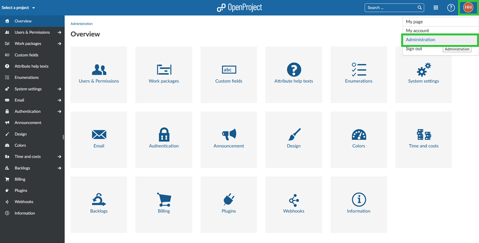

---
sidebar_navigation:
  title: System Admin guide
  priority: 999
description: OpenProject system administration guide.
robots: index, follow
keywords: system administration
---
# System Administration guide

Welcome to the OpenProject **System Administration guide**.

In order to make changes to settings affecting your entire OpenProject environment, you need to navigate to the OpenProject administration.

If you are an administrator on your OpenProject environment,  you can access the administration by clicking on your user Avatar in the upper right corner and selecting ->*Administration* from the dropdown menu.

Click on one of the categories in order to proceed with the configuration.

## Overview

| Topic                                                  | Content                                                      |
| ------------------------------------------------------ | :----------------------------------------------------------- |
| [Users and permissions](./users-permissions)           | How to manage users, groups and permissions in OpenProject?  |
| [Work packages](./manage-work-packages)                | How to configure work packages, types, status and workflows? |
| [Custom fields](./custom-fields)                       | Set custom fields for work packages, Spent time, projects, versions, users, groups and more. |
| [Attribute help texts](./attribute-help-texts)         | Add help texts to explain attributes (including custom fields) in projects and work packages. |
| [Enumerations](./enumerations)                         | Set enumerations, e.g. work package priorities, time tracking activities, document categories, and more. |
| [System settings](./system-settings)                   | Configure your system settings, e.g. a welcome text block on the landing page, display settings, repositories, and more. |
| [Email](./email)                                       | Configure email settings in OpenProject. How to configure email notifications and your email provider? How to set up incoming email? |
| [Authentication](./authentication)                     | Configure authentication methods in OpenProject, e.g. OAuth, OpenID, Two-factor-authentication, LDAP, and more. |
| [Announcement](./announcement)                         | How to create a system announcement?                         |
| [Design](./design)                                     | Create your own design and make it compliant to your company's Corporate Identity, upload logo and customize colors. |
| [Colors](./colors)                                     | Configure colors used in the system, e.g. status colors, work package types, priorities and more. |
| [Time and costs](./time-and-costs)                     | Configure your currency and create cost types in OpenProject. |
| [Backlogs](./backlogs)                                 | Configure your backlogs settings in OpenProject, e.g. story types to be displayed in the backlogs, task types, and more. |
| [Plugins](./plugins)                                   | Manage plugins in OpenProject.                               |
| [Webhooks](./webhooks)                                 | Add and manage webhooks in OpenProject.                      |
| [Information](information)                             | View the latest system information status.                   |
| [GitHub Integration](github-integration)               | How to combine GitHub and OpenProject.                       |
| [Enterprise on-premises](../enterprise-edition-guide/) | Upgrading your Community Edition to Enterprise on-premises and other administrative topics. |
| [Enterprise cloud](../cloud-edition-guide/)            | Manage your OpenProject Enterprise cloud and other administrative topics. |

## Frequently asked questions  - FAQ

### How do I know if I have system admin permissions?

If you can choose *Administration* when clicking on your avatar you have system admin permissions.