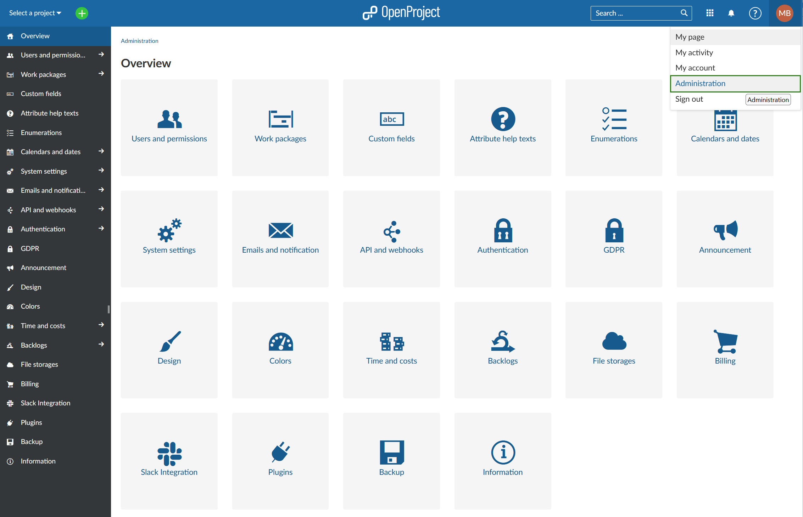

---
sidebar_navigation:
  title: System admin guide
  priority: 970
description: OpenProject system administration guide.
keywords: system administration
---
# System admin guide

Welcome to the OpenProject **System Administration guide**.

In order to make changes to settings affecting your entire OpenProject environment, you need to navigate to the OpenProject administration.

If you are an administrator on your OpenProject environment, you can access the administration by clicking on your user Avatar in the upper right corner and selecting -> **Administration** from the dropdown menu.

Click on one of the categories in order to proceed with the configuration.

## Overview

| Topic                                                        | Content                                                      |
| ------------------------------------------------------------ | :----------------------------------------------------------- |
| [Users and permissions](./users-permissions)                 | How to manage users, groups and permissions in OpenProject.  |
| [Work packages](./manage-work-packages)                      | How to configure work packages, types, status and workflows. |
| [Custom fields](./custom-fields)                             | Set custom fields for work packages, Spent time, projects, versions, users, groups and more. |
| [Attribute help texts](./attribute-help-texts)               | Add help texts to explain attributes (including custom fields) in projects and work packages. |
| [Enumerations](./enumerations/)                              | Set enumerations, e.g. work package priorities, time tracking activities, document categories, and more. |
| [Calendars and dates](./calendars-and-dates/)                | Configure working days, dates formats and calendar subscriptions. |
| [System settings](./system-settings/)                        | Configure your system settings, e.g. a welcome text block on the landing page, languages, repositories, and more. |
| [Emails and notifications](./emails-and-notifications/)      | Manage notifications and emails.                             |
| [API and webhooks](./api-and-webhooks/)                      | Manage APIs and configure webhooks.                          |
| [Authentication](./authentication)                           | Configure authentication methods in OpenProject, e.g. OAuth, OpenID, Two-factor-authentication, LDAP, and more. |
| [GDPR](../enterprise-guide/enterprise-cloud-guide/gdpr-compliance/) | Review and sign a Data Processing Agreement (DPA).           |
| [Announcement](./announcement)                               | How to create a system announcement.                         |
| [Design](./design)                                           | Create your own design and make it compliant to your company's corporate identity, upload logo and customize colors. |
| [Colors](./colors)                                           | Configure colors used in the system, e.g. status colors, work package types, priorities and more. |
| [Enterprise edition](../enterprise-guide/)                   | Upgrading and managing OpenProject Enterprise and other administrative topics. |
| [Time and costs](./time-and-costs)                           | Configure your currency and create cost types in OpenProject. |
| [Backlogs](./backlogs)                                       | Configure your backlogs settings in OpenProject, e.g. story types to be displayed in the backlogs, task types, and more. |
| [Files](./files)                                             | Settings for attachments and virus scanning functionality in OpenProject. Manage external file storages. |
| [External file storages - Nextcloud](./integrations/nextcloud/) | Set up external file storages with Nextcloud.                |
| [External file storages - One Drive](./integrations/one-drive/) | Set up external file storages with One Drive.                |
| [Plugins](./plugins)                                         | Manage plugins in OpenProject.                               |
| [Information](./information/)                                | View the latest system information status.                   |
| [Integrations](./integrations/)                              | How to integration OpenProject into other tools (eg. GitHub, Nextcloud...) |
