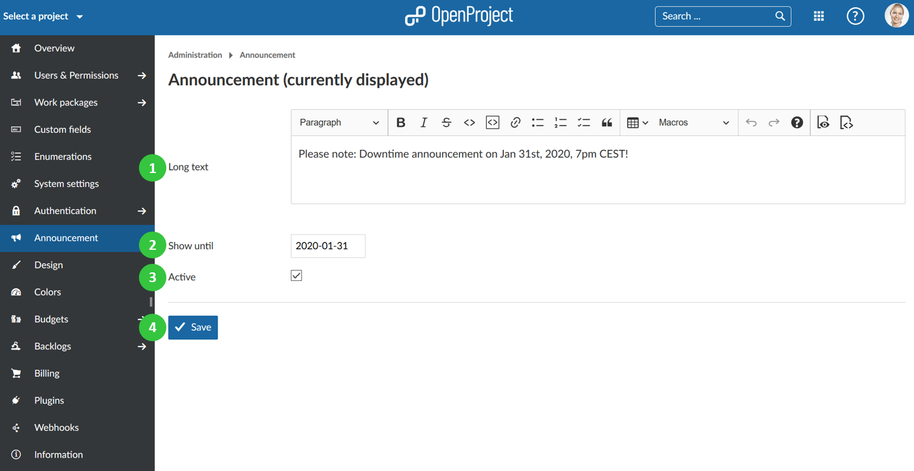
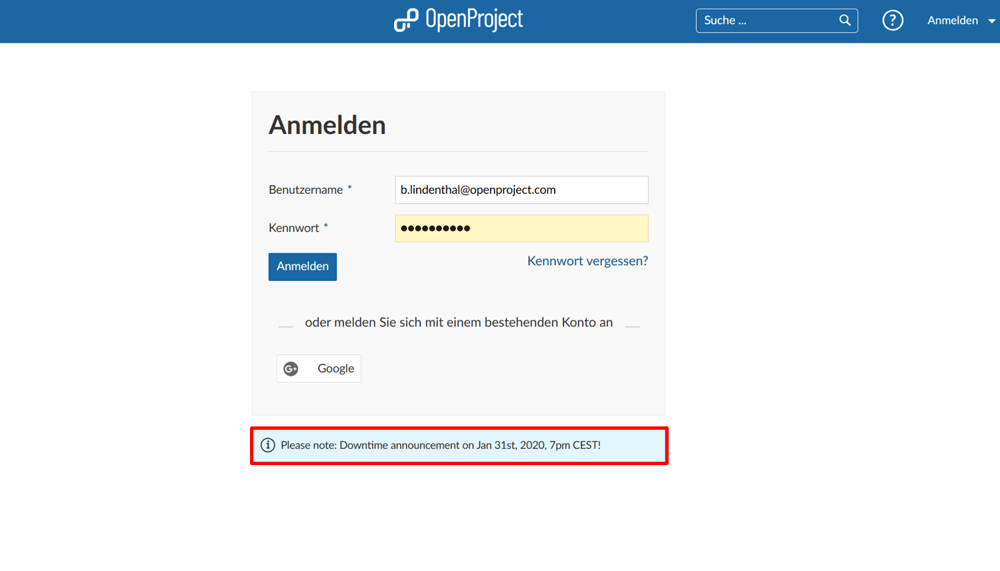

---
sidebar_navigation:
  title: Announcement
  priority: 760
description: Announcements in OpenProject.
robots: index, follow
keywords: announcement
---
# Announcement

You can configure **announcements in OpenProject** which will be displayed for a certain period of time for users when the login.

1. Enter a **text** for your announcement message.
2. **Define a date until when the announcement should be shown**.
3. **Set the announcement to active**. Only then will the announcement be shown.
4. **Save** your changes.

The active announcement will be displayed until the defined date to users **on the login screen**.

Also, the active announcement will be displayed until the defined date to users **on the application start page**.

