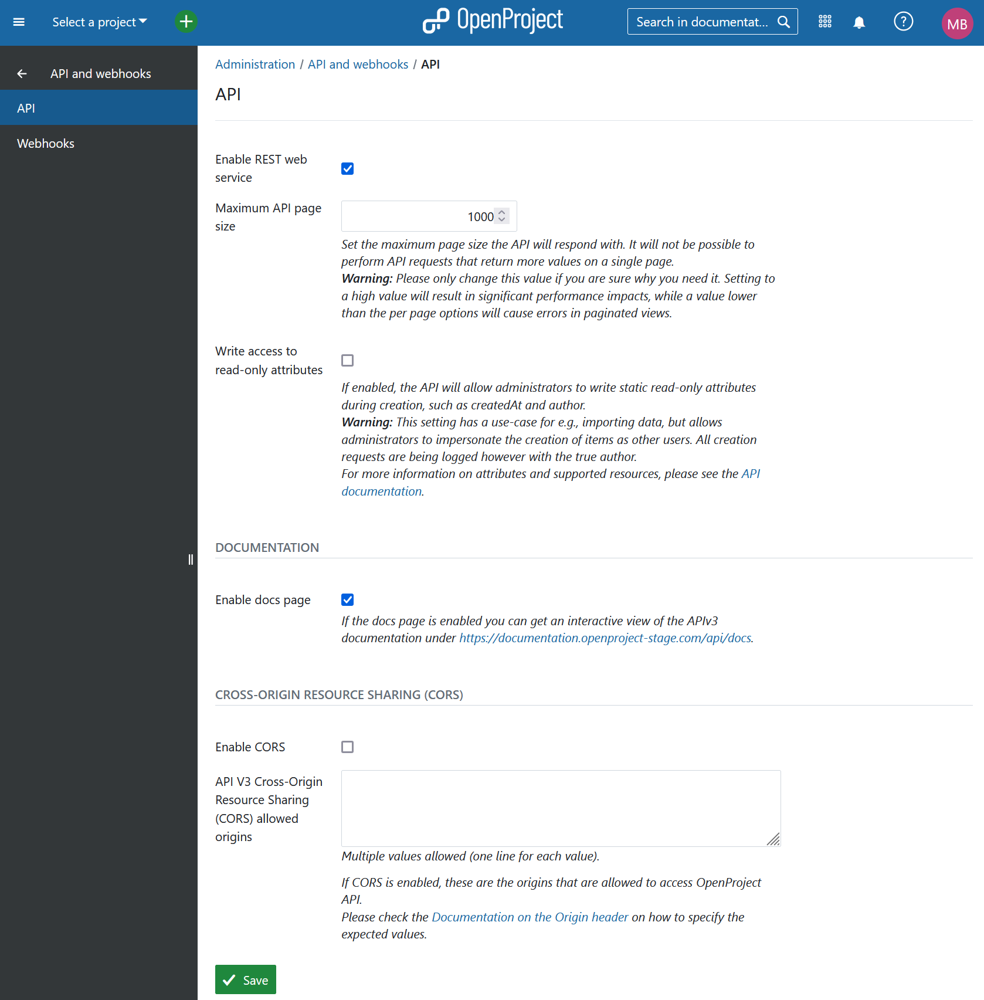
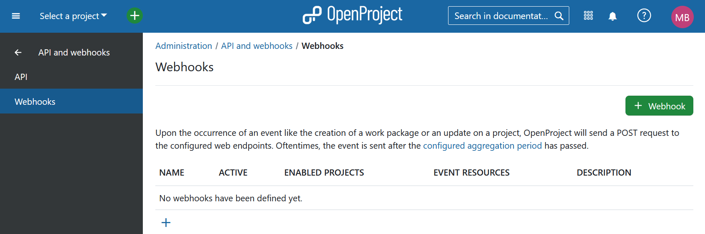
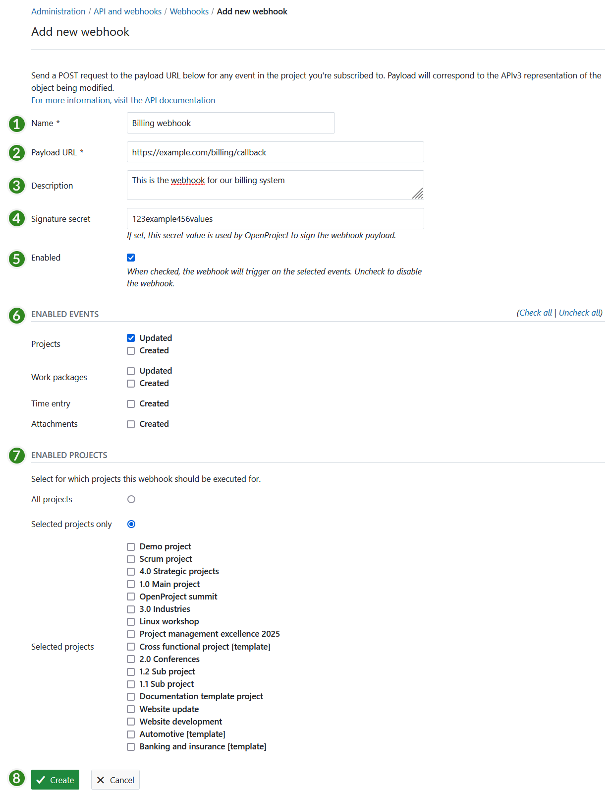

---
sidebar_navigation:
  title: API and webhooks
  priority: 900
description: Configure APIs and webhooks in OpenProject.
keywords: api webhooks
---
# API and webhooks

Configure all API-related settings and add and manage webhooks to your OpenProject environment.

Navigate to **Administration → API and webhooks**.

## API

Here, you can manage the **REST web service** to selectively control whether foreign applications may access your OpenProject API endpoints from within the browser. This setting allows users to access the OpenProject API using an API token created from the users "My account" page. You can set the **maximum page size** the API will respond with. It will not be possible to perform API requests that return more values on a single page. You can also enable **write access to read-only attributes**, which will allow administrators to write static read-only attributes during creation, such as *createdAt* and *author*. 

### Documentation

If the **docs page** is enabled you can get an interactive view of the APIv3 documentation under https://qa.openproject-edge.com/api/docs*.*

### Cross-Origin Resource Sharing (CORS)

To enable **CORS** headers being returned by the [OpenProject APIv3](../../api/),
enable the check box on this page. This will also enable it for dependent authentication endpoints, such as OAuth endpoints `/oauth/token` and the like.

You will then have to enter the allowed values for the Origin header to which OpenProject will allow access.
This is necessary since authenticated resources of OpenProject cannot be accessible to all origins with the `*` header value.

For more information on the concepts of Cross-Origin Resource Sharing (CORS), please see:

- [an overview of CORS from MDN](https://developer.mozilla.org/en-US/docs/Web/HTTP/CORS).
- [a tutorial on CORS by Auth0](https://auth0.com/blog/cors-tutorial-a-guide-to-cross-origin-resource-sharing/)

## Webhooks

You can set up webhooks for OpenProject in order to integrate OpenProject with other applications. A scenario is for example to signal the creation of a time log in OpenProject to a billing application.

Press the green **+ Webhook** button to add a new webhook to OpenProject.

You can configure the following options for webhooks:

1. Choose a **name** identifying the webhook.
2. **Payload URL** defines the endpoint, called when the webhook is triggered.
3. Freely choose an additional **description** to further identify the intent of the respective webhook.
4. By defining a **Signature secret** you guarantee that the sender of the payload request is actually OpenProject. The client will then check this signature secret.
5. **Enable** if **the webhook** should be active.
6. **Set the events** for which the webhook should be activate, i.e. webhook for updating or creating projects or work packages, or for creating time entries.
7. **Select for which projects the webhook should be active**. You can choose all projects or only specific projects. For example if you select the project "System admin guide", an event (ie. create a new time entry) will be fired via the webhook. This will only happen if a user logs time within the selected projects.
8. Press the green **Create** button to save your changes (you may nee to scroll down to find it). There you can also cancel your input.

