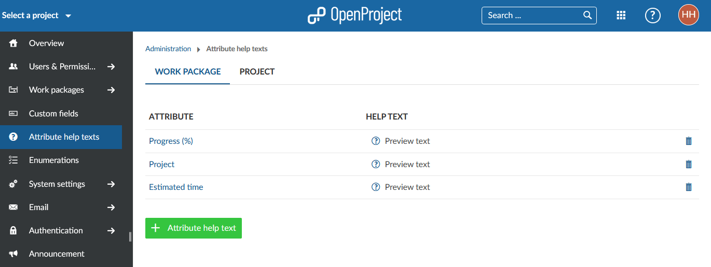
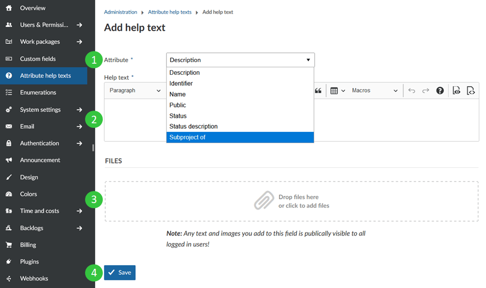
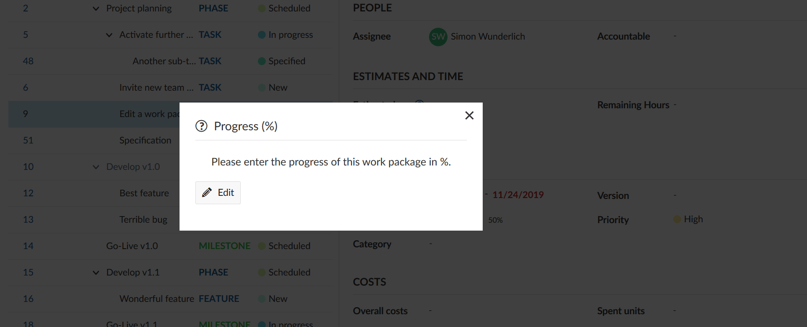
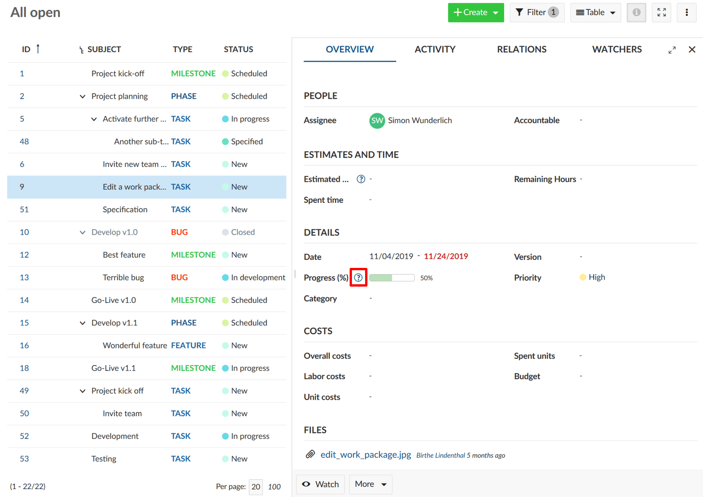
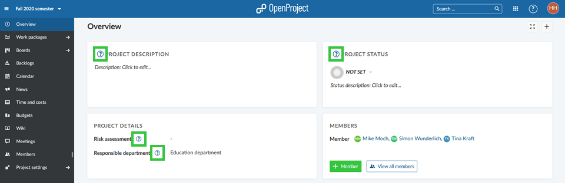
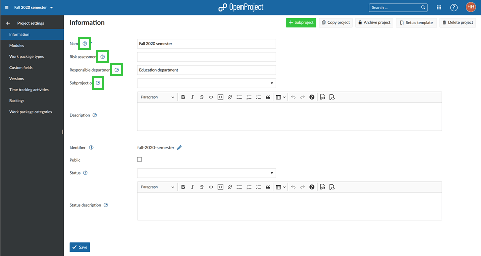

---
sidebar_navigation:
  title: Attribute help texts
  priority: 790
description: Learn how to set attribute help texts in OpenProject
robots: index, follow
keywords: attribute help texts, help texts for projects and work packages

---

# Attribute help texts (Premium feature)

**Attribute help texts** provide additional information for attributes in work packages and projects. After setting them up they are displayed when users click on the question mark symbol next to custom fields in projects and work packages. 
This way you will reduce wrong entries for attributes. This is especially relevant for company specific custom fields.

**Note**: Attribute help texts are a Premium Feature and can only be used with [Enterprise cloud](../../enterprise-guide/enterprise-cloud-guide/) or [Enterprise on-premises](../../enterprise-guide/enterprise-on-premises-guide/). An upgrade from the free Community Edition is easily possible.

## Overview

| Topic                                                        | Content                                                    |
| ------------------------------------------------------------ | :--------------------------------------------------------- |
| [Adding Attribute help texts](#adding-attribute-help-texts)  | How to add and configure an Attribute help text.           |
| [Editing or deleting Attribute help texts](#editing-or-deleting-attribute-help-texts) | How to edit and how to delete an Attribute help text.      |
| [Work packages](#work-packages)                              | Where will Attribute help texts for work packages be used? |
| [Projects](#projects)                                        | Where will Attribute help texts for projects be used?      |
| [WYSIWYG editor](#wysiwyg-editor)                            | Where can Attribute help texts be displayed?               |

Navigate to -> *Administration* -> *Attribute help texts* to set up help texts for attributes and custom fields in work packages and projects. Here you can add, edit and delete Attribute help texts.

## Adding Attribute help texts

To add an Attribute help texts for custom fields click on the green **+ Attribute help text** button. 

1. **Choose the attribute** you'd like to explain. Custom fields are also displayed here, which may require further explanation.
2. Add a **description**. You can add in-line pictures, links or videos, too. This **help text description** which will be shown in work package or project forms for the users.
3. Add **files**, e.g. excerpts from a process manual
4. **Save** your changes.

Be aware that the help text will be visible in all projects.

Once you configured the help text for an attribute, project members can see the explanation. The will see a question mark item next to the attribute. 

When the users click on it, they see the description for this attribute.

## Editing or deleting Attribute help texts

Navigate to -> *Administration* -> *Work packages* -> *Attribute help texts* in order to edit or remove an attribute help text.

1. Click on the **name** of the attribute to edit an existing attribute help text.
2. Click on the **delete icon** to delete an attribute help text.

## Work packages

The Attribute help texts for work packages will be displayed in the [details view](../../user-guide/work-packages/work-package-views/#work-package-split-screen-view) (as in the screenshot below) and in the [full screen view](../../user-guide/work-packages/work-package-views/#work-package-full-screen-view). They will help the users (e.g. the project managers) understand what kind of information to put in which fields.

## Projects

The Attribute help texts for projects will be displayed in the Project details widget in the [Project overview](../../user-guide/project-overview/) (as in the first screenshot below) and in the [Project settings](../../user-guide/projects/project-settings/project-information/) (as in the second screenshot below).

They will help the users (e.g. the project managers) understand what kind of information to put in which fields.

## WYSIWYG editor

The Attribute help texts can also be displayed in the WYSIWYG text editor by using a certain syntax. Find out more [here](../../user-guide/wysiwyg/#embedding-of-work-package-attributes-and-project-attributes). 