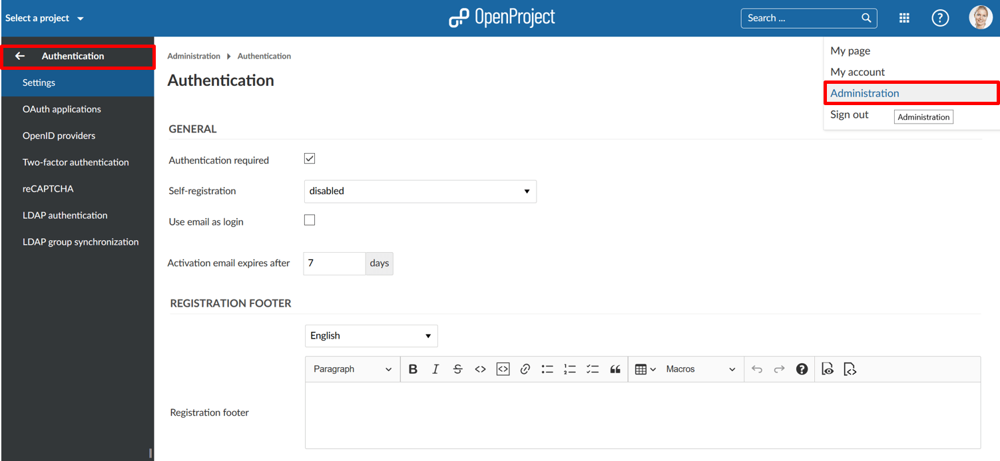

---
sidebar_navigation:
  title: Authentication
  priority: 770
description: Authentication in OpenProject.
robots: index, follow
keywords: authentication
---
# Authentication

Configure **authentication** settings and authentication providers in OpenProject.  To adapt these authentication settings, navigate to your user name and select -> *Administration* -> *Authentication*.

## Overview

| Popular Topics                                               | Description                                                  |
| ------------------------------------------------------------ | :----------------------------------------------------------- |
| [Authentication settings](authentication-settings)           | Configure general authentication settings, such as registration, passwords, and more. |
| [OAuth applications](oauth-applications)                     | How to configure OAuth applications in OpenProject?          |
| [OpenID providers](openid-providers)                         | How to configure OpenID providers in OpenProject?            |
| [Two-factor authentication](two-factor-authentication)       | Set up and manage two-factor authentication (2FA) in OpenProject. |
| [reCAPTCHA](recaptcha)                                       | How to activate reCAPTCHA in OpenProject?                    |
| [LDAP authentication](ldap-authentication)                   | How to set up LDAP authentication in OpenProject?            |
| [LDAP group synchronization](ldap-authentication/ldap-group-synchronization) | How to configure LDAP group synchronization in OpenProject (Premium feature)? |

## Frequently asked questions (FAQ)

### Which authentication provider are supported for single sign-on?

We do support the main authentication provider, such as CAS, SAML, OpenID Connect, Kerberos, and Okta. Please note that single sign-on is a premium feature and can only be activated for the Cloud Edition and the Enterprise Edition.