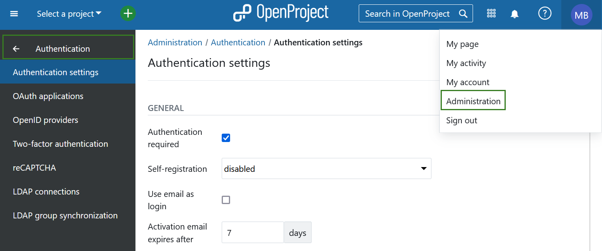

---
sidebar_navigation:
  title: Authentication
  priority: 890	
description: Authentication in OpenProject.
keywords: authentication
---
# Authentication

Configure **authentication** settings and authentication providers in OpenProject.  To adapt these authentication settings, navigate to your user name and select -> _Administration_ -> _Authentication_.

## Overview

| Topic                                                        | Content                                                      |
| ------------------------------------------------------------ | :----------------------------------------------------------- |
| [Login and registration settings](login-registration-settings) | Configure general authentication settings, such as registration, SSO, passwords, and more. |
| [OAuth applications](oauth-applications)                     | How to configure OAuth applications in OpenProject.          |
| [OpenID providers](openid-providers)                         | How to configure OpenID providers in OpenProject.            |
| [Two-factor authentication](two-factor-authentication)       | Set up and manage two-factor authentication (2FA) in OpenProject. |
| [reCAPTCHA](recaptcha)                                       | How to activate reCAPTCHA in OpenProject.                    |
| [LDAP authentication](ldap-connections)                      | How to set up LDAP authentication in OpenProject.            |
| [LDAP group synchronization](ldap-connections/ldap-group-synchronization) | How to configure LDAP group synchronization in OpenProject (Enterprise add-on). |
| [SAML](saml)                                                 | How to set up SAML integration for SSO with OpenProject (Enterprise add-on). |
| [SCIM](scim)                                                 | How to set up SCIM clients in OpenProject (Enterprise add-on). |
