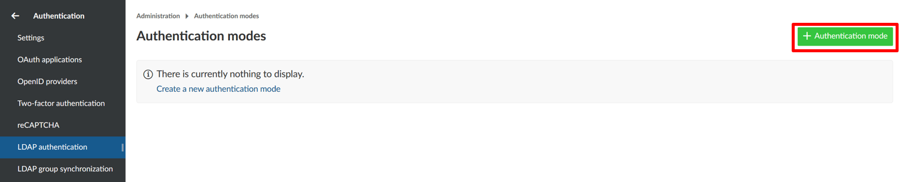
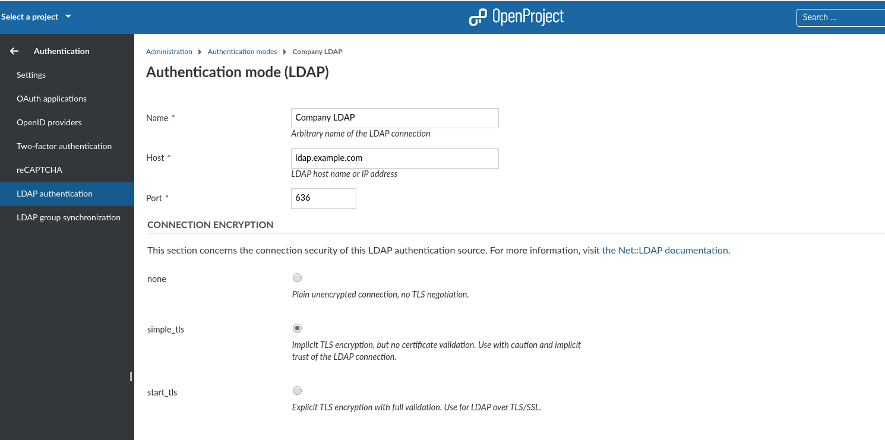
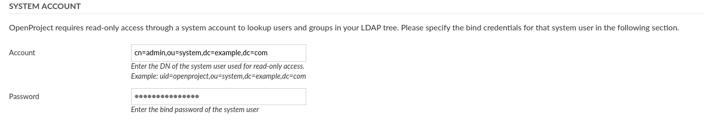
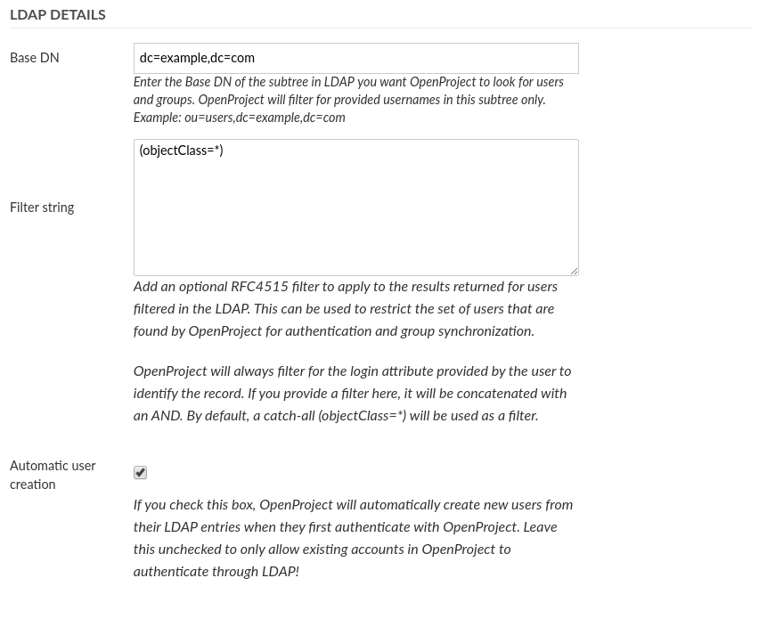
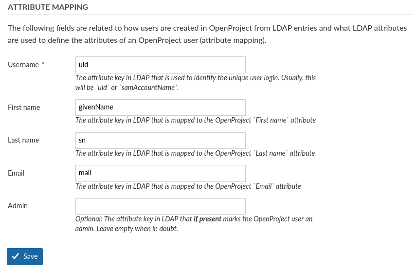
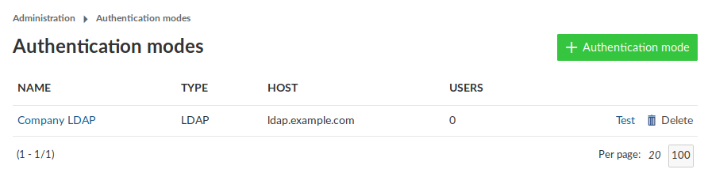

---
sidebar_navigation:
  title: LDAP authentication
  priority: 
description: Manage LDAP Authentication in OpenProject.
robots: index, follow
keywords: ldap authentication
---

# Manage LDAP Authentication

<div class="alert alert-info" role="alert">
**Note**: In order to be able to access the administration panel and manage LDAP authentication you need to be a system admin.
</div>

To see the list of all available LDAP (Lightweight Directory Access  Protocol) authentications navigate to - > *Administration* and select *-> Authentication* -> *LDAP Authentication* from the menu on the left. You will see the list of all available authentications already created.

## Add a new LDAP authentication

To create a new LDAP authentication click on the respective icon.



You will then be able to specify the LDAP configuration. This can be  any directory service compatible with the LDAPv3 standard, such as  Microsoft Active Directory or openLDAP. The configuration depends on the specific database/applications, through which the authentication with  OpenProject is intended.

The following screenshots contain an exemplary configuration for a  new LDAP authentication mode. In the following, we will go through all  available options.


#### LDAP connection details and security




In the upper section, you have to specify the connection details of your LDAP server as well as the connection encryption to use.


- **Name:** Arbitrary identifier used to show which authentication source a user is coming from (e.g., in the [Administration > Users view](https://www.openproject.org/help/administration/manage-users/))
- **Host:** Full hostname to the LDAP server
- **Port :** LDAP port. Will usually be 389 for LDAP and StartTLS and 636 for LDAP over SSL connections.
- **Connection encryption**: Select the appropriate connection encryption.
  - For unencrypted connections, select `none`  . No TLS/SSL connection will be established, your connection will be unsecure
  - For LDAPS connections (LDAP over SSL), use `simple_tls` , this is an older SSL encryption pattern that uses SSL certificates, but **DOES NOT VERIFY THEM**. Implicit trust in the connection will be placed, but the connection will be encrypted. Some older LDAP servers only support this option
  - **Recommended option**: `start_tls` will use TLS to encrypt the connection after connecting to the LDAP server on the unencrypted PORT (`389` by default).
  -  [Click here to read more details into what these options mean for connection security.](https://www.rubydoc.info/gems/ruby-net-ldap/Net/LDAP)


**Allowing untrusted certifcates for LDAP connections**

If you use `start_tls` , certificate details and host names will be verified on connections as recommended for security. In case you use a custom untrusted certificate authority (CA) that your LDAP is connecting to, you can place this CA in your system's trusted CA store if possible. For some distributions, you will need to specify this CA manually to OpenProject.

You can do this by using the [advanced configuration](https://docs.openproject.org/installation-and-operations/configuration/) function of OpenProject. You can define the CA path by setting the following ENV variable:

```bash
OPENPROJECT_LDAP__TLS__OPTIONS_CA__FILE="/path/to/the/root-ca.crt"
```

or by extending your production configuration of `config/configuration.yml` with the following segment:

```
production:
  # .. other settings ..
  
  # ldap_tls_options:
  #   ca_file: "/path/to/the/root-ca.crt"
```

You can set other TLS options for the LDAP auth source connection. They are passed as the `tls_options` to the Net::LDAP gem and ultimately end up in the `SSLContext` setting of Ruby. You can define the TLS version and other advanced options in case your connections needs it. Most users will not need to change this however.

See the following resources for more information:

- https://github.com/ruby-ldap/ruby-net-ldap/blob/master/lib/net/ldap.rb
- https://ruby.github.io/openssl/OpenSSL/SSL/SSLContext.html


#### LDAP system user credentials




Next, you will need to enter a system user that has READ access to the users for identification and synchronization purposes. Note that most operations to the LDAP during authentication will not be using these credentials, but the user-provided credentials in the login form in order to perform a regular user bind to the LDAP.


- **Account:** The full DN of a system users used for  looking up user details in the LDAP. It must have read permissions under the Base DN. This will not be used for the user bind upon  authentication.
- **Password:** The bind password of the system user’s DN above.


#### LDAP details



Next you can define what sections OpenProject will look for in the LDAP and also if users should be created automatically in OpenProject when they are accessing it. Let's look at the available options:


- **Base DN**: Enter the Base DN to search within for users and groups in the LDAP tree
- **Filter string**: Enter an optional [LDAP RFC4515 filter string](https://tools.ietf.org/search/rfc4515) to further reduce the returned set of users. This allows you to restrict access to OpenProject with a very flexible filter. For group synchronization, only users matching this filter will be added as well.
- **Automatic user creation:** Check to automatically  create users in OpenProject when they first login in OpenProject. It  will use the LDAP attribute mapping below to fill out required  attributes. The user will be forwarded to a registration screen to  complete required attributes if they are missing in the LDAP.


#### Attribute mapping



The attribute mapping is used to identify attributes of OpenProject with attributes of the LDAP directory. At least the *login* attribute is required to create DNs from the login credentials.

- **Login:** The login attribute in the ldap. Will be used to construct the DN from `login-attribute=value,`. Most often, this will be *uid.*
- **First name:** The attribute name in the LDAP that maps to first name. Most often, this will be *givenName.* If left empty, user will be prompted to enter upon registration if **automatic user creation** is true.
- **Last name:** The attribute name in the LDAP that maps to last name. Most often, this will be *sn.* If left empty, user will be prompted to enter upon registration if **automatic user creation** is true.
- **Email:** The attribute name in the LDAP that maps to the user’s mail address. This will usually be *mail.* If left empty, user will be prompted to enter upon registration if **automatic user creation** is true.
- **Admin:** Specify an attribute that if it has a truthy value, results in the user in OpenProject becoming an admin account.  Leave empty to never set admin status from LDAP attributes.

 

Lastly, click on *Create* to save the LDAP authentication  mode. You will be redirected to the index page with the created  authentication mode. Click the *test*  button to create a test connection using the system user’s bind credentials.




With the [OpenProject Enterprise Edition](https://www.openproject.org/enterprise-edition/) it is possible to [synchronize LDAP and OpenProject groups](./ldap-group-synchronization).