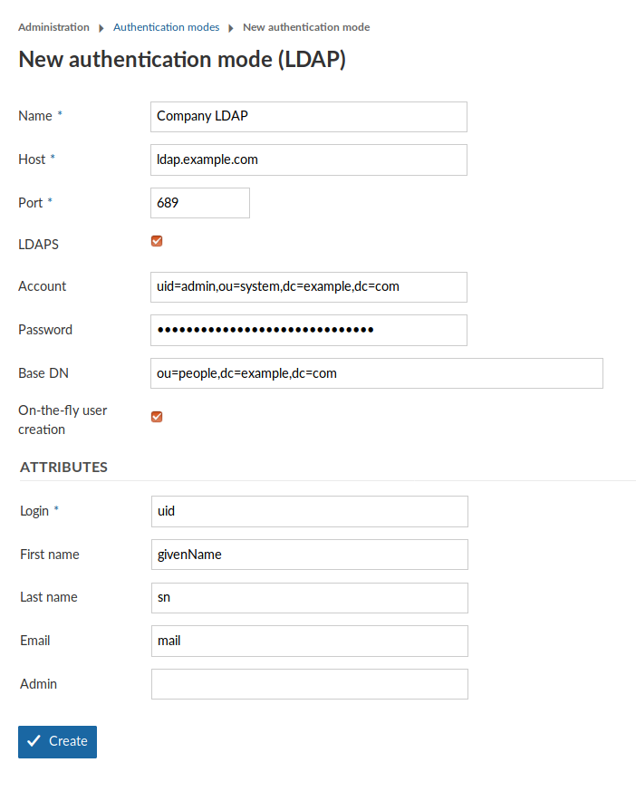

---
sidebar_navigation:
  title: LDAP authentication
  priority: 
description: Manage LDAP Authentication in OpenProject.
robots: index, follow
keywords: ldap authentication
---

# Manage LDAP Authentication

**Note**: In order to be able to access the administration panel and manage LDAP authentication you need to be a system admin.

To see the list of all available LDAP (Lightweight Directory Access  Protocol) authentications navigate to - > *Administration* and select *-> Authentication* -> *LDAP Authentication* from the menu on the left. You will see the list of all available authentications already created.

## Add a new LDAP authentication

To create a new LDAP authentication click on the respective icon.

You will then be able to specify the LDAP configuration. This can be  any directory service compatible with the LDAPv3 standard, such as  Microsoft Active Directory or openLDAP. The configuration depends on the specific database/applications, through which the authentication with  OpenProject is intended.

The following screenshot contains an exemplary configuration for a  new LDAP authentication mode. In the following, we will go through all  available options.

- **Name:** Arbitrary identifier used to show which authentication source a user is coming from (e.g., in the [Administration > Users view](https://www.openproject.org/help/administration/manage-users/))
- **Host:** Full hostname to the LDAP server
- **Port :** LDAP port. Will usually be 389 for LDAP and 689 for LDAPS connections.
- **LDAPS :** If checked, this will result in NET::LDAP connecting with the *simple_tls* option *enabled.* [Click here to read more details into what this means for connection security.](https://www.rubydoc.info/gems/ruby-net-ldap/Net/LDAP)
- **Account:** The full DN of a system users used for  looking up user details in the LDAP. It must have read permissions under the Base DN. This will not be used for the user bind upon  authentication.
- **Password:** The bind password of the system user’s DN above.
- **On-the-fly user creation:** Check to automatically  create users in OpenProject when they first login in OpenProject. It  will use the LDAP attribute mapping below to fill out required  attributes. The user will be forwarded to a registration screen to  complete required attributes if they are missing in the LDAP.

**Attribute mapping**

The attribute mapping is used to identify attributes of OpenProject with attributes of the LDAP directory. At least the *login* attribute is required to create DNs from the login credentials.

- **Login:** The login attribute in the ldap. Will be used to construct the DN from `login-attribute=value,`. Most often, this will be *uid.*
- **First name:** The attribute name in the LDAP that maps to first name. Most often, this will be *givenName.* If left empty, user will be prompted to enter upon registration if **on-the-fly-creation** is true.
- **Last name:** The attribute name in the LDAP that maps to last name. Most often, this will be *sn.* If left empty, user will be prompted to enter upon registration if **on-the-fly-creation** is true.
- **Email:** The attribute name in the LDAP that maps to the user’s mail address. This will usually be *mail.* If left empty, user will be prompted to enter upon registration if **on-the-fly-creation** is true.
- **Admin:** Specify an attribute that if it has a truthy value, results in the user in OpenProject becoming an admin account.  Leave empty to never set admin status from LDAP attributes.

 

Lastly, click on *Create* to save the LDAP authentication  mode. You will be redirected to the index page with the created  authentication mode. Click the *test*  button to create a test connection using the system user’s bind credentials.

 

With the [OpenProject Enterprise Edition](https://www.openproject.org/enterprise-edition/) it is possible to [synchronize LDAP and OpenProject groups](./ldap-group-synchronization).