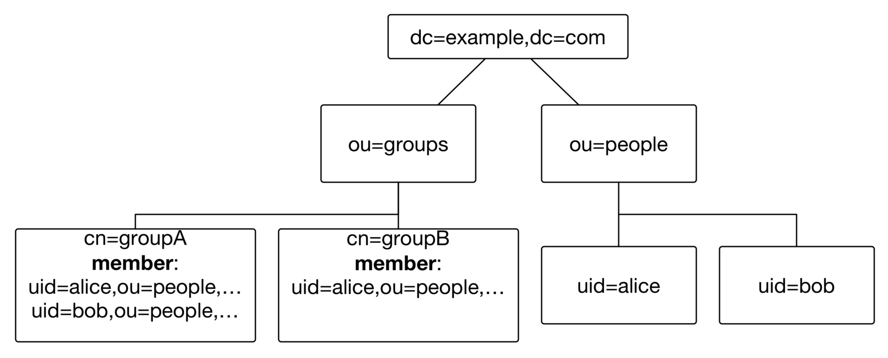
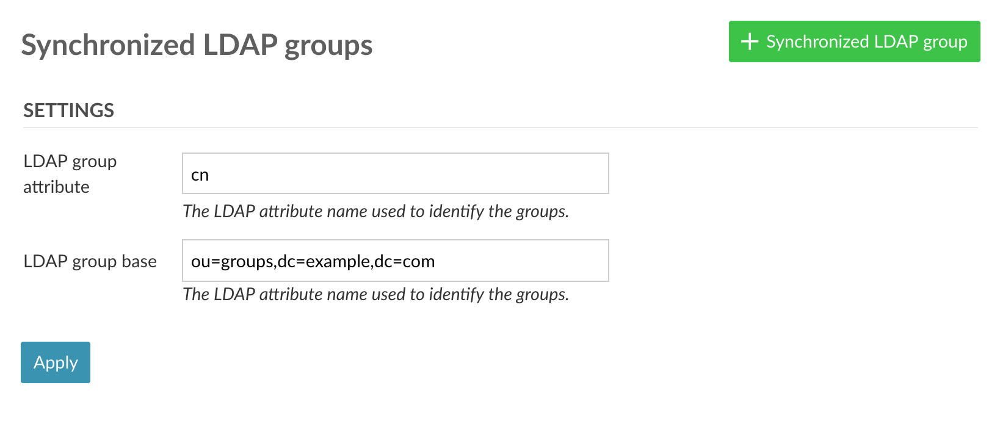

---
sidebar_navigation:
  title: LDAP group synchronization
  priority: 
description: Synchronize LDAP groups.
robots: index, follow
keywords: synchronize ldap groups
---

# Synchronize LDAP and OpenProject groups (Premium feature)

Note: This feature is available for the Enterprise Edition only for  OpenProject versions 7.4+. For more information and differences to CE, [see this page](https://www.openproject.org/enterprise-edition/).

In OpenProject EE, you can synchronize LDAP group memberships defined through the [groupOfNames](https://tools.ietf.org/html/rfc4519#section-3.5) LDAP object class. This guide assumes that you:

- - have at least one group defined in OpenProject (See the “[Managing groups](../../../users-permissions/groups/)” guide for more information on how to create and edit groups),
  - have set up your LDAP authentication source (See the “[Manage LDAP authentication](../../ldap-authentication/)” guide)
  - have at least one LDAP entry with a *groupOfNames* object class and at least one *member* reference to an entry within your base DN of your LDAP authentication source. We use the inverse *memberOf* filter to determine the members of a group entry.

For the sake of simplicity, we assume that in this guide, your LDAP structure looks like the following:

You have two groups *cn=groupA,ou=groups,ou=example,ou=com and cn=groupB,ou=groups,ou=example,ou=com* with two and one users, respectively*.* Your base DN is *ou=people,ou=example,ou=com.*

## LDAP group synchronization

LDAP group synchronization augments the memberships defined by  administrators in an existing OpenProject group. Important things to  note are:

- Only existing groups and users in OpenProject can be synchronized.  The functionality will not simply create all entries in the LDAP group  base nor will it synchronize users that do not exist in OpenProject.
- Group synchronization have to be enabled by an administrator by creating a *synchronized LDAP group* that ties the OpenProject group to an LDAP entry.
- Only synchronized memberships will be removed from the OpenProject  group. If you want to add a user outside your LDAP authentication to an  OpenProject group, you can safely do so without the membership being  removed.

## Configure synchronized LDAP group

In order to get to the LDAP group sync administration pane, expand the LDAP authentication menu item in your administration.

 

### Define group base and key settings

In order for the LDAP groups plugin to locate your group entries, you first need to set the *group key* to **cn** (the identifying attribute of the group entries) and *group base* to **ou=groups,ou=example,ou=com** as shown in the following screenshot.

LDAP group synchronization settings

 

### Create a synchronized group

To create a new synchronized group, use the button on the top right  of the page. There, you will select your LDAP authentication source that contains the group, as well as the existing OpenProject group that  members should be synchronized to.

The *entry* *identifier* field corresponds to the value of the group key, e.g. **groupA** for our first exemplary group.

Click on *Create* to finish the creation of the synchronized  group. The LDAP memberships of each user will be synchronized hourly  through a cron job on your packaged installation. Changes and output  will be logged to */var/log/openproject/cron-hourly.log*.