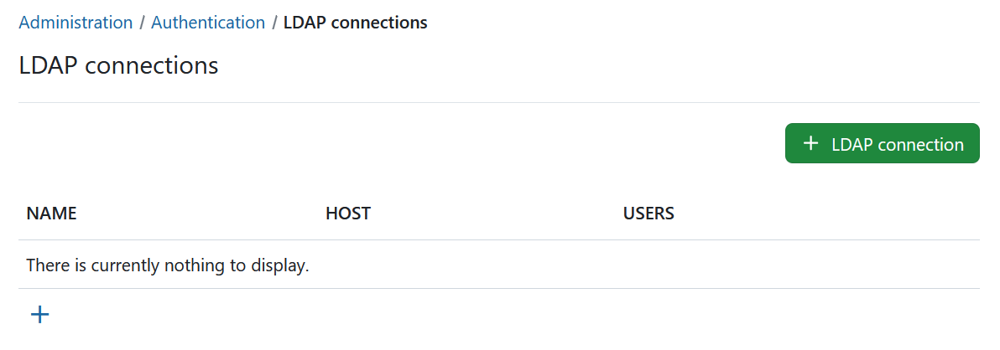
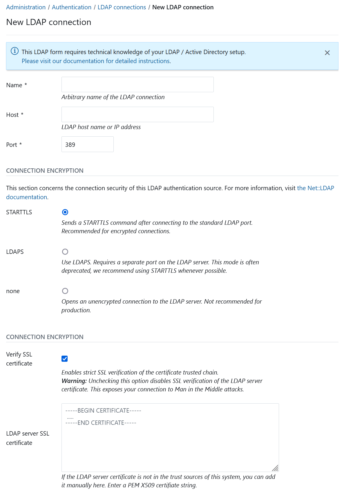
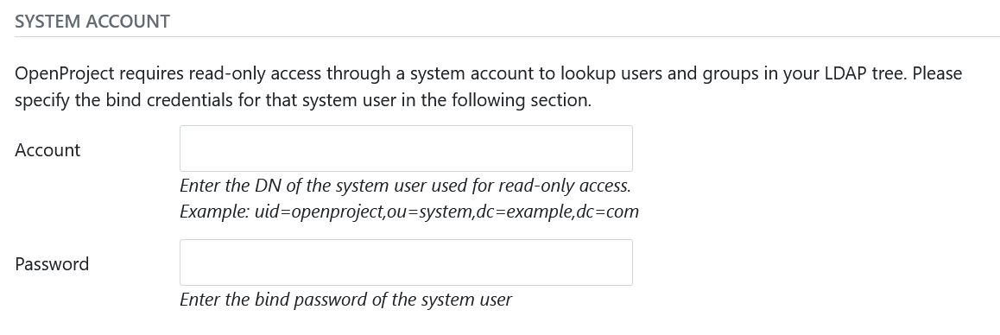
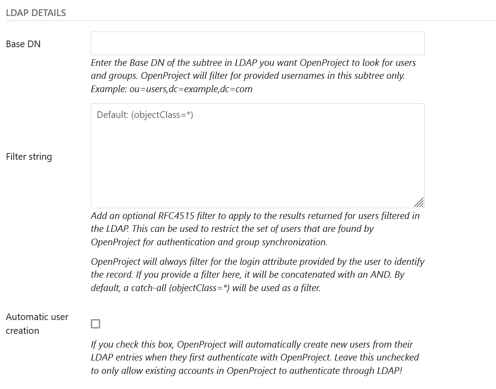
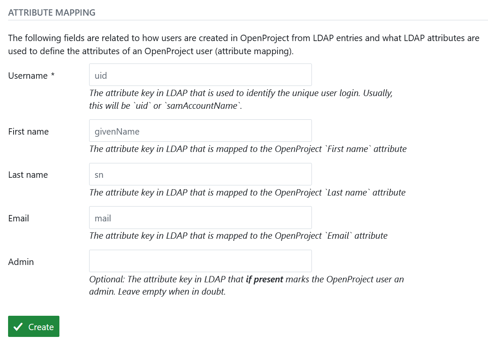
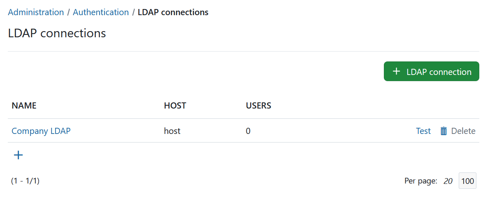

---
sidebar_navigation:
  title: LDAP connections
  priority: 500
description: Manage LDAP Authentication in OpenProject.
keywords: ldap authentication
---

# Manage LDAP connections

> [!NOTE]
> In order to be able to access the administration panel and manage LDAP authentication you need to be a system admin.

To see the list of all available LDAP (Lightweight Directory Access  Protocol) authentications navigate to - > *Administration* and select *-> Authentication* -> *LDAP connections* from the menu on the left. You will see the list of all available connections already created.

## Add a new LDAP connection

To create a new LDAP connection, click on the respective icon.



You will then be able to specify the LDAP configuration. This can be  any directory service compatible with the LDAPv3 standard, such as  Microsoft Active Directory or openLDAP. The configuration depends on the specific database/applications, through which the authentication with  OpenProject is intended.

The following screenshots contain an exemplary configuration for a  new LDAP authentication mode. In the following, we will go through all  available options.

### LDAP connection details and security



In the upper section, you have to specify the connection details of your LDAP server as well as the connection encryption to use.

- **Name:** Arbitrary identifier used to show which authentication source a user is coming from (e.g., in the [Administration > Users view](../../users-permissions/users/))
- **Host:** Full hostname to the LDAP server
- **Port :** LDAP port. Will usually be 389 for LDAP and StartTLS and 636 for LDAP over SSL connections.
- **Connection encryption**: Select the appropriate connection encryption.
  - **Recommended option**: `STARTTLS` will issue an TLS connection upgrade to encrypt the connection after connecting to the LDAP server on the unencrypted PORT (`389` by default).
  - For LDAPS connections (LDAP over SSL), use `LDAPS` , this is an SSL encryption pattern that uses SSL certificates and connects to a separate port on the LDAP server. Some older LDAP servers only support this option, but this option is deprecated in most ldap servers favoring the STARTTLS method of operation.
  - For unencrypted connections, select `none`  . No TLS/SSL connection will be established, your connection will be insecure and no verification will be made.
  - [Click here to read more details into what these options mean for connection security.](https://www.rubydoc.info/gems/ruby-net-ldap/Net/LDAP)

- **SSL encryption options**: Provides additional options for LDAPS and STARTTLS connections. Be aware that these options do not apply for the connection encryption `none` option.

  - **Verify SSL certificate**: By default, for STARTTLS and LDAPS, SSL certificate trust chains will be verified during connection. As many LDAP servers in our experience use self-signed certificates, checking this option without providing the SSL certificate will fail. However, we recommend you enable this checkbox for any LDAP connections used in production.

  - **LDAP server SSL certificate**: If the LDAP server's certificate is not trusted on the system that the OpenProject server runs on, you have the option to specify one or multiple PEM-encoded X509 certificates. This certificate might be the LDAP server's own certificate, or an intermediate or root CA that you trust for the sake of this connection.

### LDAP system user credentials



Next, you will need to enter a system user that has READ access to the users for identification and synchronization purposes. Note that most operations to the LDAP during authentication will not be using these credentials, but the user-provided credentials in the login form in order to perform a regular user bind to the LDAP.

- **Account:** The full DN of a system users used for  looking up user details in the LDAP. It must have read permissions under the Base DN. This will not be used for the user bind upon  authentication.
- **Password:** The bind password of the system user’s DN above.

### LDAP details



Next you can define what sections OpenProject will look for in the LDAP and also if users should be created automatically in OpenProject when they are accessing it. Let's look at the available options:

- **Base DN**: Enter the Base DN to search within for users and groups in the LDAP tree
- **Filter string**: Enter an optional [LDAP RFC4515 filter string](https://datatracker.ietf.org/doc/html/rfc4515) to further reduce the returned set of users. This allows you to restrict access to OpenProject with a very flexible filter. For group synchronization, only users matching this filter will be added as well.
- **Automatic user creation:** Check to automatically  create users in OpenProject when they first login in OpenProject. It  will use the LDAP attribute mapping below to fill out required  attributes. The user will be forwarded to a registration screen to  complete required attributes if they are missing in the LDAP.

#### Filter Examples

```text
(memberof=CN=OpenProject,OU=Rollen,OU=Gruppen,DC=intern)
```

### Attribute mapping



The attribute mapping is used to identify attributes of OpenProject with attributes of the LDAP directory. At least the *login* attribute is required to create DNs from the login credentials.

- **Login:** The login attribute in the ldap. Will be used to construct the DN from `login-attribute=value,`. Most often, this will be *uid.*
- **First name:** The attribute name in the LDAP that maps to first name. Most often, this will be *givenName.* If left empty, user will be prompted to enter upon registration if **automatic user creation** is true.
- **Last name:** The attribute name in the LDAP that maps to last name. Most often, this will be *sn.* If left empty, user will be prompted to enter upon registration if **automatic user creation** is true.
- **Email:** The attribute name in the LDAP that maps to the user’s mail address. This will usually be *mail.* If left empty, user will be prompted to enter upon registration if **automatic user creation** is true.
- **Admin:** Specify an attribute that if it has a truthy value, results in the user in OpenProject becoming an admin account.  Leave empty to never set admin status from LDAP attributes.

Lastly, click on *Create* to save the LDAP authentication  mode. You will be redirected to the index page with the created  LDAP connection. Click the *test*  button to create a test connection using the system user’s bind credentials.



With the [OpenProject Enterprise edition](https://www.openproject.org/enterprise-edition/) it is possible to [synchronize LDAP and OpenProject groups](./ldap-group-synchronization).

## Multiple LDAP connections

OpenProject supports multiple LDAP connections to source users from. The user's authentication source is remembered the first time it is created (but can be switched in the administration backend). This ensures that the correct connection / LDAP source will be used for the user.

Duplicates in the unique attributes (login, email) are not allowed and a second user with the same attributes will not be able to login. Please ensure that amongst all LDAP connections, a unique attribute is used that does not result in conflicting logins.

## LDAP connections through seeding / Environment variables

OpenProject allows you to define an LDAP connection (and optionally, synchronized group filters for enterprise editions) through a configuration or environment variable.

Please see the [advanced configuration guide](../../../installation-and-operations/configuration/) for more information.

## LDAP user synchronization

By default, OpenProject will synchronize user account details (name, e-mail, login) and their account status from the LDAP through a background worker job every 24 hours.

### **Enable status synchronization**

If you wish to synchronize the account status from the LDAP, you can enable status synchronization using the following configuration:

- `ldap_users_sync_status: true`
- (or the ENV variable `OPENPROJECT_LDAP__USERS__SYNC__STATUS=true`)

The user will be ensured to be active if it can be found in LDAP. Likewise, if the user cannot be found in the LDAP, its associated OpenProject account will be locked.

### Disable the synchronization job

If for any reason, you do not wish to perform the synchronization at all, you can also remove the synchronization job from being run at all with the following variable:

- `ldap_users_disable_sync_job: true`
- (or the ENV variable `OPENPROJECT_LDAP__USERS__DISABLE__SYNC__JOB=true`)
