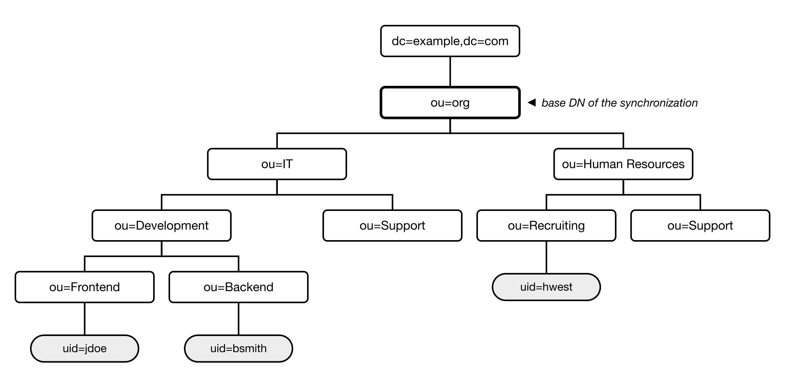

---
sidebar_navigation:
  title: LDAP department synchronization
  priority: 003
description: Synchronize LDAP organizational units into the OpenProject department hierarchy.
keywords: synchronize ldap departments, ldap department, organizational unit, organization, hierarchy

---

# Synchronize LDAP and OpenProject departments (Enterprise add-on)

[feature: ldap_groups ]

In OpenProject Enterprise edition, you can mirror the organizational unit (OU) structure of your LDAP or Active Directory into the OpenProject [organization](../../../users-permissions/organization/): each OU below a configured base DN becomes a department, and users are assigned to the department of the OU they reside in. This guide assumes that you:

- have set up your LDAP authentication source (see the “[Manage LDAP authentication](../../ldap-connections/)” guide)
- have an LDAP subtree in which departments are modelled as organizational unit entries, with user entries placed directly below the OU they belong to

> [!NOTE]
> This feature is available for both Enterprise cloud and Enterprise on-premises. When using Enterprise cloud, your LDAP server must be reachable from the OpenProject cloud infrastructure, which typically means exposing it to the internet, which is not recommended. This is a network and security consideration for your organization to evaluate. Consider using [SAML](../../saml/) or [SCIM provisioning](../../scim/) as a more secure alternative.

For the sake of simplicity, we assume that in this guide your LDAP structure looks like the following, with `ou=org,dc=example,dc=com` as the subtree you want to synchronize:



Synchronizing this subtree results in the following department hierarchy in OpenProject, with `jdoe` assigned to _IT / Development / Frontend_, `bsmith` to _IT / Development / Backend_ and `hwest` to _Human Resources / Recruiting_:

```text
IT
├── Development
│   ├── Frontend
│   └── Backend
└── Support
Human Resources
├── Recruiting
└── Support
```

Note that the base DN itself is only the anchor of the synchronization and does not become a department. Its direct child OUs become top-level departments, deeper OUs are nested accordingly.

To access the LDAP department synchronization administration pane, expand the LDAP authentication menu item in your administration.

## Create an LDAP department synchronization

Unlike [group synchronization](../ldap-group-synchronization/), departments are never mapped one by one. You always configure a subtree, and OpenProject discovers the organizational units within it.

To create a new synchronization, use the **+ Add LDAP department synchronization** button on the top right of the index page. The following properties can be set:

- **Name:** A label for this synchronization, for organizational purposes only.
- **LDAP connection:** Select the LDAP connection you want this synchronization to use. Users created by department synchronization will be tied to that LDAP and may bind against it for authentication.
- **Base DN:** Enter the DN of the subtree whose organizational units should be synchronized, for example `ou=org,dc=example,dc=com`. It must be within the base DN of the selected LDAP connection, and it may not overlap the base DN of another synchronization on the same LDAP connection.
- **Organizational unit filter:** The RFC4515 LDAP filter identifying the organizational unit entries to be synchronized. Defaults to `(objectClass=organizationalUnit)`.
- **OU name attribute:** The attribute used for naming the associated OpenProject departments, for example `ou`.
- **Unique identifier attribute:** (optional) The attribute holding a stable unique identifier of the OU entry, for example `objectGUID` (Active Directory) or `entryUUID` (OpenLDAP). When set, departments survive renames and moves of their OU. Leave empty to match OUs by DN.
- **User filter:** (optional) An RFC4515 LDAP filter identifying user entries below the base DN. Leave empty to use the filter of the LDAP connection, or a generic `(objectClass=person)` filter when the connection does not define one.
- **Sync users:** Check this option if you want users found below the base DN to be automatically created in OpenProject. When unchecked, only users that already exist in OpenProject are assigned to departments.

Click on **Create** to finish the creation of the synchronization. A first synchronization is started in the background immediately, and the department hierarchy and its members are synchronized every 30 minutes afterwards through a background job.

## How the synchronization works

Each run consists of two steps:

1. **Structure:** The organizational unit filter is queried against the base DN. Every matching OU is created or updated as a department (named from the **OU name attribute**), nested according to its position in the LDAP tree.
2. **Members:** The user filter is queried against the base DN. Each user entry is assigned to the department of its **immediate parent OU**.

LDAP is authoritative for the memberships it manages. A user can only belong to one department, so a user found below a different OU than before is moved: they are removed from their previous department and added to the new one. Memberships that the synchronization no longer sees in LDAP are removed as well.

To trigger a synchronization manually (OU discovery **and** member sync), use the **Synchronize organizational units** button on the detail page of a synchronization, or run the following rake task in a [console](../../../../installation-and-operations/operation/control/):

```shell
bundle exec rake ldap_departments:synchronize
```

The rake task synchronizes all configured trees, the button only the one you are looking at.

## Managed departments

The detail page of a synchronization lists all departments it currently manages, with their full path, the DN of the OU they were created from, and their member count. The departments themselves are managed under [**Administration** → **Users and permissions** → **Organization**](../../../users-permissions/organization/), where they are marked as _Managed by LDAP synchronization_.

Because the synchronization owns them, managed departments are read-only in that administration section:

- Their name and parent department cannot be changed manually.
- Users cannot be added to or removed from them manually, and users belonging to a managed department cannot be moved to another department.
- No department can be created or moved underneath a managed department.
- Managed departments cannot be deleted.

To edit a department manually again, stop managing it as described below.

## Stop managing departments

Departments and their members are never deleted by removing a mapping — they only stop being managed and become regular departments that you can edit or delete manually.

- **Stop managing a single department:** On the detail page of the synchronization, open the **More** (**⋯**) menu of a department and select **Delete**. The mapping is removed, the department and its members are kept. It will be recreated as a managed department on the next run if its OU still matches the filter.
- **Remove a whole synchronization:** Open the **More** (**⋯**) menu of the synchronization on the index page and select **Delete**. All departments it managed are kept and become regular departments.

If an OU disappears from your LDAP (or no longer matches the organizational unit filter), OpenProject drops the mapping automatically during the next run. The department and its members are kept as an unmanaged department.

## FAQ

### Are nested organizational units supported?

Yes. Organizational units are synchronized at any depth below the base DN and are nested accordingly in the OpenProject department hierarchy.

Users, however, are only assigned to the department of the OU they reside in directly. A user entry that is not a direct child of a synchronized OU is not assigned to any department.

### Can I synchronize several subtrees?

Yes, you can create as many synchronizations as you need, also against different LDAP connections. Two synchronizations on the same LDAP connection may not overlap, though: neither base DN may be an ancestor of, or identical to, the other, since the same OU cannot be claimed by two synchronizations.

### What happens when an organizational unit is renamed or moved?

If you configured a **Unique identifier attribute**, the OU is matched by that identifier and the existing department is renamed or re-nested accordingly.

Without it, OUs are matched by DN: the renamed or moved OU is treated as a new one, and the department of the old DN is unmanaged (but kept). We therefore recommend setting the unique identifier attribute whenever your directory provides one.

### Can I combine department synchronization with group synchronization?

Yes. Departments and groups are separate concepts in OpenProject, and both synchronizations are independent of each other. Users can be a member of any number of groups while belonging to exactly one department.

## Troubleshooting

### No departments are being synchronized

1. Double-check the base DN and the LDAP connection. The base DN must be contained within the base DN of the LDAP connection, otherwise it will not be found by the connection, as the connection's base DN is used for all subsequent queries.
2. Verify the organizational unit filter against your directory, for example with `ldapsearch`. If your directory models departments with a different object class than `organizationalUnit`, adjust the filter accordingly.
3. Remember that the base DN itself never becomes a department. Only entries **below** it are synchronized.
4. Check that the **OU name attribute** exists on your OU entries. Entries without a value for that attribute are skipped, since the department cannot be named.

### Users are not being assigned to departments

For users to be assigned to departments, the following conditions need to be met:

1. The user entries must be located directly below a synchronized OU. Users placed in a separate subtree (for example a common `ou=people` branch) cannot be assigned, as their parent entry is not a department.
2. The user filter must match your user entries. When left empty, the filter of the LDAP connection is used, falling back to `(objectClass=person)`. Verify it with `ldapsearch` if in doubt.
3. The **Login** attribute configured on the LDAP connection must match an attribute that is actually present on your LDAP user entries. If the attribute name is wrong or absent, users will be found below the OU but not matched to OpenProject accounts.
4. Users that do not yet exist in OpenProject are only created when **Sync users** is checked for the synchronization.
5. Users to be created need to have all required attributes present and non-empty: _login, email, first and last name_. If any of these attributes are missing or empty, the user cannot be saved to the database.
6. If your enterprise license exceeds the user limit, new users cannot be created through the synchronization. On-premises users will find a corresponding entry in the application logs.

### A user is in the wrong department

The department is derived from the OU the user entry resides in, and LDAP takes precedence over manual assignments. If a user was assigned to a department manually before, the synchronization moves them to the department of their OU on the next run.

Note that this also applies in reverse: as long as a user belongs to a managed department, they cannot be moved to another department manually.
