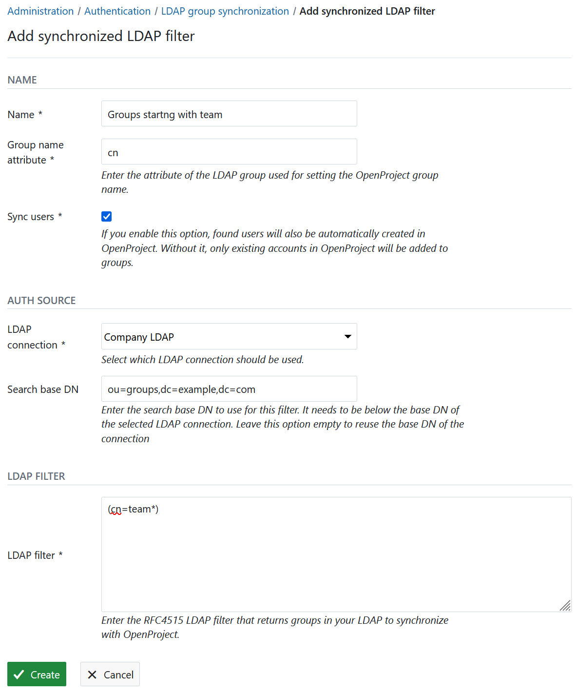
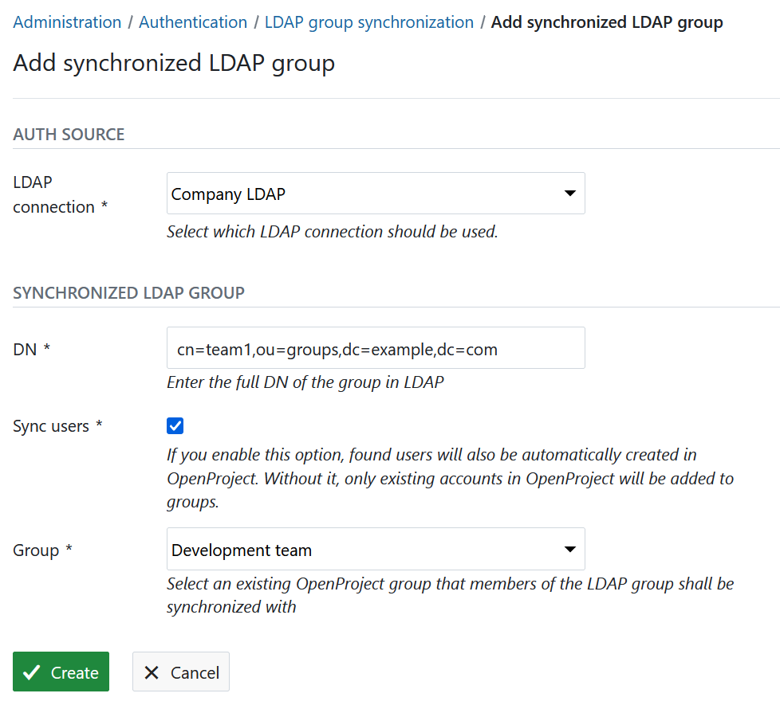

---
sidebar_navigation:
  title: LDAP group synchronization
  priority: 002
description: Synchronize LDAP groups.
keywords: synchronize ldap groups
---

# Synchronize LDAP and OpenProject groups (Enterprise add-on)

Note: This feature is available for the Enterprise on-premises only, for OpenProject versions 7.4+. For more information and differences to Community edition, [see this page](https://www.openproject.org/enterprise-edition/).

In OpenProject Enterprise on-premises, you can synchronize LDAP group memberships defined through the [groupOfNames](https://tools.ietf.org/html/rfc4519#section-3.5) LDAP object class. This guide assumes that you:

- have at least one group defined in OpenProject (See the “[Managing groups](../../../users-permissions/groups/)” guide for more information on how to create and edit groups),
- have set up your LDAP authentication source (See the “[Manage LDAP authentication](../../ldap-connections/)” guide)
- have at least one LDAP entry with a *groupOfNames* object class and members of that group to contain the *`memberOf: <DN of the group>`* attribute to determine the members of a group entry. Right now we do not support LDAP instances that only have *member* attributes, but not the inverse *memberOf* property.

> [!NOTE]
> OpenProject does not support other attributes other than the `memberOf` property to define groups. Please make sure that user objects have the `memberOf` property for the synchronization to work.

For the sake of simplicity, we assume that in this guide, your LDAP structure looks like the following:


You have two groups *cn=groupA,ou=groups,ou=example,ou=com and cn=groupB,ou=groups,ou=example,ou=com* with two and one users, respectively*.* Your base DN is *ou=people,ou=example,ou=com.*

## LDAP group synchronization

LDAP group synchronization augments the memberships defined by  administrators in an existing OpenProject group. Important things to  note are:

- Only existing groups and users in OpenProject can be synchronized. The functionality will not simply create all entries in the LDAP group  base nor will it synchronize users that do not exist in OpenProject.
- Group synchronization have to be enabled by an administrator by creating a *synchronized LDAP group* that ties the OpenProject group to an LDAP entry.
- Only synchronized memberships will be removed from the OpenProject group. If you want to add a user outside your LDAP authentication to an  OpenProject group, you can safely do so without the membership being  removed.

## Configure LDAP group synchronization filters

Instead of manually synchronizing groups from a given DN, you can also create filter objects that will query the LDAP not only for group members, but the groups themselves.

When the synchronization task is executed, the filter is being queried against the LDAP and resulting group objects will be created as synchronized groups *and* as OpenProject groups.



### Create a synchronized filter

To create a new synchronized filter, use the button on the top right of the index page. There, you will select your LDAP authentication source that should be queried. The following properties can be set:

- **Name:** Name of the LDAP filter, only for organizational purposes
- **Group name attribute:** The attribute used for naming the associated OpenProject groups.
- **Sync users:** Check this option if you want members of all synchronized groups this filter creates to be automatically created in OpenProject. When unchecked, only members of any group that also are existing users in OpenProject can be synchronized.
- **LDAP connection:** Select the LDAP connection you want this synchronized filter to use. Users created by group synchronization will be tied to that LDAP and may bind against it for authentication.
- **Search base DN:** (optional) Enter the base DN of the LDAP subtree you want to perform the search in. If you leave this unset, the base DN of the LDAP connection will be used instead. The DN specified here must contain the base DN of the LDAP connection to be valid.
- **LDAP filter:** The LDAP filter string to be used for identifying LDAP group entries to be synchronized with OpenProject.

Click on *Create* to finish the creation of the synchronized  filter. This filter is being executed hourly as part of the background job before the actual group synchronization runs.

> [!NOTE]
> If you manually create a synchronized group that is also found by a filter, its properties (such as the *Sync users* setting) is being overridden by the filter setting.

## Configure synchronized LDAP groups

In order to get to the LDAP group sync administration pane, expand the LDAP authentication menu item in your administration.

### Define group base and key settings

In order for the LDAP groups plugin to locate your group entries, you first need to set the *group key* to **cn** (the identifying attribute of the group entries) and *group base* to **ou=groups,ou=example,ou=com** as shown in the following screenshot.



### Create a synchronized group

To create a new synchronized group, use the button on the top right  of the page. There, you will select your LDAP authentication source that contains the group, as well as the existing OpenProject group that  members should be synchronized to. The following options can be set:

- **LDAP connection:** Select the LDAP connection you want this synchronized group to use. Users created by group synchronization will be tied to that LDAP and may bind against it for authentication.
- **DN:** Enter the full distinguished name (DN) of the group you want to synchronize. For example: `cn=team1,ou=groups,dc=example,dc=com`.
- **Sync users:** Check this option if you want members of this group to be automatically created in OpenProject. When unchecked, only members of the group that also are existing users in OpenProject can be synchronized.
- **Group:** Select an OpenProject group you want the members of the LDAP group to synchronize to.

Click on *Create* to finish the creation of the synchronized  group. The LDAP memberships of each user will be synchronized hourly  through a background job on your packaged installation. Changes and output will be logged to */var/log/openproject/cron-hourly.log*.

If you want to trigger the synchronization *manually* you can do so by running the respective rake task directly.
In the packaged installation, for instance, this would work like this:

```shell
sudo openproject run bundle exec rake ldap_groups:synchronize
```

This method of creating synchronized groups is well-suited for a small number of groups, or a very individual set of groups that you need to synchronize. It is very flexible by allowing individual groups to synchronize users into OpenProject.

If you need to synchronize a large number of groups that follow a common pattern, consider using the following filter functionality.

## FAQ

### Are nested / recursive LDAP groups supported?

No, at this point in time, nested LDAP groups (i.e., group DNs being memberOf of another group entry) are not supported in OpenProject.
However, there is a feature ticket for this in the wish list: https://community.openproject.org/projects/openproject/work_packages/34049

If you'd like to voice your interest in this feature, please comment it with your use-case to provide visibility.

## Troubleshooting

### LDAP groups are not being synchronized

Please double check the DN of the groups and the LDAP connection. The base DN of the LDAP connection and the DN must share a common hierarchy. Otherwise, the group DN will not be found by the connection, as the base DN is used for all subsequent queries for the lifetime of the connection.

### Users are not being synchronized

For users to be automatically synchronized, the following conditions need to be met:

1. The connection, or the LDAP group need to have "Sync users" checked. This setting overrides the LDAP connection's "Sync users" attribute for fine-grained control over which groups will have users synchronized.
2. The group needs to define their members using the `member` LDAP property, and users need to have the `memberOf` property or virtual property. OpenProject will look for users with the following filter: `(memberOf=<DN of the group>).` You can use `ldapsearch` to verify that this works as expected.
3. The users defined in the groups need to have all required attributes present to be created. These are at *login, email, first and last name*. If any of these attributes are missing, the user cannot be saved to the database.
4. If you enterprise license exceeds the user limit, new users can also not be synchronized through LDAP. A corresponding log entry will be logged.
