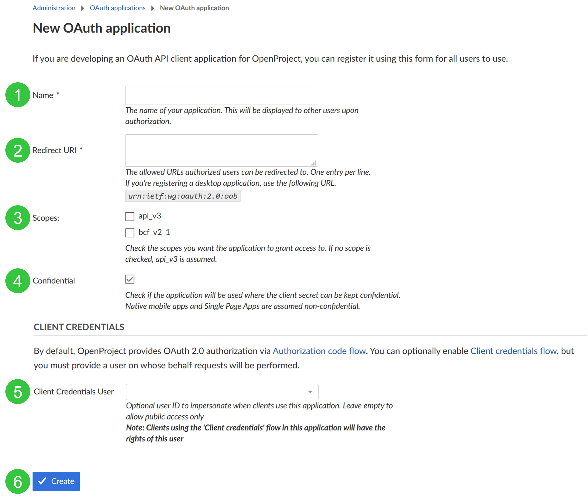

---
sidebar_navigation:
  title: OAuth applications
  priority: 900
description: OAuth application settings in OpenProject.
robots: index, follow
keywords: OAuth application settings
---
# OAuth applications

To activate and configure OAuth applications, navigate to -> *Administration* -> *Authentication* -> *OAuth applications*.

## Add a new authentication application for OAuth

To add a new OAuth application, click the green **+ Add** button.


You can configure the following options to add your OAuth application.

1. Enter the **name** of your OAuth application.
2. **Define redirect URLs** where authorized users can be redirected to.
3. Set the **scope** that the OAuth application will have access to. Choose the API you want to grant access to. Multiple selection is possible. If no scope is checked, per default **api_v3** is assumed.
4. Check if the application will be used **confidentially**.
5. (Optional) Choose **client credential flows** and define a user on whose behalf requests will be performed.
6. Press the blue **Create** button to add your OAuth application.



Don't forget to note down your `Client ID` and your `Client secret` in a safe space. You will need it later.

## OAuth endpoints

The authentication endpoints are at

* Auth URL: `https://example.com/oauth/authorize`
* Access Token URL: `https://example.com/oauth/token`

## **Authorization code flow** example

### Requesting authorization code

Request an authorization code. Please adopt the following URL replacing 

 * the `example.com` with the root path of your OpenProject instance,
 * `<Client ID>` with your client ID, and
 * `<Redirect URI>` with the redirect URI just as you configured it above.
 * You can leave the `scope` value untouched unless you are running the OpenProject BIM edition and also plan to access to the BCF version 2.1 REST API. Then simply replace `api_v3` with `api_v3%20bcf_v2_1`.

`https://example.com/oauth/authorize?response_type=code&client_id=<Client ID>&redirect_uri=<Redirect URI>&scope=api_v3&prompt=consent`

That requests redirects you to a URL that holds a `code` parameter which is the authentication code.

Typically the server that was requested with that redirect will save the authorization code and use it
to obtain an API token, with which the server can then act on behalf of the current user. 

In this example we skip that server side implementation and just copy the value of the `code` parameter from the URL that you see in your browser.

### Requesting API token

With the authorization code that you obtained above you can now request an API token.

We do this manually in the command line using cURL. Please replace

 * the `example.com` with the root path of your OpenProject instance,
 * `<Client ID>` with your client ID,
 * `<Client secret>` with your client secret,
 * `<Authentication code>` with the code you obtained above,
 * and `<Redirect URI>` with the redirect URI just as you configured it above.

```
$ curl --request POST \
  --url 'https://example.com/oauth/token' \
  --header 'content-type: application/x-www-form-urlencoded' \
  --data grant_type=authorization_code \
  --data client_id=<Client ID> \
  --data client_secret=<Client secret> \
  --data code=<Authentication code> \
  --data 'redirect_uri=<Redirect URI>'
```

The response will contain the token that you need when working with the API. Please copy the token.

### Performing a request to the OpenProject API with OAuth token

With the token that you obtained above you can now make API calls to the OpenProject instance 
on behalf of the current user.

For example, the following cURL command fetches all projects from the API V3. Please replace
                                                                  
 * the `example.com` with the root path of your OpenProject instance, and
 * `<Token>` with the code you obtained above.

`$ curl --request GET 'https://example.com/api/v3/projects' \
  --header 'Authorization: Bearer <Token>'`

## Using Postman with OAuth?

Set redirect URLs to `urn:ietf:wg:oauth:2.0:oob` in both, for your application (see step 2 above) and 
within Postman.

In Postman the configuration should look like this (Replace `{{protocolHostPort}}` with your host, 
i.e. `https://example.com`)


## CORS headers

By default, the OpenProject API is _not_ responding with any CORS headers.
If you want to allow cross-domain AJAX calls against your OpenProject instance, you need to enable CORS headers being returned.

Please see [our API settings documentation](../../../system-admin-guide/system-settings/api-settings/) on
how to selectively enable CORS.
