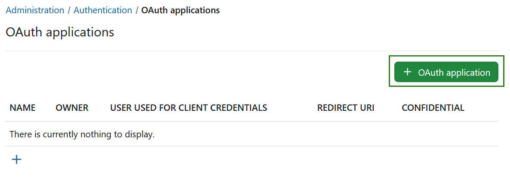
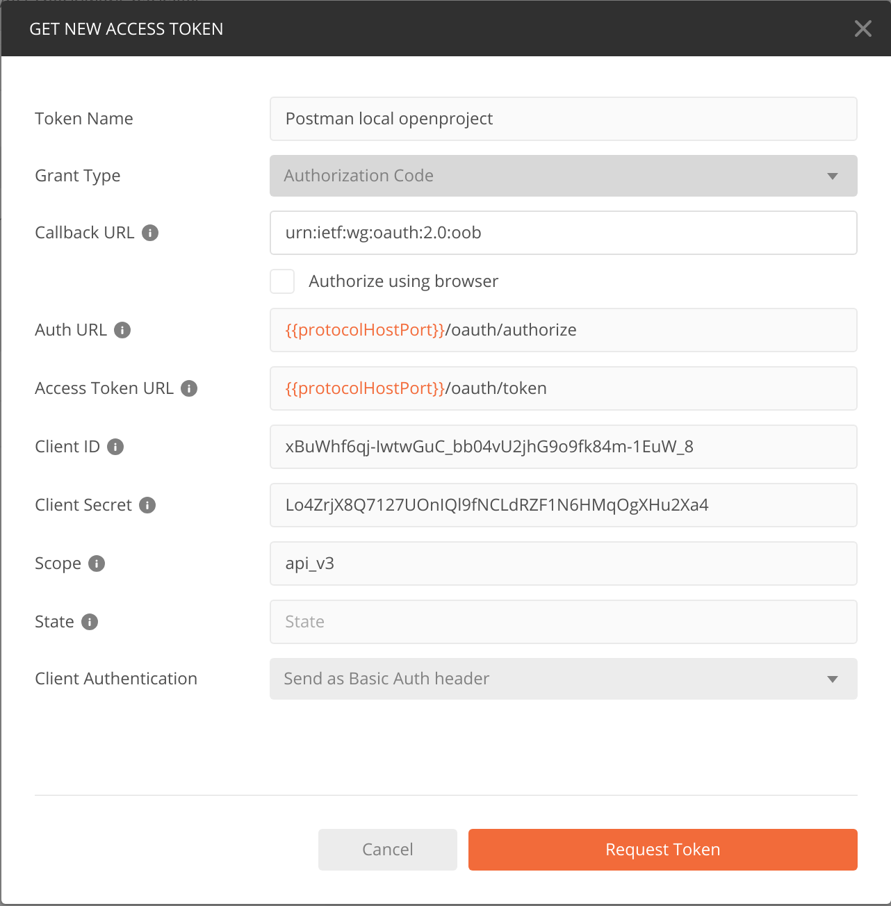

---
sidebar_navigation:
  title: OAuth applications
  priority: 900
description: OAuth application settings in OpenProject.
keywords: OAuth application settings
---
# OAuth applications

To configure OpenProject to act as a server to an OAuth client applications, please navigate to *Administration* -> *Authentication* -> *OAuth applications*.

## Add a new authentication application for OAuth

To add a new OAuth application, click the green **+ OAuth application** button.



You can configure the following options to add your OAuth application:

1. Enter the **Name** of your OAuth application.
2. Define a **Redirect URL** where users are redirected to
   after having authorized OAuth2 access in OpenProject.
   This URL is provided by your client application.
   In the case of locally running Postman you can use the special string:
   `urn:ietf:wg:oauth:2.0:oob`
   Postman 9.6 and higher also provides a Web URL that you can use:
   `https://oauth.pstmn.io/v1/callback`.
3. Set the **Scopes** that the OAuth client application will be
   able to access. Multiple selection is possible.
   If no scope is checked, per default **api_v3** is assumed.
   api_v3 is the standard OpenProject API, while
   [bcf_v2_1](../../../api/bcf-rest-api) is specific to the BIM edition of
   OpenProject.
4. Check if the application will be **Confidential**.
   This is typically the case for client applications
   running on a server or desktop but requires the
   client application to ensure it.
5. (Optional) Choose **Client Credentials User** and define a
   user on whose behalf requests will be performed.
6. Press **Create** to add your OAuth application.


> [!TIP]
> Don't forget to note down your `Client ID` and your `Client secret`
in a safe space. You will need them later.

## OAuth endpoints

The authentication endpoints of OpenProject OAuth2 server are:

* Auth URL: `https://example.com/oauth/authorize`
* Access Token URL: `https://example.com/oauth/token`

## *Authorization code flow* example

### Request authorization code

Request an authorization code. Please adopt the following URL replacing:

* `example.com` with the IP/host name of your OpenProject instance,
* `<Client ID>` with your OAuth2 client ID, and
* `<Redirect URI>` with the redirect URI as configured above.
* You can leave the `scope` value untouched unless you are running the OpenProject BIM edition and also plan to access to the BCF version 2.1 REST API. Then simply replace `api_v3` with `api_v3%20bcf_v2_1`.

`https://example.com/oauth/authorize?response_type=code&client_id=<Client ID>&redirect_uri=<Redirect URI>&scope=api_v3&prompt=consent`

This requests redirects you to a URL that holds a `code` parameter
which is the authentication code.

Typically the server that was requested with that redirect will save
the authorization code and use it to obtain API token, with which
the server can then act on behalf of the current user.

In this example we skip that server side implementation and just
copy the value of the `code` parameter from the URL that you see
in your browser.

### Request API token

With the authorization code that you obtained above you can now
request an API token.

We do this manually in the command line using cURL. Please replace:

* `example.com` with the IP/host name of your OpenProject instance,
* `<Client ID>` with your OAuth2 client ID,
* `<Client secret>` with your OAuth2 client secret,
* `<Authentication code>` with the code you obtained above,
* and `<Redirect URI>` with the redirect URI as configured above.

```shell
$ curl --request POST \
  --url 'https://example.com/oauth/token' \
  --header 'content-type: application/x-www-form-urlencoded' \
  --data grant_type=authorization_code \
  --data client_id=<Client ID> \
  --data client_secret=<Client secret> \
  --data code=<Authentication code> \
  --data 'redirect_uri=<Redirect URI>'
```

The response will look like this:

```json
{
  "access_token": "Ize6vvCIeENQ_suzd9kBJ6BxDNpxcumfTfweZQaOoJc",
  "token_type": "Bearer",
  "expires_in": 7200,
  "refresh_token": "kDQ5pxzOE_4kCSKzONZaI1ogcyjcXk97_KhBS0JfCw4",
  "scope": "api_v3",
  "created_at": 1652112852
}
```

The response contains the bearer token ("access_token") and a refresh token that you will need when working with the API.
Please copy the tokens for reference.

### Perform a request to the OpenProject API with OAuth token

With the token that you obtained above you can now make API calls to the OpenProject instance on behalf of the current user.

For example, the following cURL command fetches all projects from the API V3. Please replace:

* `example.com` with the IP/host name of your OpenProject instance, and
* `<Token>` with the bearer token you obtained above.

```shell
$ curl --request GET 'https://example.com/api/v3/projects' \
  --header 'Authorization: Bearer <Token>'`
```

## Using Postman with OAuth2

You can exercise the authentication flow above using Postman.
Just create a new request:

```text
GET {{protocolHostPort}}/api/v3/projects
```

with {{protocolHostPort}} corresponding to your server and port,
for example `http://localhost:3000`. Then go to the
Authorization tab and select **Type**: OAuth2 2.0. On the right
side you will see a form similar to the one below.
Please fill in your specific Client ID and Client Secret from above.



Clicking on "Request Token" will initiate the same flow as above
and complete with a success screen. Please click on "Use Token"
to use this token for authenticating your `/api/v3/projects` request.

Please note that your Bearer token will expire after two hours (default)
and you will have to click on "Request Token" again. Otherwise your
API request will return an error message.

## CORS headers

By default, the OpenProject API is _not_ responding with any CORS headers.
If you want to allow cross-domain AJAX calls against your OpenProject instance, you need to enable CORS headers being returned.

Please see [our API settings documentation](../../../system-admin-guide/api-and-webhooks/) on
how to selectively enable CORS.
