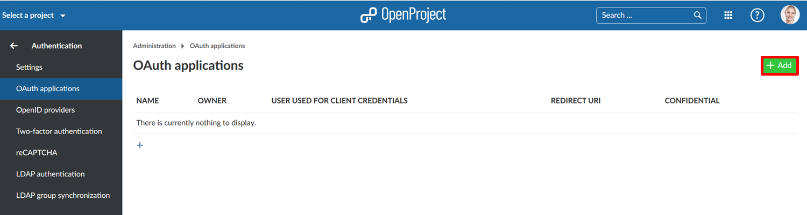
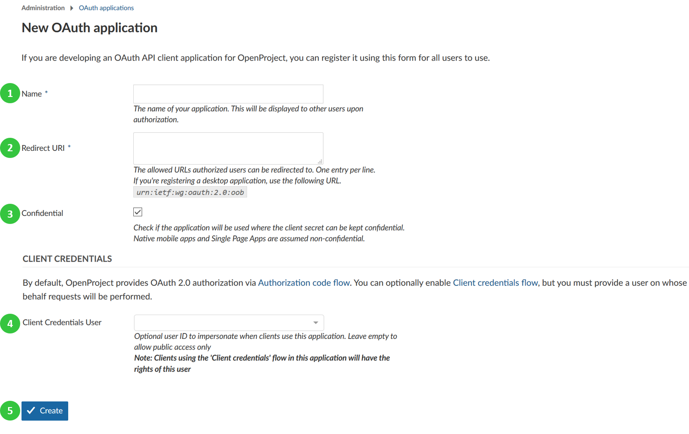

---
sidebar_navigation:
  title: OAuth applications
  priority: 900
description: OAuth application settings in OpenProject.
robots: index, follow
keywords: OAuth application settings
---
# OAuth applications

To activate and configure oauth applications, navigate to -> *Administration* -> *Authentication* and choose -> *Oauth applications*.

## Add a new authentication application for oauth

To add a new oauth application, click the green **+ Add** button.

You can configure the following options to add your oauth application.

1. Enter the **name** of your oauth application.
2. **Define redirect URLs** where authorized users can be redirected to.
3. Check if the application will be used **confidentially**.
4. Choose **client credential flows** and define a user on whose behalf requests will be performed.
5. Press the blue **Create** button to add your oauth application.

## Oauth endpoints

The authentication endpoints are at

* Auth URL: `https://example.com/oauth/authorize`
* Access Token URL: `https://example.com/oauth/token`

## Using Postman with oauth?

Set redirect URLs to `urn:ietf:wg:oauth:2.0:oob` in both, for your application (see step 2 above) and 
within Postman.

In Postman the configuration should look like this (Replace `{{protocolHostPort}}` with your host, 
i.e. `https://example.com`)

