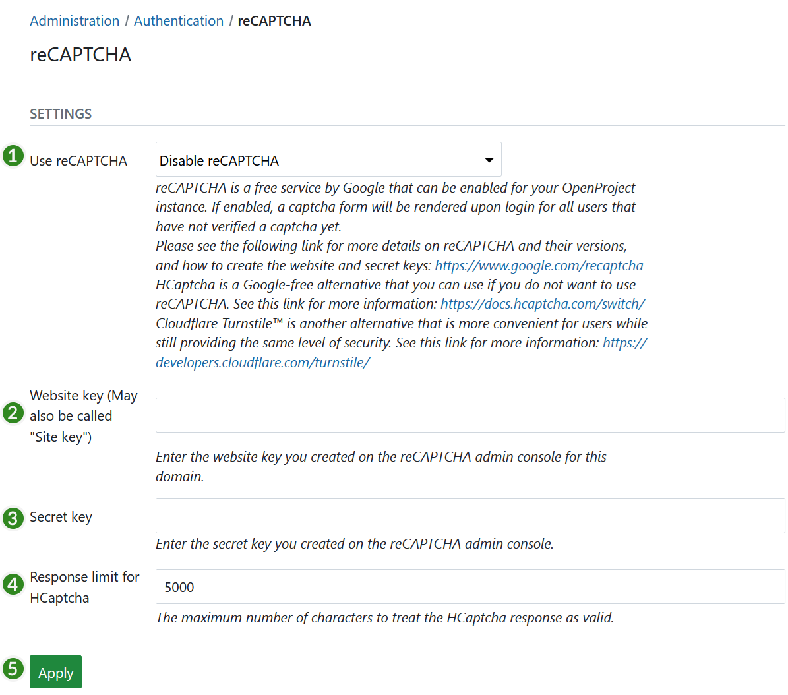

---
sidebar_navigation:
  title: reCAPTCHA
  priority: 600
description: configure reCAPTCHA for OpenProject.
keywords: reCAPTCHA
---
# reCAPTCHA configuration

To activate and **configure reCAPTCHA** for OpenProject, navigate to *Administration* -> *Authentication* and choose -> *reCAPTCHA.*

 If enabled, a captcha form will be rendered upon login for all users that have not verified a captcha yet. Please see the following link for more details on reCAPTCHA and their versions, and how to create the website and secret keys: [https://www.google.com/recaptcha](https://www.google.com/recaptcha).

You can configure the following options:

1. Activate reCAPTCHA for OpenProject. You can choose between reCAPTCHA v2 and reCAPTCHA v3.
2. Insert the **website key**.
3. Insert the **secret key**.
4. Enter the **response limit for HCaptcha**. 
5. Press the **Apply** button to save your changes.

# Cloudflare Turnstile configuration

To use Cloudflare Turnstile with OpenProject, you need to configure the reCAPTCHA settings in the Cloudflare dashboard. Please see the following link for more details on Cloudflare Turnstile and how to configure it: [https://developers.cloudflare.com/turnstile/](https://developers.cloudflare.com/turnstile/).

Once you created a sitekey and secret key in the Cloudflare dashboard, you can configure OpenProject to use these keys.

1. Select "Turnstile" in the reCAPTCHA admin settings.
2. Insert the **website key**.
3. Insert the **secret key**.
4. Press the **Apply** button to save your changes.
