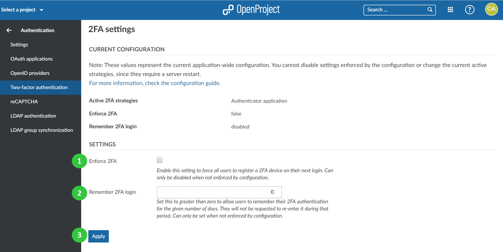

---
sidebar_navigation:
  title: Two-factor authentication
  priority: 700
description: configure two-factor authentication for OpenProject.
robots: index, follow
keywords: two-factor authentication
---
# Two-factor authentication (Premium feature)

To activate and **configure two-factor authentication** for OpenProject, navigate to -> *Administration* -> *Authentication* and choose -> *two-factor authentication*.

You can configure the following options:

1. **Enforce two-factor authentication (2FA) for the whole system**. All users will be forced to [register a 2FA device](../../../getting-started/my-account/#two-factor-authentication-premium-feature) on their next login.
2. **Remember 2FA login for a given number of days**, e.g. 30 days.
3. Press the blue **Apply** button to save your changes.

