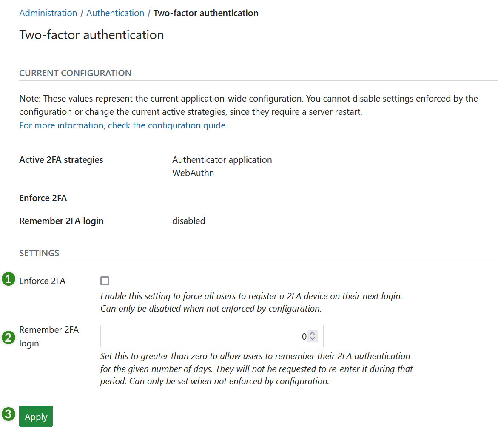

---
sidebar_navigation:
  title: Two-factor authentication
  priority: 700
description: configure two-factor authentication for OpenProject.
keywords: two-factor authentication
---
# Two-factor authentication (2FA)

## Basic 2FA using TOTP

To activate and **configure two-factor authentication** for OpenProject, navigate to *Administration* -> *Authentication* and choose -> *two-factor authentication*.

From the GUI you are able to configure the following options:

1. **Enforce 2FA** (two-factor authentication) for every user. All users will be forced to [register a 2FA device](../../../user-guide/my-account/#two-factor-authentication) on their next login.
2. **Remember 2FA login** for a given number of days, e.g. 30 days.
3. Press the **Apply** button to save your changes.

> [!NOTE]
> These options will not be shown in the administration if 2FA settings are configured through [environment variables](../../../installation-and-operations/configuration/environment/).

Usually with another device device like a mobile phone or a tablet, you are able to use a TOTP Application in order to generate the token that is needed as an extra layer of security on top of your password. Here are some applications that work for OpenProject 2FA.

- Open Source andOTP (Android Device) in the [Play Store](https://play.google.com/store/apps/details?id=org.shadowice.flocke.andotp&gl=US)

- Open Source OTP Auth (Apple Devices) in the [Apple Store](https://apps.apple.com/us/app/otp-auth/id659877384)

- Google Authenticator
- Microsoft Authenticator

### Clock skew

TOTP operates on the principal that the second factor and the server handling the authentication process are roughly in sync.
By default, the allowed clock skew (difference in seconds between client and server) is 30 seconds, which means that the server will accept time shifts of 30 seconds in the past and future, respectively.

If you are trying to register a new device and keep getting failures even though the code appears correct,
time drift between the device and the server is most likely the reason for it.

## Basic 2FA using WebAuthn

[WebAuthn](https://www.w3.org/TR/2019/REC-webauthn-1-20190304/) is a W3C standard for authentication on the web. It uses private-public key cryptography to verify the users identity. The private key is either secured on a hardware token or within the browser or a password manager.

WebAuthn is supported by most modern browsers and is therefore enabled by default in OpenProject when 2FA is enabled.

## Advanced 2FA using MessageBird, Amazon SNS

At the moment the advanced settings for improved security are only reachable by defining [configuration variables](../../../installation-and-operations/configuration/).

Those methods are explained in the [Two-factor authentication](../../../installation-and-operations/configuration/#two-factor-authentication) paragraph.
