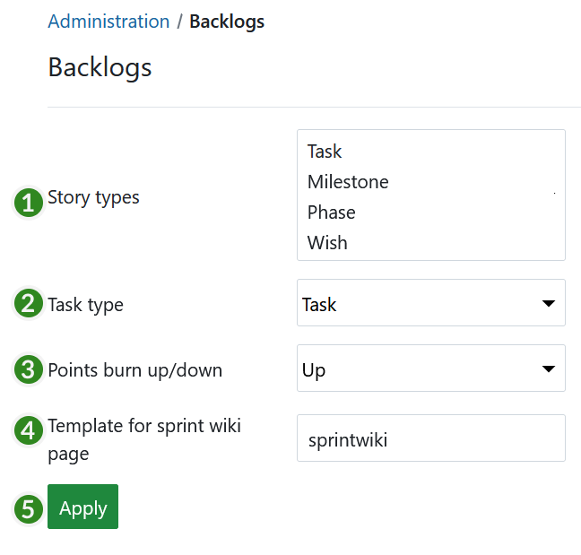

---
sidebar_navigation:
  title: Backlogs
  priority: 840
description: Configure backlogs in OpenProject.
keywords: configure backlogs, backlogs settings
---
# Backlogs configuration

Configure your backlogs settings in OpenProject.

Navigate to *Administration* -> *Backlogs* to set up your backlogs.

You can configure the following in the backlogs settings:

1. Set the work package types which should be used as **story types**. Hold Ctrl (or Cmd on Mac) to choose several types. The story types will appear in the Backlogs view (product backlog, wish list, sprint) and can be created, prioritized directly in the Backlogs view, e.g. EPIC, FEATURE, BUG.
2. Set the **task type**. The task type will appear in the task board to manage in your daily stand ups.
   Please note: You can't use a work package type as story type *and* as task type.
3. Define to show **burn-down** or **burn-up** **chart**.
4. Set a template for **sprint wiki page**. If you create a wiki page with this name, e.g. sprintwiki, you will set up a new wiki page based on this template if you open it via the sprint drop-down menu in the backlogs view. This way, you can easily create templates for sprint review meetings or retrospectives.
5. Press the **Apply** button to save your changes.

