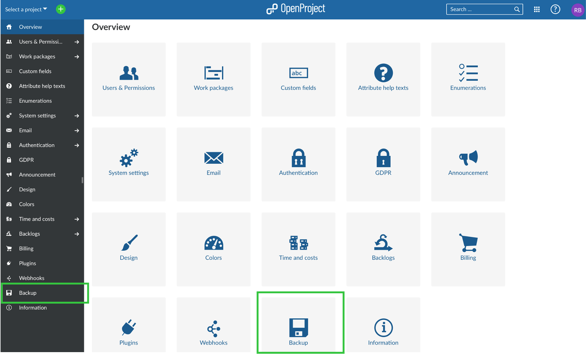
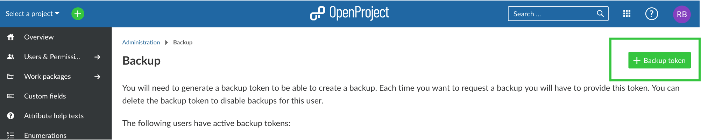

---
sidebar_navigation:
  title: Backup
  priority: 790
description: Backing up OpenProject.
keywords: system backup
---
# Backup

## Preparation for Backup

Unless disabled via the [configuration](../../installation-and-operations/configuration/#backup-enabled) users can make backups of the OpenProject installation from within the administration area. They either need to be an administrator or have the global permission to do so.

You can yourself create backups of your OpenProject installation. Go to *Administration* and *Backup* to get started.



To be able to create a backup, a so called _backup token_ has to be generated first. This is supposed to add another level of security since backing up the whole installation includes sensitive data.

You will then need to create a backup token by clicking **+ Backup token**.



You will be asked to confirm your password when you try to generate or reset a token. The _backup token_ will only be displayed once after it has been generated. Make sure you store it in a safe place.

The system generates the token which you then fill in where requested in the field below. Then you can press the **Request backup** button


Each time you request a backup this token has to be provided. This also applies when requesting a backup via the API where on top of the API token the _backup token_ will have to be provided as well.


## Notifications

Each time a _backup token_ is created or reset an email notification will be sent to all administrators take make everyone aware that there is a new user with access to backups.

After having requested the backup, you will receive an email notification with a link to download your backup. For this, you will need additional authentication (username and password as well as 2-Factor-Authentication if activated) to download the backup files.

## Delayed reset

*Note: this is only valid for on-premises installations*

If the user resetting (or creating) a backup token does not have a password, for instance because they
authenticate using Google, the newly generated backup token will only be valid after an initial waiting period.
This is to make sure that no unauthorised user can get their hands on a backup even when accessing
a logged-in user's desktop.

As a system administrator you can skip this period by running the following rake task on the server's terminal:

```
sudo openproject run rake backup:allow_now
```

__In a docker setup you can open a terminal on any of the web or worker processes and run the rake task there.__

## Pull a backup via APIv3

It is sometimes good to have backups on other locations (e.g. local vs cloud). You are able to pull a backup via the APIv3 in OpenProject.

*Preconditions:*

1. The Token must be already generated and stored in a secure keystore
2. The API Key must be known and stored in a secure keystore

You could use our [example bash script](./script/backup-via-apiv3.sh) and integrate it in your crond for running it daily.

## Troubleshooting

In case you have trouble creating your backup, please [get in touch](mailto:support@openproject.com) with us. We can then provide a current or past backup (database + attachments) to you. This way you can also get your data if you decide to stop using the Enterprise cloud edition.
