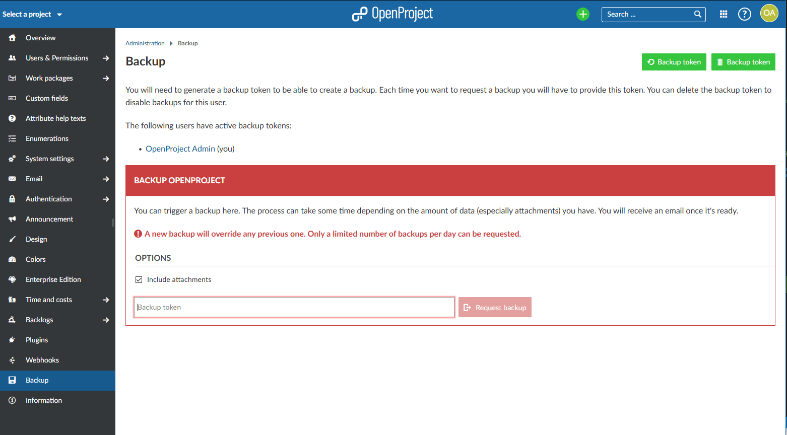

---
sidebar_navigation:
  title: Backup
  priority: 501
description: Backing up OpenProject.
robots: index, follow
keywords: system backup
---
# Backup

Unless disabled via the [configuration](../../installation-and-operations/configuration/#backup-enabled)
users can make backups of the OpenProject installation from within the administration area.
They either need to be an administrator or have the global permission to do so.



## Backup token

To be able to create a backup, a so called _backup token_ has to be generated first.
This is supposed to add another level of security since backing up the whole installation
includes sensitive data.

You will be asked to confirm your password when you try to generate or reset a token.
The _backup token_ will only be displayed once after it has been generated.
Make sure you store it in a safe place.

Each time you request a backup this token has to be provided.
This also applies when requesting a backup via the API where on top of the API token
the _backup token_ will have to be provided as well.

## Delayed reset

If the user resetting (or creating) a backup token does not have a password, for instance because they
authenticate using Google, the newly generated backup token will only be valid after an initial waiting period.
This is to make sure that no unauthorised user can get their hands on a backup even when accessing
a logged-in user's desktop.

As a system administrator you can skip this period by running the following rake task on the server's terminal:

```
sudo openproject run rake backup:allow_now
```

__In a docker setup you can open a terminal on any of the web or worker processes and run the rake task there.__

## Notifications

Each time a _backup token_ is created or reset an email notification will be sent to all administrators
take make everyone aware that there is a new user with access to backups.
