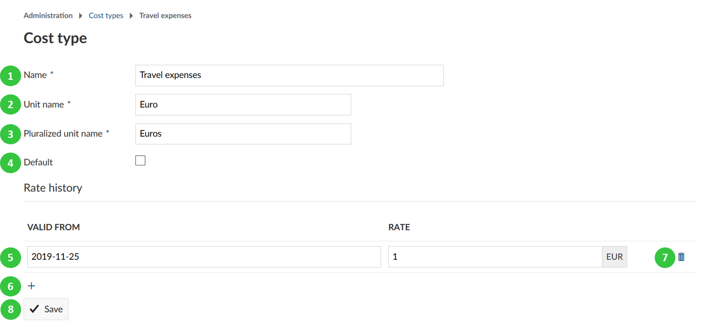

---
sidebar_navigation:
  title: Budgets
  priority: 680
description: Define budgets in OpenProject.
robots: index, follow
keywords: budgets
---
# Budgets

You can configure costs in OpenProject and create cost types to track unit costs.

Navigate to -> *Administration* -> *Budgets*.

## Settings

Navigate to -> *Administration* -> *Budgets* -> *Settings* to define settings for OpenProject costs.

1. Configure the **currency used in the system, e.g. EUR**.
2. **Specify the format of the currency**, if the number should be before or after the currency, e.g. 10 EUR, or $ 10.
3. Press the blue **Apply** button to save your changes.

## Create and manage cost types

You can create and manage **cost types** to [book unit costs to work packages in OpenProject](../../user-guide/time-and-costs/cost-tracking/).

Navigate to -> *Administration* -> *Budgets* -> *Cost types* to create and manage unit costs types.

Click the green **+ Cost type** button to create a new cost type.

You can set the following options:

1. Give the cost type a **name**.
2. Define the **unit name** for this cost type, e.g. Euro, piece, day, etc.
3. Set the **pluralized unit name**, e.g. Euros, pieces, days, etc.
4. Choose if the cost type should be the **default cost type** when booking new unit costs.
5. Define the Rate history and **set a date** from which this cost type should be valid and **set a rate** (in the specified unit) for this date.
6. With the + icon you can add **additional rates for other dates**.
7. The delete icon will **remove a rate** for a certain date.
8. Do not forget to **save** your changes.

In the overview list of all rates you can define the following.

1. **Filter for cost types at a certain fixed date** in the list, 2. choose whether also locked cost types should be displayed and 3. press the blue apply button: This way you will get the cost types with the rate (at the chosen fixed date) displayed in the list below.

4. Click on the name of a cost type to **edit an existing cost type**.
5. **Set a current rate** (for the current valid from period) and press the save icon to apply it.
6. **Lock** a cost type.

**Note**: With cost types you can also book any kind of units to work packages, e.g. vacation days, leaves, travel days, etc.. Just choose 1 as a unit. This way, you could e.g. track vacation days against a vacation budget and evaluate the days in the [cost reporting](../../user-guide/time-and-costs/reporting/).

