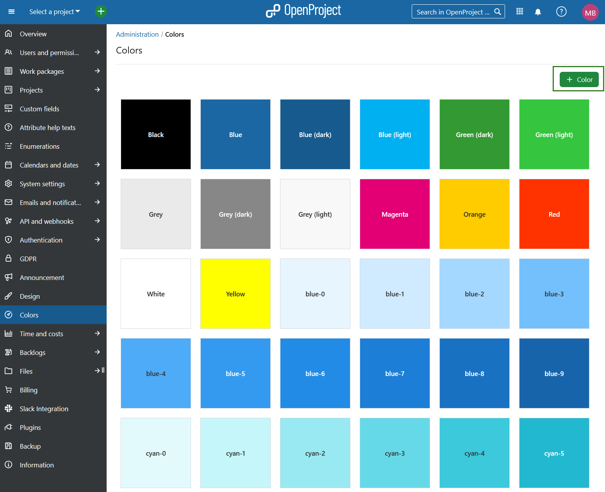
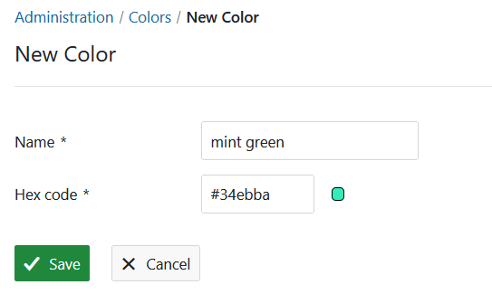

---
sidebar_navigation:
  title: Colors
  priority: 860
description: Set colors in OpenProject.
keywords: colors
---
# Colors

To define a set of colors in OpenProject, navigate to *Administration* -> *Colors*.

You can configure a set of predefined colors in OpenProject which you can choose for e.g. [set colors for work package types](../manage-work-packages/work-package-types/) or attribute highlighting, e.g. for [status](../manage-work-packages/work-package-status/).

## Define a new color in OpenProject

To add a new color, press the green **+ Color** button at the top right.

1. Add a **name** for your new color.
2. Enter the **hexcode** for your new color.
3. Press the **Save** button.

