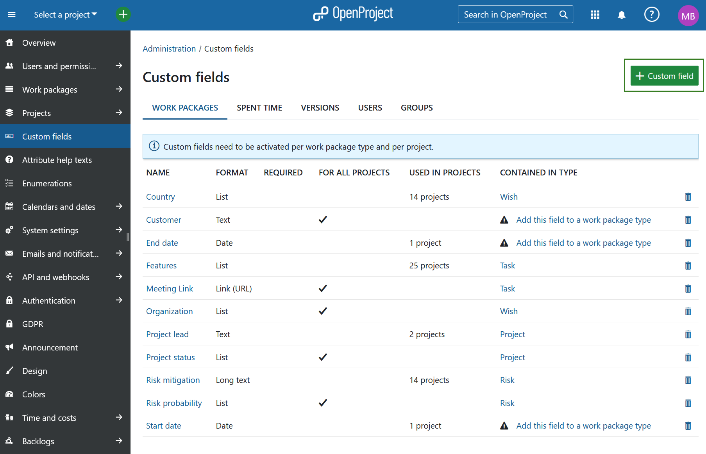
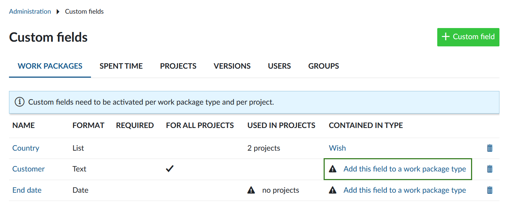
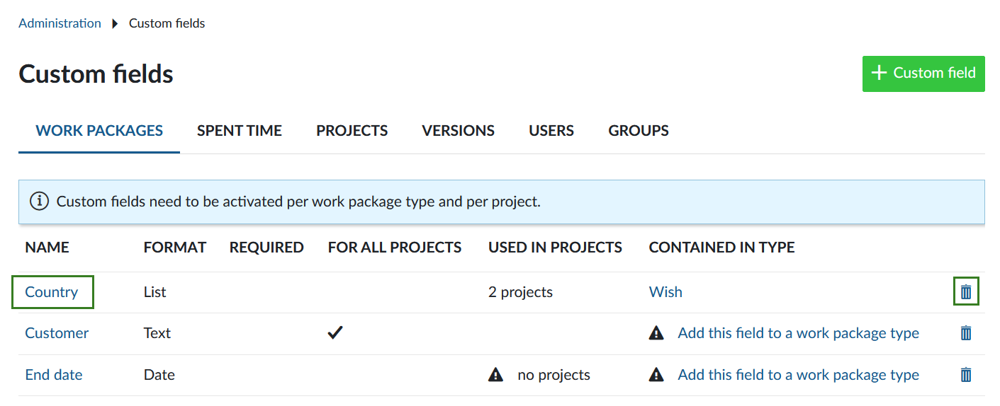
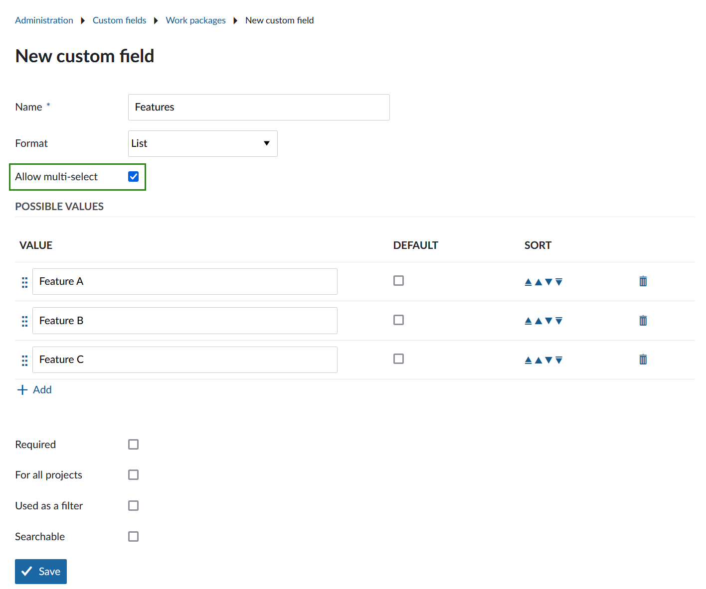
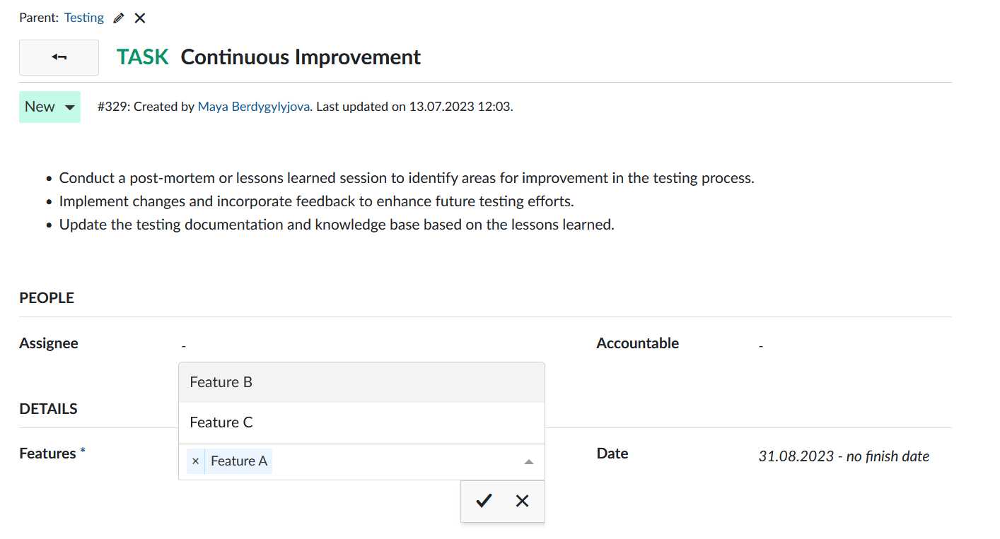

---
sidebar_navigation:
  title: Custom fields
  priority: 960
description: Manage custom fields in OpenProject.
keywords: manage custom fields
---
# Manage custom fields

You can **create additional custom fields for different sections**, e.g. work packages, projects, users or groups in OpenProject.

Custom fields enable to configure your OpenProject exactly to your needs, i.e. to adapt work package forms to your company specific requirements.

<video src="https://openproject-docs.s3.eu-central-1.amazonaws.com/videos/OpenProject-Forms-and-Custom-Fields-1.mp4" type="video/mp4" controls="" style="width:100%"></video>

## Add a new custom field

To **create a new custom field** navigate to *Administration* -> *Custom fields* and select the section for which you will create a new custom field, e.g. for work packages.

You will see the list of all the custom fields that have been created so far, divided by the section on the different tabs for which they were created.

If none have been created so far, click on the link **Create a new custom field** in the respective section, e.g. on the tab for work packages.

Depending on the module, for which the new custom field is being  created, slightly different options may be offered. This is an example of a new custom field for a work package.

1. Custom field **Name**, which will appear as the attribute name on the work package form.
2. Choose a **Format** of the custom field, e.g. text, list, date, boolean. You can choose between the following formats for custom fields:

3. Specify the **minimal and maximal length**. If a 0 is chosen, no restriction will be imposed on the length of the custom field.
4. **Regular expression** specifying which values are allowed for the custom field.
5. **Default value** will be used as a default value for the custom field.
6. Set if the new custom field should be a **required** field.
7. Specify if the new custom field should be **used for all projects**. This means the custom field will be active for all projects and does not need to be activated separately per project.
8. Specify if the new custom field should be **used as a filter for work packages**. See [here](../../user-guide/work-packages/work-package-table-configuration/#filter-work-packages) how to filter work packages.
9. Specify if the new custom field should be **searchable** via the global search.
10. **Save** the new custom field.

## Assign a custom field to a work package type and project

> [!IMPORTANT]
>
> Custom fields need to be activated per work package type and per project. Work package custom fields are only visible when two conditions are met:
>
> 1. Custom field has been added to the work package type (form configuration).
> 2. Custom field is activated for the project.

1. [Assign a custom field to a work package type](../manage-work-packages/work-package-types/#work-package-form-configuration-enterprise-add-on) (Form configuration). You can do this directly via the link in the custom field overview.

2. Activate the custom field for a project in the [project settings](../../user-guide/projects/project-settings/custom-fields/). This is not relevant if the setting **For all projects** has been configured for the custom field.

With these additional settings, you have absolute freedom which custom fields are relevant for your projects and types. You can customize only those types that are relevant and create a whole set of custom attributes for your work packages.

## Edit or remove a custom field

To **edit an existing custom field** select the appropriate tab and click on the custom field name.

To **delete** a custom field, click on the delete icon next to the respective custom field in the list.

## Create a multi-select custom field

For work package custom fields of type **List** and **User** you may also select **multi-select custom fields** to select more than one value at once.

To create a multi-select custom field follow the same steps as you would when [creating a standard custom field](#add-a-new-custom-field). Select format **List, User or Version** and check the option *Allow multi-select*.

When using multi-select custom fields, you can add as many options as required. The cross icon next to an option will remove it from the selection. The check mark will save your changes.

