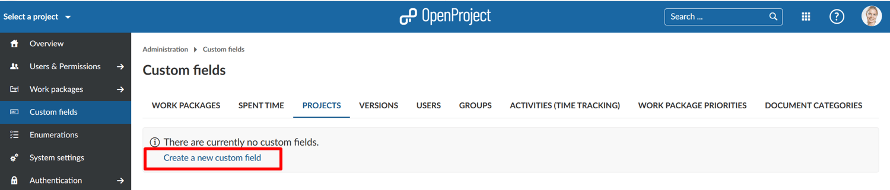
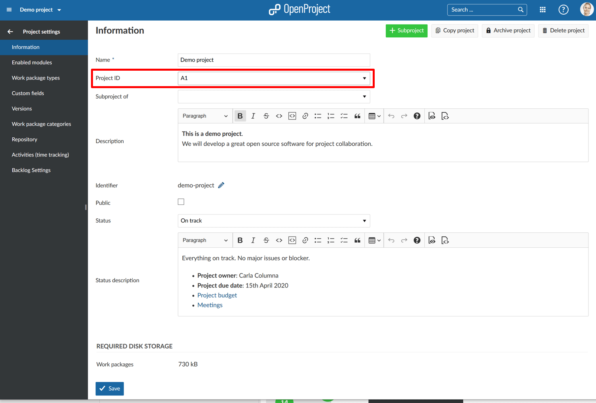
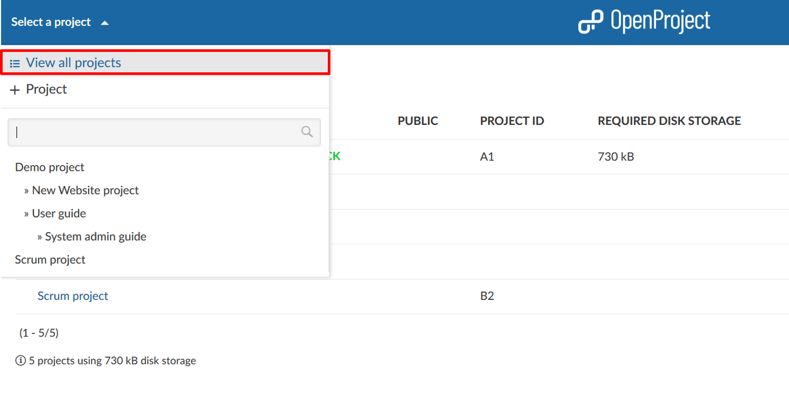
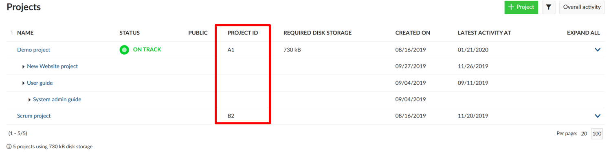

---
sidebar_navigation:
  title: Custom fields for projects
  priority: 700
description: Custom fields for projects.
robots: index, follow
keywords: custom fields for projects
---
# Display custom fields in the project list (Premium feature)

As a user of the [OpenProject Enterprise Edition](https://www.openproject.org/enterprise-edition/) or [Cloud Edition](https://www.openproject.org/hosting/) you can customize the work package list and show additional project information by adding custom fields to the project list, e.g. adding accountable, project due date, progress, and more.

## Creating a custom field for projects

To create a new custom field for projects, navigate to -> *Administration* -> *Custom fields* and select the tab **Project**. 
Click on the link **Create a new custom field** to create a project custom field.

1. In the newly opened create form provide a **name** to display in the project list (e.g. Project  accountable).
2. Choose a **format** (e.g. List) for the custom field, e.g. list.
3. **Enter the possible values** which can be selected (for a list). This is not relevant if you choose e.g. Text format.
4. Define if the custom field should be **required**.
5. If you check **visible** it will also be visible for all users (non Admins) in the project overview and displayed in the project details widget on the [Project Overview](../../../user-guide/project-overview/).
6. Define if the custom field for projects should be **searchable**.
7. Click **Save** to create the custom field.

## Setting and displaying a project custom field

Once you created the custom field you can set it in the [project settings](../../../user-guide/projects/project-settings/).

To do this navigate to a project and select *Project settings* from the side menu. The project custom field is visible under *Information*. As a project manager you can set the project custom field.

If you selected Visible in the custom fields settings, the custom field for projects is also available in the view all projects overview.

Navigate to the project list by selecting *View all projects* from the project selection menu in the top left side.

In the list of all projects you will see the project custom field displayed as a column in the  project list. Therefore, you can easily communicate project information  across multiple projects.

Furthermore, the project custom field will also be displayed in the Project details widget on the [project overview page](../../../user-guide/project-overview/).