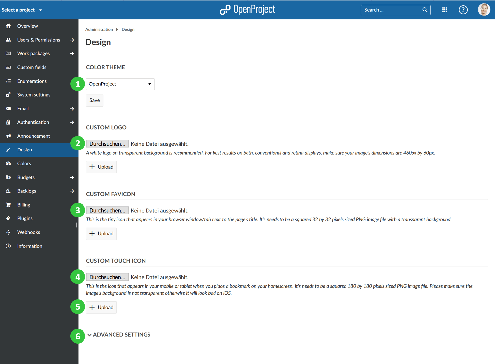
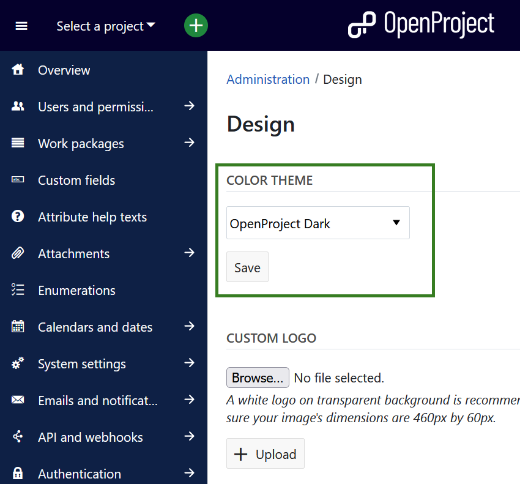
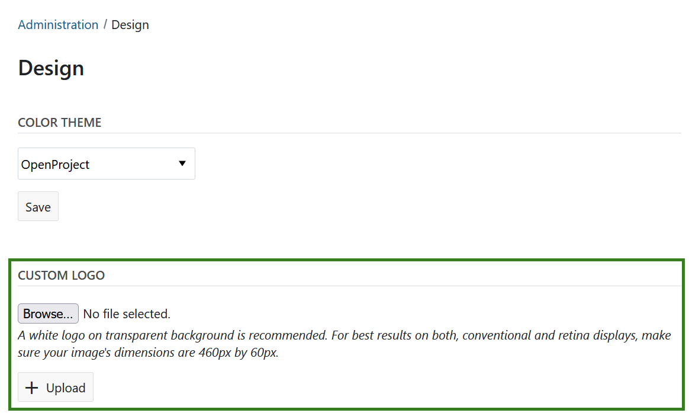
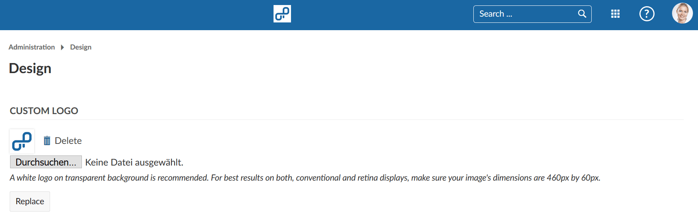
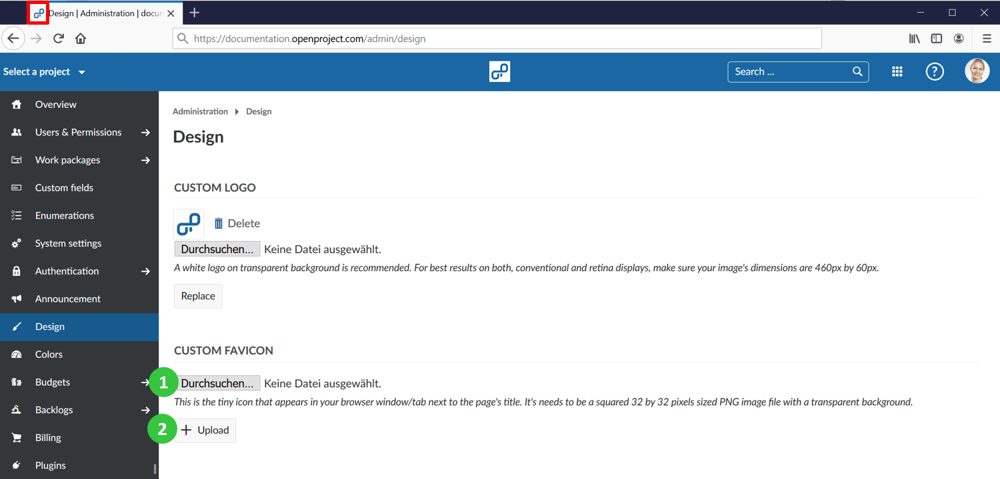
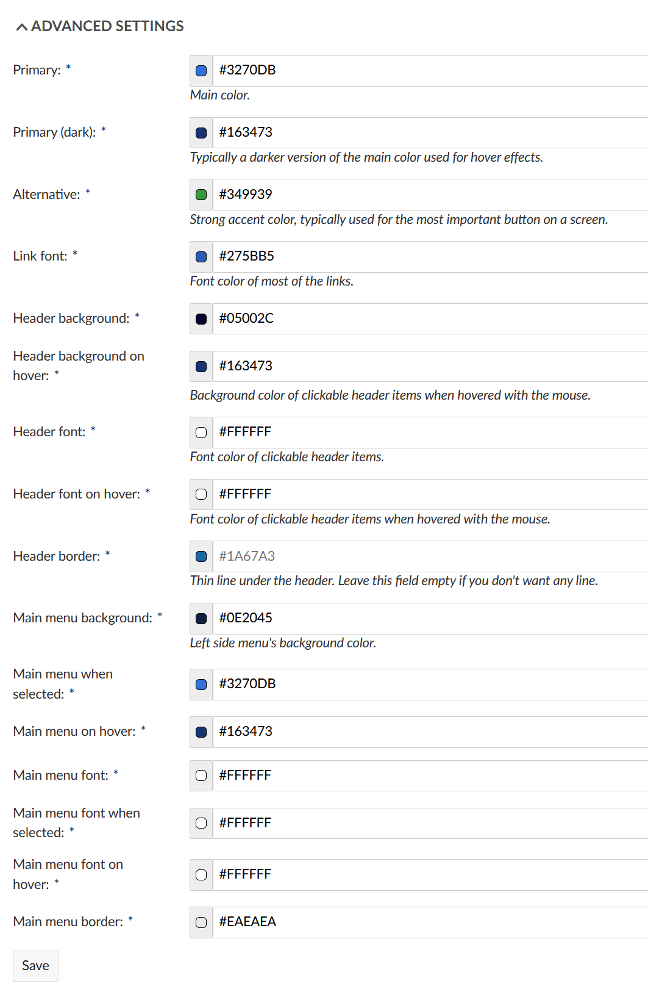

---
sidebar_navigation:
  title: Design
  priority: 700
description: Custom color, theme and logo.
robots: index, follow
keywords: custom color, theme and logo
---
# Set custom color theme and logo (Premium feature)

As an OpenProject premium feature you can replace the default  OpenProject logo with your own logo. In addition, you can define your own color theme which allows you to implement your corporate identity in OpenProject.

Navigate to -> *Administration* -> *Design* in order to customize your OpenProject theme and logo.

The design page provides several options to customize your OpenProject Enterprise Edition:

1. Choose a default color theme: OpenProject, Light or Dark. Press the Save button to apply your changes.

2. Upload your own **custom logo** to replace the default OpenProject logo.

3. Set a custom **favicon** which is shown as an icon in your browser window/tab.
4. Upload a custom **touch icon** which is shown on your smartphone or tablet when you bookmark OpenProject on your home screen.
5. [Advanced settings](#advanced-settings) to configure **custom colors** to adjust nearly any aspect of OpenProject, such  as the color of the header and side menu, the link color and the hover color.

## Choose a color theme

You can choose between the three default color themes for OpenProject:

* OpenProject 
* OpenProject Light
* OpenProject Dark

Press the Save button to apply your changes. The theme will then be changed.

## Upload a custom logo

To replace the default OpenProject logo with your own logo, make sure that your logo has the dimensions 460 by 60 pixels. Select the *Choose File* button and select the file from your hard drive to upload it (1).

Click the *Upload* button to confirm and upload your logo (2).

## Set a custom favicon

To set a custom favicon to be shown in your browser’s tab, make sure  you have a PNG file with the dimensions 32 by 32 pixels. Select the *Choose File* button and select the file from your hard drive to upload it (1).

Click the *Upload* button to confirm and upload your favicon (2).

## Set a custom touch icon

To set a custom touch icon that appears on your smartphone’s or  tablet’s homescreen when you bookmark a page, make sure you have a PNG  file with the dimensions 180 by 180 pixels. Select the *Choose File* button and select the file from your hard drive to upload it.

Click the *Upload* button to confirm and upload your custom touch icon.

When you bookmark your OpenProject environment’s URL, you will see that the uploaded icon is used as a custom touch icon.

## Advanced settings

Aside from uploading logos and icons, you can also customize the colors used within your OpenProject environment. 

To do this change the color values (entered as color hex code) in the *Custom Colors* section. In order to find the right hex code for a color, you can use a website, such as [color-hex.com](http://www.color-hex.com/).
 You can see the selected color in the preview area next to the color hex code. Therefore, it is possible to see the selected color before saving the changes.

As soon as you press the **Save** button your changes are applied and the colors of your OpenProject environment are adjusted accordingly.

 