---
sidebar_navigation:
  title: Design
  priority: 870
description: Custom color, theme, logo and PDF.
keywords: custom color, theme, logo, PDF
---
# Set custom color theme and logo (Enterprise add-on)

[feature: define_custom_style ]

As an OpenProject Enterprise add-on you can replace the default OpenProject logo with your own logo. In addition, you can define your own color theme which allows you to implement your corporate identity in OpenProject.

Navigate to _Administration_ → _Design_ in order to customize your OpenProject theme and logo.

The design page provides several options to customize your OpenProject Enterprise edition, grouped in five tabs, **Interface, Branding, Default colors, PDF export styles and PDF export font**. 
You can [choose a color theme](#choose-a-color-theme) in the first two tabs. 

Under **Interface** you can also choose [custom colors](#interface-colors) for elements of the interface, such as the primary button color, accent color, the background of the top navigation header and the main menu.

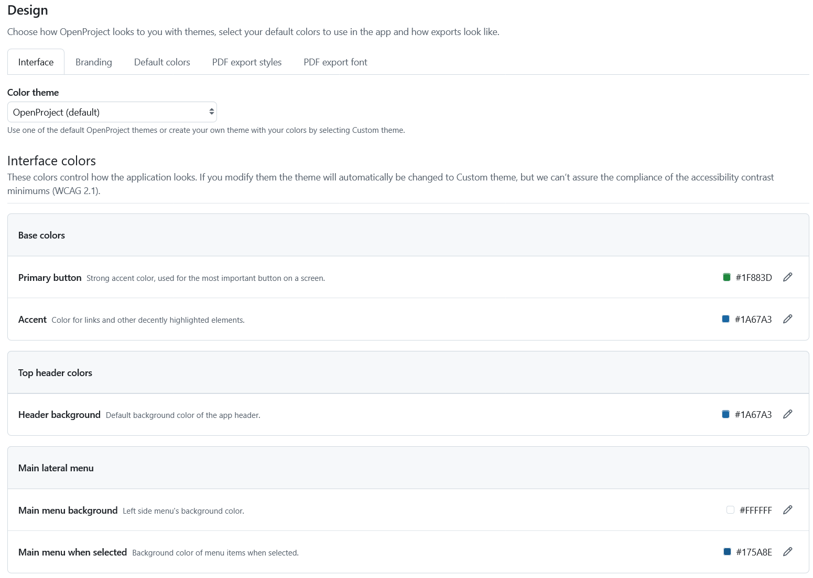

Under the **Branding** tab you can also [upload a custom desktop and/or mobile logos](#upload-a-custom-logo) to replace the default OpenProject logo, [set a custom favicon](#set-a-custom-favicon), which is shown as an icon in your browser window/tab, and [upload a custom touch icon](#set-a-custom-touch-icon), which is shown on your smartphone or tablet when you bookmark OpenProject on your home screen.

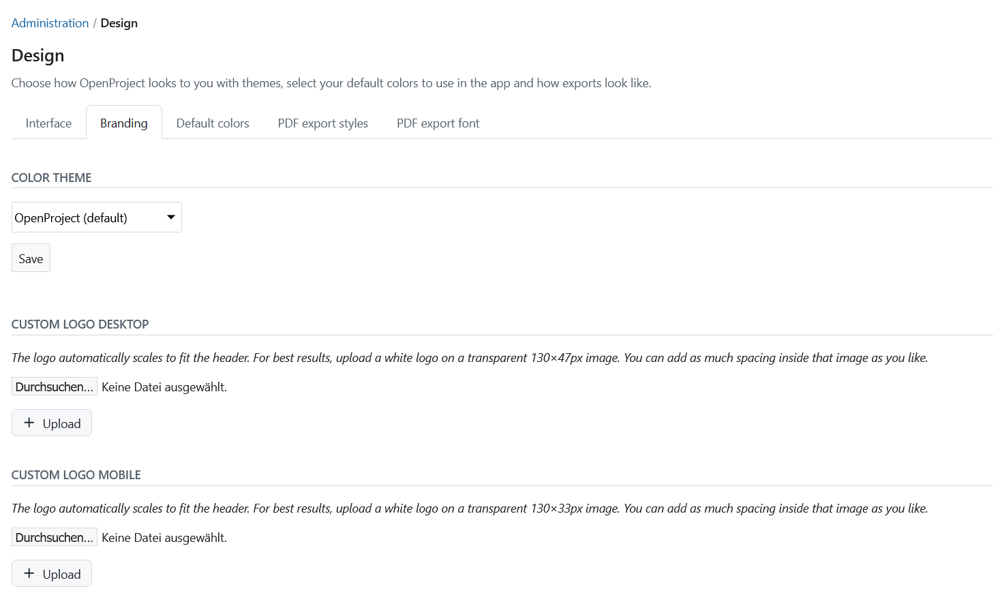

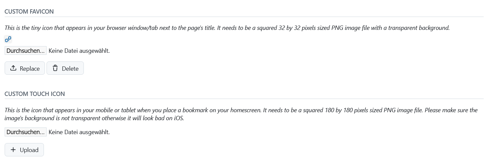

Under **Default colors** tab you can configure a set of predefined colors in OpenProject which you can choose for e.g. [set colors for work package types](https://www.openproject.org/docs/system-admin-guide/manage-work-packages/work-package-types) or attribute highlighting, e.g. for [status](https://www.openproject.org/docs/system-admin-guide/manage-work-packages/work-package-status).

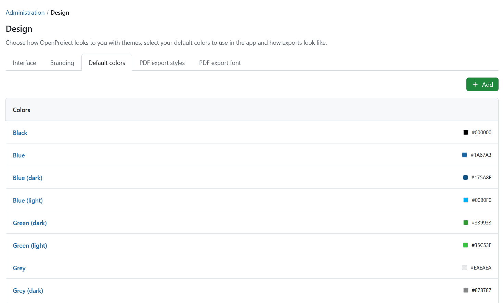

Under **PDF export settings** you can set the preferences for e.g. [exporting work packages in a PDF format](../../user-guide/work-packages/exporting/#pdf-export), meetings, timesheets… 

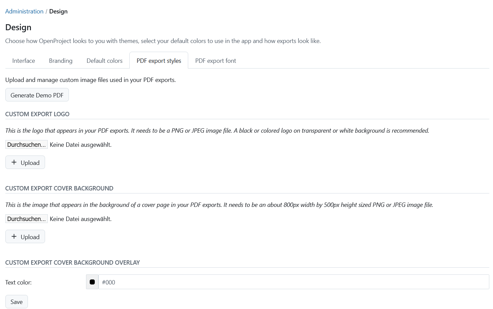

Under **PDF export font** tab you can upload a font family to be used in all PDF exports (e.g. Work packages report, Gantt, Meetings, Timesheet).
The font files must be in the TrueType Font (TTF) format. Maximum font file size is 40 MB.

> [!TIP]
> You can generate a demo PDF to see a preview of your settings. Click the **Generate Demo PDF** button.

> [!IMPORTANT]
> Only the regular style of a font family is required. Italic and bold text will be formatted in regular style of the uploaded font if these font files are omitted.

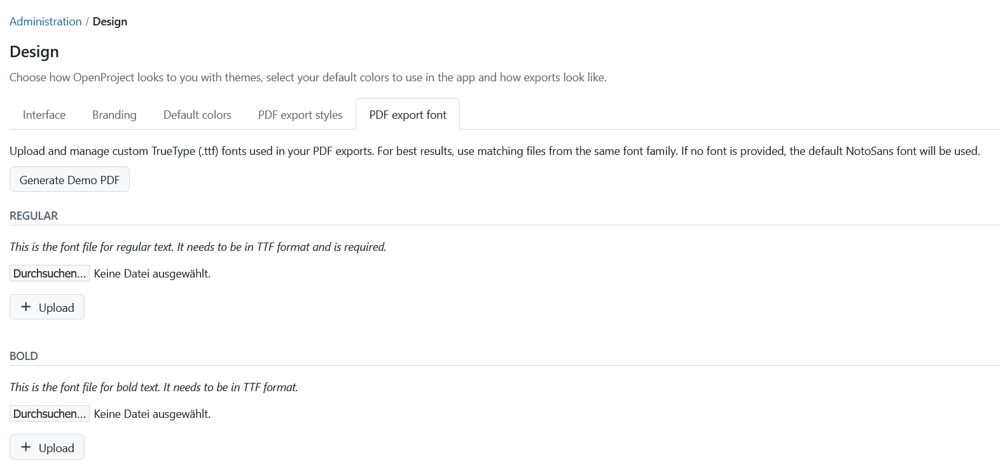

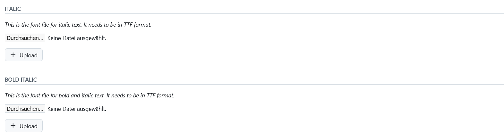

## Choose a color theme

You can choose between the three default color themes for OpenProject:

- OpenProject
- OpenProject Gray (previously called OpenProject Light)
- OpenProject Navy Blue (previously called OpenProject Dark)

Press the Save button to apply your changes. The theme will then be changed.

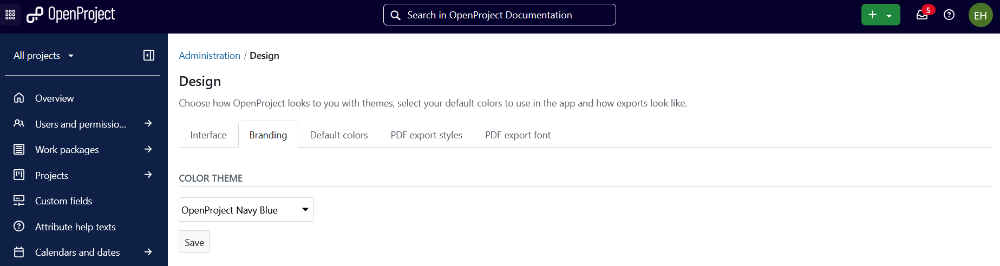

## Upload a custom logo

In the Administration → Design area, you can replace the standard OpenProject logo with your own branding.

### Custom logo desktop

This field to upload the version of your logo that should appear on larger screens. The logo you upload will automatically scale to fit the header. For best results, we recommend uploading a white logo on a transparent 130×47px image. You can add as much spacing inside that image as you like. 

Select the _Browse_ button and select the file from your hard drive to upload it.

Click the _Upload_ button to confirm and upload your logo.

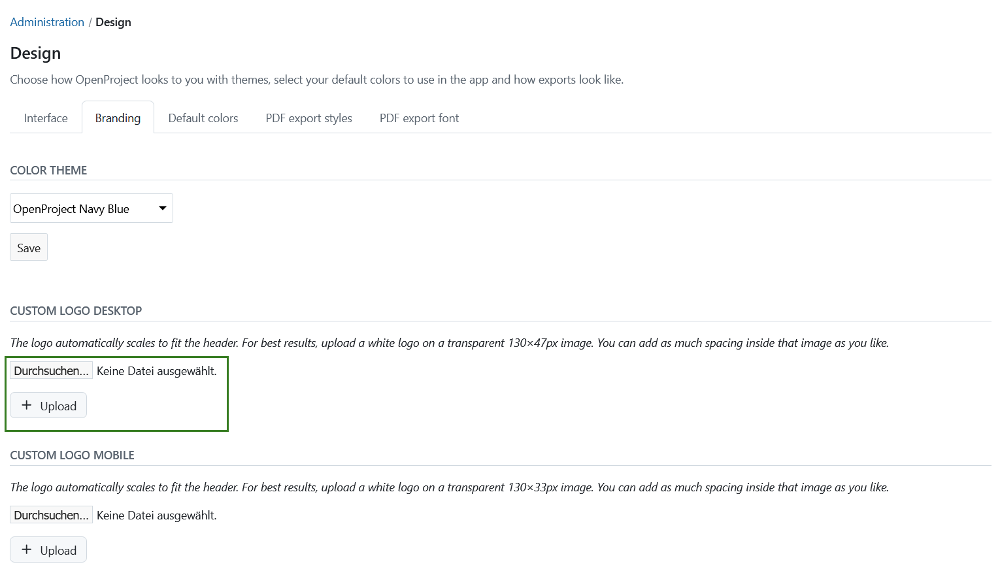

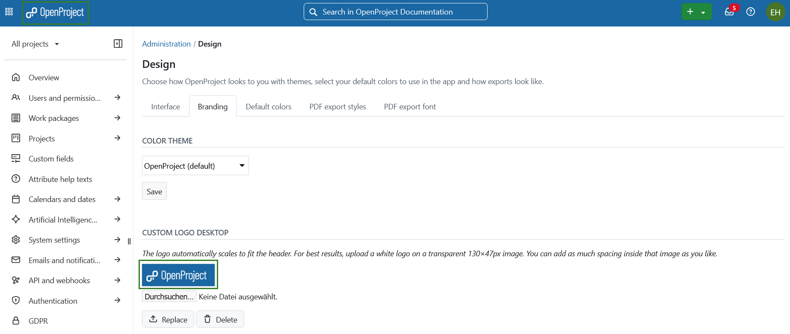

### Custom logo mobile

A separate Custom logo mobile section allows you to provide an alternative logo optimized for smaller displays.

### Logo display behavior

Depending on which custom logos are uploaded, OpenProject will adjust the displayed logo according to the following principles:

- If both desktop and mobile logos are provided, the logo switches responsively with the screen size.
- If only a mobile logo is available, it will be used everywhere.
- If only a desktop logo is uploaded, it will appear on desktop screens, while mobile views will not show a logo.
- If no logo is uploaded, OpenProject continues to display its default logo.
- When a custom logo is in use, a separate high-contrast version is no longer enforced.

## Set a custom favicon

To set a custom favicon to be shown in your browser’s tab, make sure you have a PNG file with the dimensions 32 by 32 pixels. Select the _Choose File_ button and select the file from your hard drive to upload it.

Then click the _Upload_ button to confirm and upload your favicon.

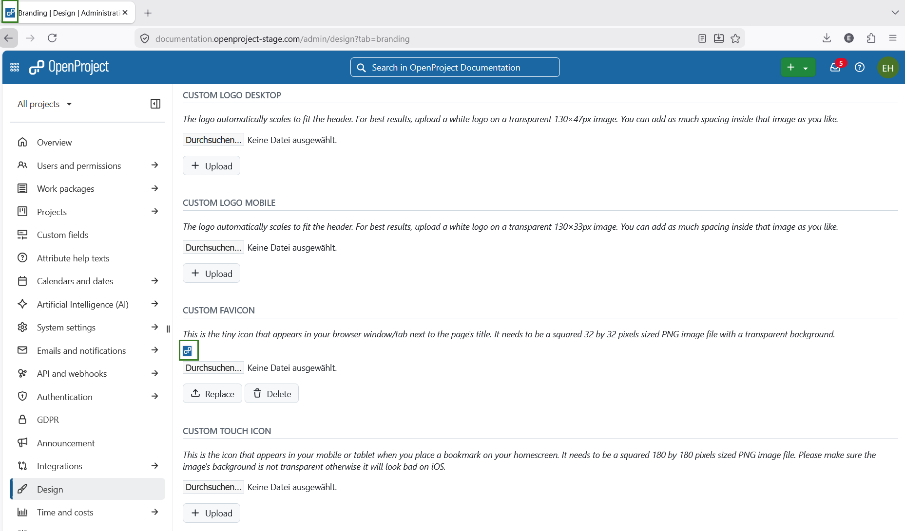

## Set a custom touch icon

To set a custom touch icon that appears on your smartphone’s or tablet’s homescreen when you bookmark a page, make sure you have a PNG file with the dimensions 180 by 180 pixels. Select the _Choose File_ button and select the file from your hard drive to upload it.

Click the _Upload_ button to confirm and upload your custom touch icon.

When you bookmark your OpenProject environment’s URL, you will see that the uploaded icon is used as a custom touch icon.

## Set a new color

To add a new color to the default colors, click the green **+ Add** button at the top right.

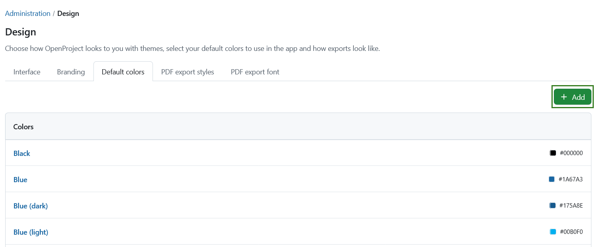

Add a  name for your new color, enter the hexcode and click the **Save** button.

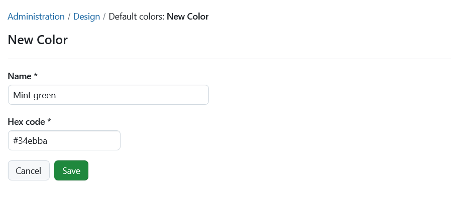

## Interface colors

Aside from uploading logos and icons, you can also customize the colors used within your OpenProject environment.

To do this, enter the hex value for any color you would like to change. You can use a website like [htmlcolorcodes.com](https://htmlcolorcodes.com/color-picker/) to help you find the perfect color.
You can see the selected color in the preview area next to the color hex code. Therefore, it is possible to see the selected color before saving the changes.

> [!TIP]
> If the button color you select is too light to have white text on top of it, the icon and text color will be displayed in black instead.

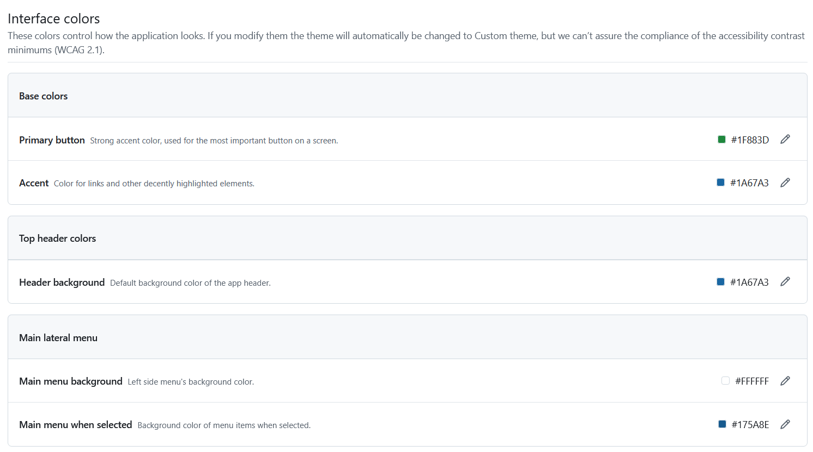

As soon as you press the **Save** button your changes are applied and the colors of your OpenProject environment are adjusted accordingly.
