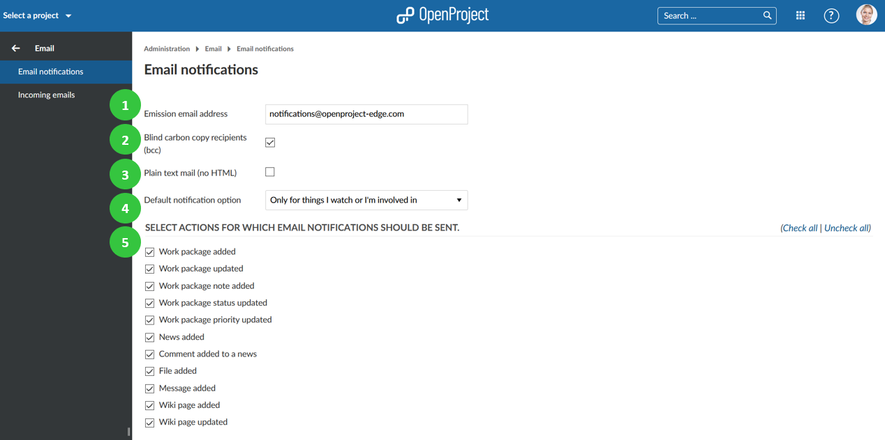
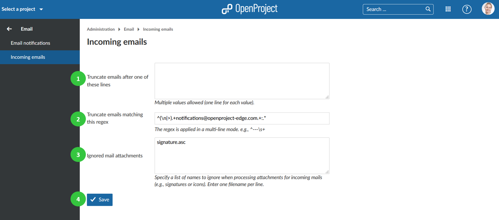

---
sidebar_navigation:
  title: Email
  priority: 790
description: Email configuration in OpenProject.
robots: index, follow
keywords: email configuration
---
# Email settings

Configure **email settings** in OpenProject, i.e. Email notifications and incoming email configuration.

Navigate to -> *Administration* -> *Emails*.

# Email notifications settings

To adapt email notification settings, go to Email and choose *Email notifications*.

1. **Emission email address**. This email Address will be shown as the sender for the email notifications sent by OpenProject (for example,  when a work package is changed).
2. Activate **blind carbon copy recipients** (bcc).
3. Define if the email should be formatted in **plain text** (no HTML).
4. Select the default notification options. The default notifcation can be adapted in the [user profile](../../../getting-started/my-account/#email-notifications).
5. Select for which **actions email notification should be sent**. You have the possibilty to check all or uncheck all at the top right.

## Configure email header and email footer

Configure your notification email header and footer which will be sent out for email notifications from the system.

1. **Formulate header and/or footer** for the email notifications. These are used for all the email notifications from OpenProject (e.g. when  creating a work package).
2. **Choose a language** for which the email header and footer will apply.
3. **Send a test email**.
4. Do not forget to **save** your changes.

## Incoming emails settings

To adapt incoming email settings, go to *Email* -> *Incoming Email*. Here you can configure the following options.

1. **Define after which lines an email should be truncated**. This setting allows shortening email after the entered lines.
2. Specify a **regular expression** to truncate emails.
3. **Ignore mail attachment** of the specified names in this list.
4. Do not forget to **save** the changes.

**To set up incoming email**, please visit our [Operations guide](../../installation-and-operations/configuration/incoming-emails/).