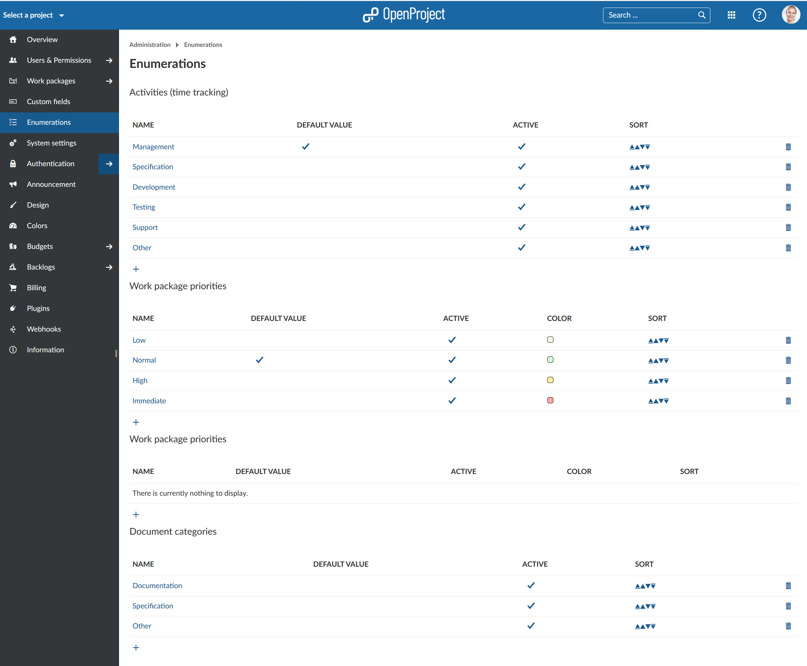
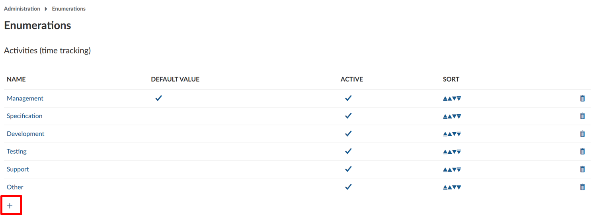
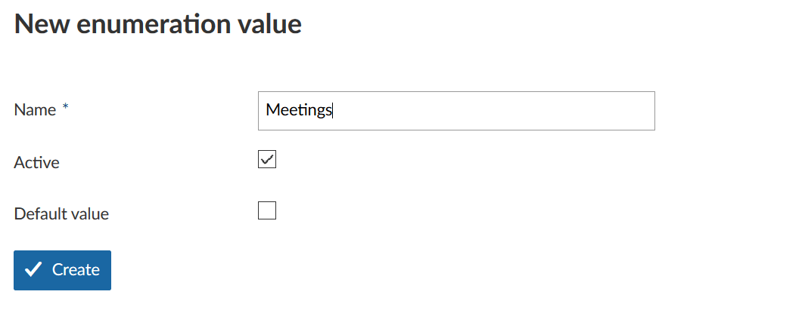
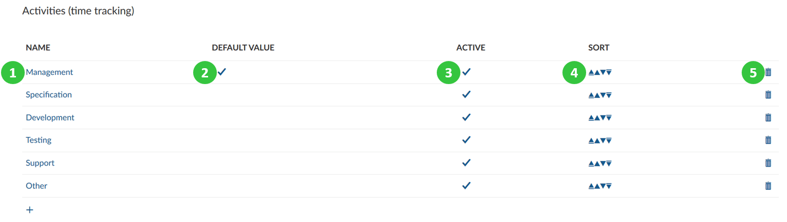

---
sidebar_navigation:
  title: Enumerations
  priority: 780
description: Manage enumerations in OpenProject.
robots: index, follow
keywords: enumerations, time tracking, priority, document categories
---
# Manage Enumerations

**Enumerations** is a menu item in admin settings that allows the configuration of Activities (for time tracking), project status and work package priorities. 

To get an overview of existing enumeration values for all of these categories, navigate to *Administration -> Enumerations*. You will see the enumerations overview, divided into respective sections.

## Create new enumeration value

To create a new enumeration value, select the **+ icon** in the respective category.

You will then be able to name the value, activate it and choose if it should be the default setting. Press the blue **Create** button to save your changes.

## Edit or remove enumeration value

1. To **edit** an existing configuration simply click on the name.
2. If the enumeration is activated, it will have the check mark in the column **Active**.
3. The **default value** is identified by the check mark in the respective column.
4. You can move the enumerations in the list of possible values up or down with the sort.
5. To remove an enumeration click on the respective **delete icon**.

To **change the color of work package priorities** choose the respective priority in the section Work package priorities.

 

**Note**: To activate the [Activities for time tracking](../../user-guide/projects/project-settings/activities-time-tracking) in a certain project, navigate to *Project settings -> Time tracking activities*. 

 