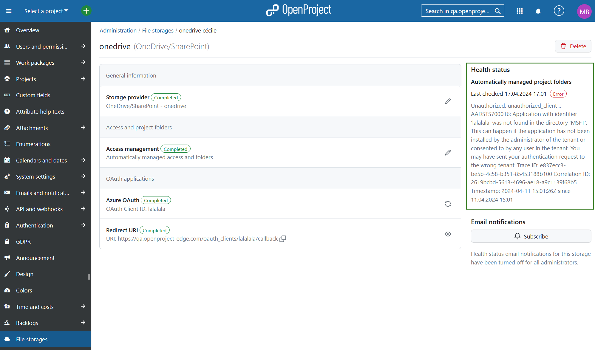

---
sidebar_navigation:
  title: File storages troubleshooting
  priority: 999
description: File storages troubleshooting in OpenProject.
keywords: file storages, Nextcloud error, Nextcloud troubleshooting, OneDrive error, Sharepoint error, OneDrive, Sharepoint, error, troubleshooting
---

# File storage errors and troubleshooting

## Unhealthy file storages email notifications

In some cases it is possible that a file storage has been set-up incorrectly, the connection is faulty or the storage itself has problems. In this case the respective message will appear under *Administration* -> *File storages*. 

> Please note that this only applies to file storages where **automatically managed project folders** have been selected.

If a problem has been detected for a file storage with automatically managed folders enabled, the OpenProject adminstrators will be notified via email of the detected error. Admin will be notified once a day of the faulty integration, including the specific error description and solution suggestions (see the section below). 

Once the error has been resolved, the admin will also receive an email informing him/her/them of this.

You can choose to subscribe or unsubscribe to these email notifications by clicking the respective button under the error message. 

## File storage errors description 	

Once you have set up your files storages, it is possible that a technical error may occur. Please consult the following table for possible reasons behind the errors and suggested solutions.

| Error name   | Error description                       | Possible reasons                                             | Next steps and solutions                                     |
  | ------------ | --------------------------------------- | ------------------------------------------------------------ | ------------------------------------------------------------ |
  | Error        | No group specified                      | The group is not specified for the storage. The name is saved in the database.  Glitch during setup or manual changes to the DB. Saved in the Storages Table in the providers field (JSON). | Setup the entire storage again.                              |
  | Error        | Group does not exist                    | The app was activated on Nextcloud and the group was removed afterwards. Changes on Nextlcoud: OpenProject group was removed. | Manually add the group in the Nextcloud setup and call it OpenProject. Add the user OpenProject to the group OpenProject. |
  | Error        | User does not exist                     | After the app was activated on Nextcloud and the user was removed afterwards.  Changes on Nextlcoud: OpenProject user was removed. | Manually add the user in the Nextcloud setup and call that user OpenProject. Add the user OpenProject to the group OpenProject.   Alternatively reinstall the OpenProject integration app on Nextcloud. You will also need to reconfigure the Nextcloud storage. |
  | Error        | Insufficient privileges                 | OpenProject can not change the user permissions for folders or add folders to the OpenProject folder, because the OpenProject user no longer has access to the folder. | Reinstall the OpenProject integration app on Nextcloud. You will need to reconfigure the Nextcloud storage.   Make sure the OpenProject user is the admin of the OpenProject group and also the admin of the OpenProject folder. |
  | Error        | Failed to remove or add user from group | A user does not exist in the file storage.   A user can not be removed from the OpenProject group due to admin rights.   This may occur when running the sync job and further information can be found in the server logs. | Ensure that the user exists in the file storage platform.  Remove admin rights for that user on the OpenProject group.   If the user is also an admin in the files storage group, he/she/they need to be removed by a file storage platform admin. |
  | Not allowed  | Outbound request method not allowed     | OpenProject sent wrong requests to the storage.   This error can occur both in Nextcloud and OneDrive/Sharepoint integration. | Report this to [OpenProject community](https://community.openproject.org/projects/openproject/forums) or [support team](https://www.openproject.org/contact/). |
  | Not found    | Outbound request destination not found  | OpenProject can not reach file storage platform:   - This could be due to Storage provider being down: - DNS problems  - Network problems (flaky)  - Local networks (Nexctloud specific setting that needs to enabled)   This error can occur both in Nextcloud and OneDrive/Sharepoint integration. | See if you can access the file storage platform from your browser.   For Nextcloud, see if Nextcloud settings are active if in local network. |
  | Unauthorized | Outbound request not authorized         | - Authentification is failing  - Application password was changed and not updated in OpenProject (Nextcloud OAuth settings are wrong and SP client secret or id is wrong). - User has no access, can not login, no token can be negotiated.   Server to server: the client secret might be wrong   OpenProject User credentials might be wrong | Check the storages setup. Check if the client secret (SP) or the OAuth setup is correct (in Nextcloud). Check if the application password is correct. |
  | Conflict     | *error_text_from_response*              | A folder or a file was created, which already exists on the storage platform, e.g. creating a folder with the same name.   Can happen if for example a user manually created something on the storage platform. | Check in the storage platform if the folder already exists.  |
  | Error        | Outbound request failed                 | An unexpected 500 error, e.g. TOS app was activated and OpenProject can not access storage anymore.   Password configuration plugin may have caused problems. | See if file storage is working correctly. If it does, collect as much information as possible and contact [OpenProject community](https://community.openproject.org/projects/openproject/forums) or [support team](https://www.openproject.org/contact/). |

If the suggested troubleshooting solutions did not resolve your issue, please reach out to the [OpenProject community](https://community.openproject.org/projects/openproject/forums) or [support team](https://www.openproject.org/contact/) for further assistance.

## Unhealthy file storages e-mail notifications

Once a file storage has been set-up 
