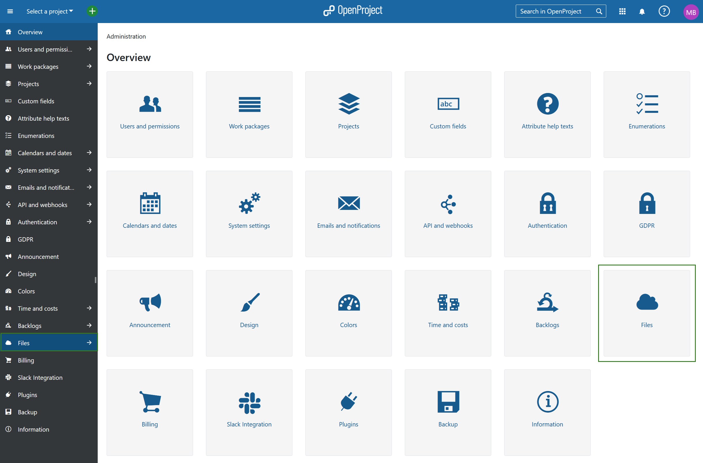
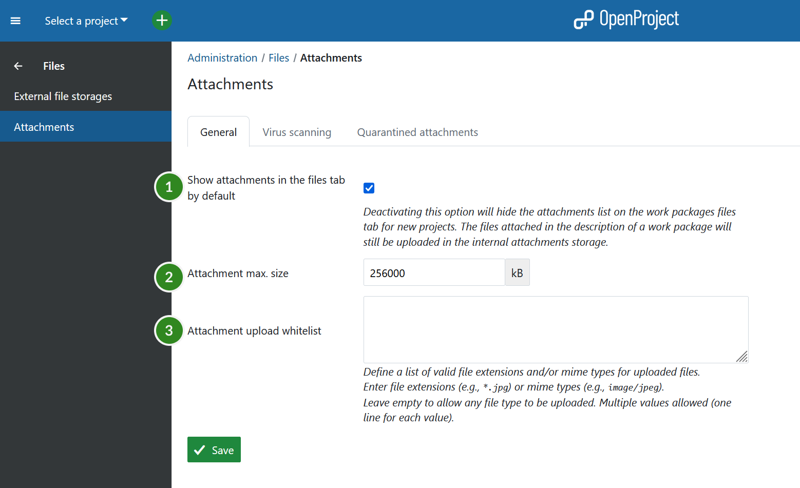

---
sidebar_navigation:
  title: Attachments
  priority: 800
title: Attachments in OpenProject
description: Attachment settings and virus scanning in OpenProject
keywords: Attachment, attachment settings, virus scanning, clamav

---

# Attachments in OpenProject

In OpenProject you can determine the maximum attachment size and activate the virus scanning functionality. To do that navigate to *System Administration* -> *Files* and select *Attachments*

## Attachment general settings

1. Here you can select whether **Attachments** should be shown in the **Files** tab under work packages by default throughout the entire instance. It can still be de-activated for specific projects.

2. Here you can increase or decrease **maximum attachment size** (in kB).

3. The box next to **Attachment upload whitelist** is an open-entry text box in which some common file formats are pre-populated by default. The file formats in this list are specifically whitelisted or allowed to be attached to work packages.
   If you wish, you can add additional file formats. Use only one file format entry per line, and keep to the following cadence:  

   `*****.[**file extension**]`

   Example: To add mp3-files to the whitelist, your entry would be `***.mp3**`.

   Do not forget to **save** your changes.

   

## Virus scanning (Enterprise-add-on)

For information about virus scanning, please see the [documentation on virus scanning](./virus-scanning/).
