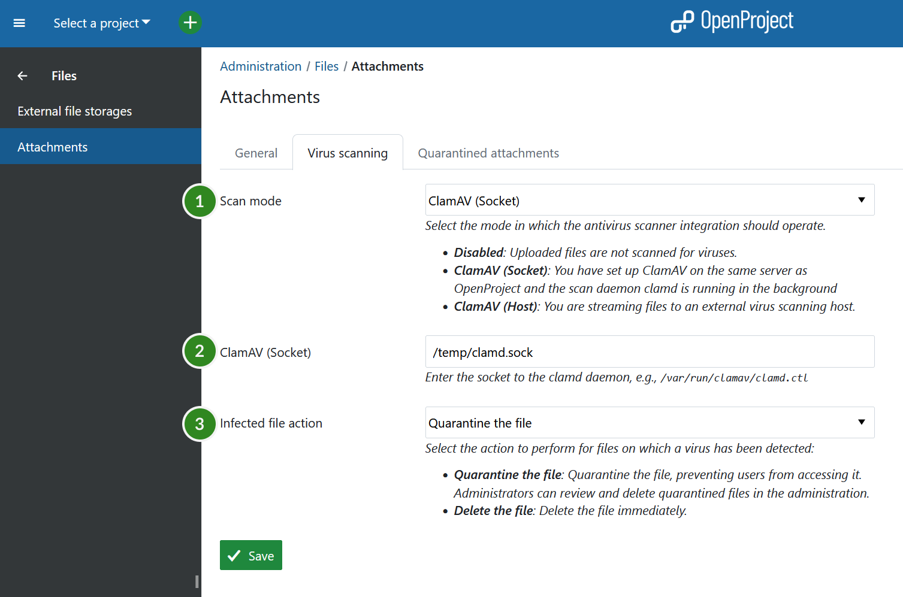

---
sidebar_navigation:
  title: Virus scanning
  priority: 940
title: Virus scanning
description: Settings for scanning attachments for viruses within OpenProject
keywords: Virus scanning, clamav

---

# Virus scanning (Enterprise add-on)
>
> **Note**: This functionality is an Enterprise add-on. It is currently not available on the Hosted Enterprise Cloud.

You can configure OpenProject to automatically scan uploaded attachments for viruses using the [ClamAV antivirus](https://www.clamav.net/) engine.

ClamAV can detect different kinds of harmful software such as viruses and worms. It works on many types of files, such as those used in Windows, Linux, and Mac computers, as well as zipped files, program files, pictures, Flash, PDFs, and more.

If you're using ClamAV locally, it comes with a helper tool called Freshclam that regularly updates its list of known threats to keep it current. It is crucial to keep the virus definitions updated for appropriate protection against malware.

## Installing ClamAV

To be able to use the antivirus integration in OpenProject, you need to first install ClamAV on your environment.

### Packaged installations

On a packaged installation, you can simply install ClamAV locally on your distribution. For more information, please see [information on ClamAV packages](https://docs.clamav.net/manual/Installing/Packages.html) and the [general installation documentation from ClamAV](https://docs.clamav.net/manual/Installing.html).

When installed as a package on the same server, you can configure OpenProject to use the `ClamAV socket` mode of operation, which uses a local unix socket to communicate with ClamAV.

**Debian, Ubuntu distributions**

ClamAV is part of the standard packages and can be installed as a daemon just like this:

```shell
apt-get install clamav clamav-daemon
```

The installer will launch a `clamd` daemon that can be used to transmit files to the daemon for scanning. A `freshclam` daemon is also started to ensure the definitions are kept up-to-date. In any case, double-check the configuration and ensure they are running.

**RHEL Linux, Centos**

On RedHad Enterprise Linux and Centos, you need to install the epel-release packages first, followed by ClamaV

```shell
dnf install -y epel-release
dnf install -y clamav clamd clamav-update
```

For these distributions, you need to manually create the configuration files for `freshclam` and `clamd`.  For more information, see https://docs.clamav.net/manual/Installing.html#rpm-packages-for-centos-redhat-fedora-suse-etc

### Docker

To run ClamAV in Docker, follow this guide: https://docs.clamav.net/manual/Installing/Docker.html.

As a quick-start, you can use this command to start clamav with local volume mounts for the virus database:

```shell
docker run -it --rm \
    --name clamav \
    --publish 3310 \
    --mount source=clam_db,target=/var/lib/clamav \
    clamav/clamav:stable_base
```

This will publish the `clamd` TCP connection on port `3310`.

**Docker-Compose**

On docker compose, you can register clamav as a separate service to have hostname resolution:

```yaml
# ... other configuration
services:
  clamav:
    image: "clamav/clamav:stable_base"
    container_name: "clamav"
    ports:
      - "3310:3310"
    volumes:
      # Virus DB
      - /var/docker/clamav/virus_db/:/var/lib/clamav/
    restart: unless-stopped
```

In both these cases, use the `ClamAV (Host)` option with `clamav:3310` as the host value.

## Configuration in OpenProject

To enable the virus scanning functionality, visit *Administration > Files > Attachments > Virus scanning*.

You will see the following options:

1. **Virus scan mode**
   - **Disabled**: Uploaded files will not be scanned for viruses.
   - **ClamAV (Socket)**: A local socket for installed packages or locally mounted docker sockets will be used.
   - **ClamAV (Host)**: A TCP connection to the clamd daemon will be used.
2. **Socket or Host value.**
   - This value is only shown when Scan mode is enabled.
   - Enter the path to the local socket or `hostname:port` for the host mode according to the ClamAV installation documentation.
3. **Infected file action**

   Here you can select the action to take place when a virus was found:

   - **Quarantine the file**: quarantined files will be displayed under *Administration > Attachments > Quarantined attachments* for review or deletion.
   - **Delete the file directly**.



### When enabling for the first time

If you have an existing installation of OpenProject, enabling the option will first perform a liveliness check of the connection parameters to ClamAV. An error will be shown if OpenProject cannot connect to ClamAV. In this case, you need to verify the settings and socket/host value in the administration.

If the connection was made successfully, all existing files that have not been scanned before, will be scanned for viruses. This will take place in the background, and you will be redirected to a job status screen to inform you when this is done. If this window remains open, it will provide notifications regarding any detected viruses upon completion. Depending on the number of existing attachments, this initial scan may require some time to process.

### Disabling virus scanning

If you disable virus scanning with some files still being in quarantine, a notice will be shown to inform you about that fact. These files will remain in quarantine until you delete them.

## Usage in OpenProject

If the virus scanning mode has been enabled, all uploaded attachments will be scanned for viruses automatically.

> **Note**: While attachments are in the process of being scanned, they are only accessible to the original author. As soon as they are scanned without any findings, they are made accessible to all other users.

If viruses are found, they are treated according to the *Infected file action* setting.

- Quarantine: The files are still visible in the container (e.g., in the work package they were uploaded in), but are no longer accessible. A comment is made to inform users about it.
- Delete: The file is deleted straight away. A comment is made to inform the users about it.
