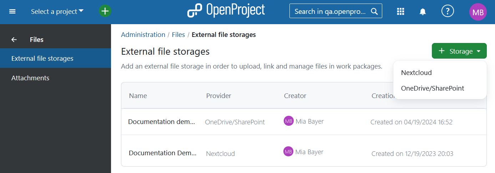

---
sidebar_navigation:
  title: File storages
  priority: 990
description: File storages in OpenProject.
keywords: file storages, Nextcloud setup, Nextcloud integration, OneDrive setup, Sharepoint setup, OneDrive, Sharepoint
---

# External file storages

You can connect your OpenProject installation to Nextcloud or OneDrive/SharePoint. To do that navigate to **Administration** -> **Files** -> **External file storages** and select the respective option.

You need to have administrator rights to be able to setup the integration.

## Nextcloud integration setup guide

For detailed guide on the initial setup, please consult [Nextcloud integration setup guide](../../integrations/nextcloud/).

For instructions on using the integration after the setup has been complete please refer to [Nextcloud integration user guide](../../../user-guide/file-management/nextcloud-integration/).

## OneDrive/SharePoint integration (Enterprise add-on) setup guide

> [!NOTE] 
> OneDrive/SharePoint integration is an Enterprise add-on and can only be used with [Enterprise cloud](../../../enterprise-guide/enterprise-cloud-guide/) or [Enterprise on-premises](../../../enterprise-guide/enterprise-on-premises-guide/). An upgrade from the free Community edition is easy and helps support OpenProject.

For detailed guide on the initial setup, please consult [OneDrive/SharePoint integration setup guide](../../integrations/one-drive/).

For instructions on using the integration after the setup has been complete please refer to [SharePoint/OneDrive integration user guide](../../../user-guide/file-management/one-drive-integration/).

## Health status

For troubleshooting guidance related to file storages, visit
the [File storage troubleshooting](./health-status) page. Here you will find possible explanations and
suggested solutions and will be able to conduct health status checks with immediate results. If you encounter any
challenges not addressed here, do not hesitate to reach out to
the [OpenProject community](https://community.openproject.org/projects/openproject/forums)
or [support team](https://www.openproject.org/contact/) for further assistance.
