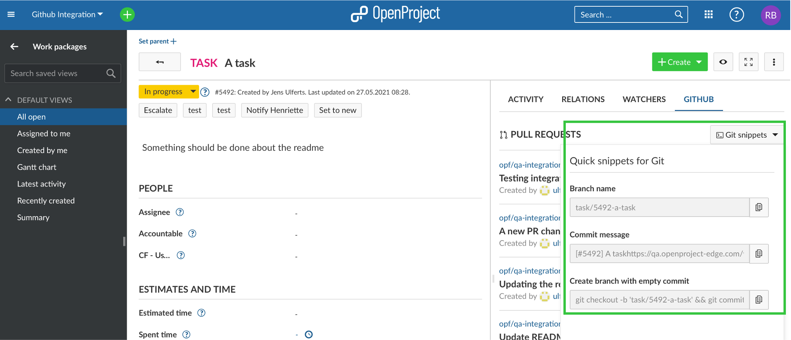
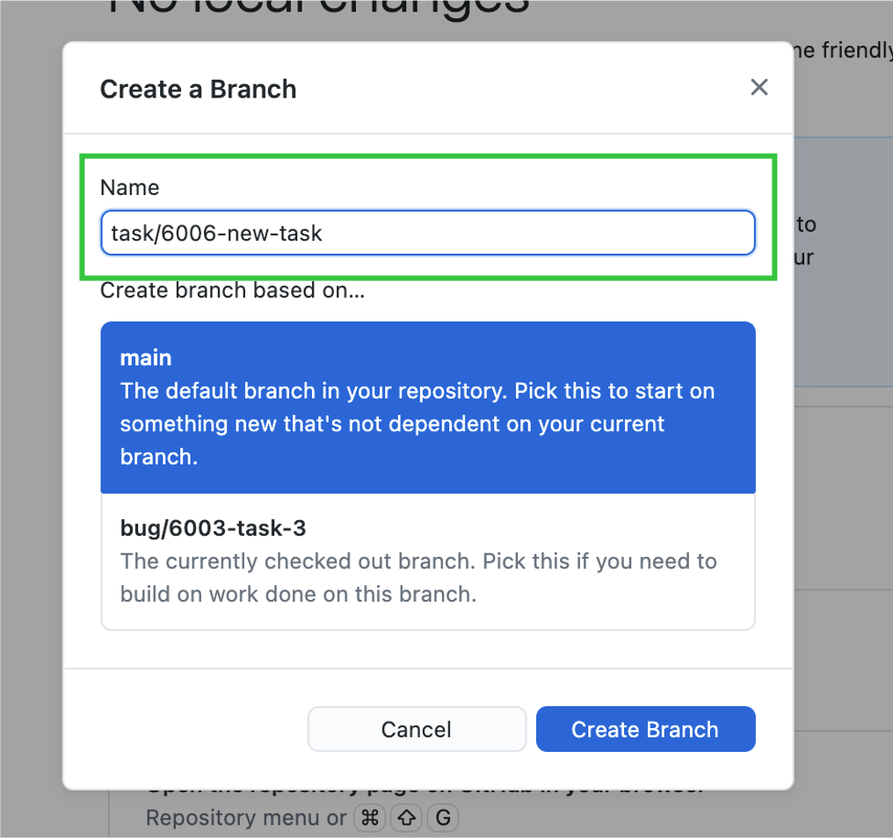
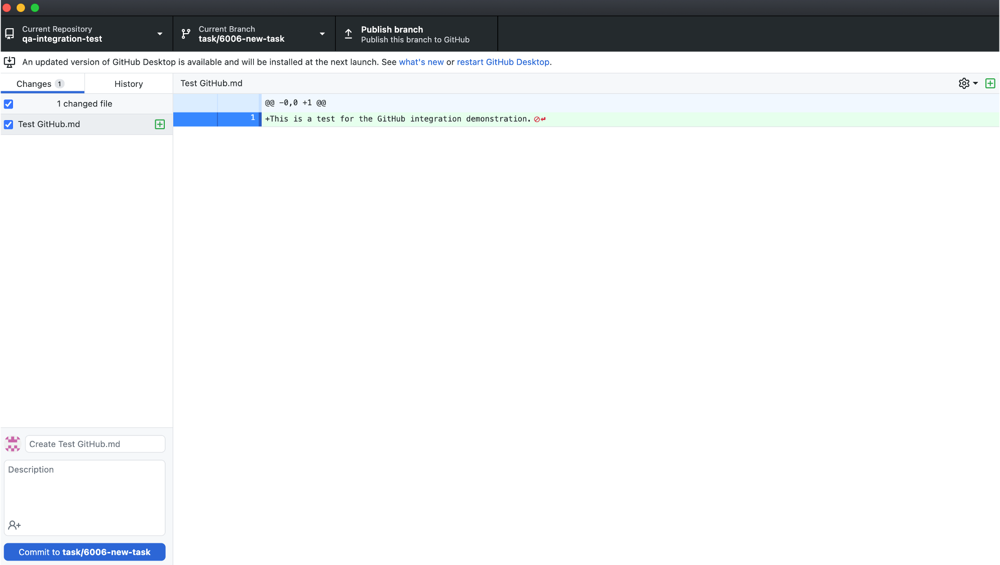
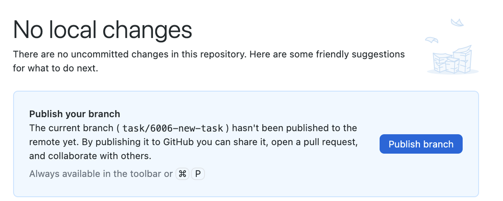
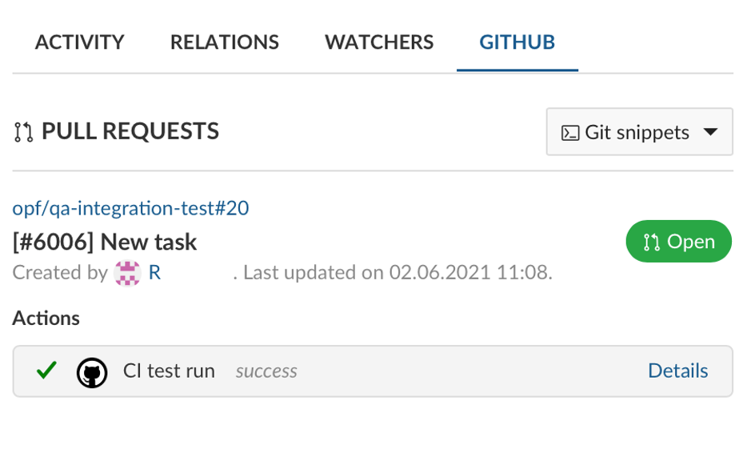

---
sidebar_navigation:
  title: Github integration
  priority: 600
description: Integrate the Github pull request workflow into OpenProject.
robots: index, follow
keywords: github integration
---
# GitHub integration

OpenProject offers an integration for GitHub pull requests to integrate software development closely with planning and specification.

OpenProject work packages will directly display information from GitHub in a separate tab.


In your OpenProject work package, the GitHub integration supports you to create a branch straight from the work package and consequently the matching pull request.




In order to create a new branch, open the GitHub tab in your OpenProject work package detail view. Click on Git snippets to extend the menu. First, copy the branch name.


Then, open your desktop client, e.g. GitHub desktop. There, you create your branch with the name you copied from your OpenProject work package.



Then go to Typora (or any other editor) and create content or make changes.


Save and the changes will appear in GitHub desktop or the client you are using.



In order to commit these changes, go to OpenProject to copy the commit message.


And use it in the GitHub desktop commmit message field. Make sure you use the reference for the OpenProject work package (in this case #6006) in the title.


After having committed, publish your branch.



Subsequently, you can create your pull request. Title and comment with the link to the respective OpenProject work package will be prefilled. If you want, you can add some additional information.


Click on **Create pull request** and your pull request will be opened.


When you click on the link in the comment, it will take you to the OpenProject work package, where you will see in the Activity tab of the work package that the pull request was created.


In the GitHub tab of that work package, the status of the pull request as well as the GitHub Action will be displayed.



If the status of a pull request changes, it will accordingly appear in its OpenProject work package. Please see the example below.


## Configuration

You will have to configure both OpenProject and GitHub for the integration to work.

### OpenProject

First you will need to create a user in OpenProject that will make the comments.
The user will have to be added to each project with a role that allows them
to comment on work packages.

The role needs two permissions and should only receive those two: "View work packages" and "Add notes" which you will find in the "Work package tracking" section.


Once the user is created you need to generate an OpenProject API token for it
to use later on the GitHub side of things. For this you have to:

1. Login as the newly created user
2. Go to My Account (click on Avatar in top right corner)
3. Go to Access Token
4. Click on generate in the API row

Copy the generated key. You can then configure the necessary webhook in GitHub.

In addition, in *Project settings* and *Modules* you will need to activate the GitHub module so that all information pulling through from GitHub will be shown in the work packages.


### GitHub

In GitHub you have to set up a webhook in each repository to be integrated with OpenProject.


You need to configure just two things in the webhook.
The **Content Type** has to be `application/json`.
The **Payload URL** must point to your OpenProject server's GitHub webhook endpoint (`/webhooks/github`).

Now you need the API key you copied earlier. Append it to the *Payload URL* as a simple GET parameter named `key`. In the end the URL should look something like this:

```
https://myopenproject.com/webhooks/github?key=42
```
_Earlier version may have used the `api_key` parameter. In OpenProject 10.4, it is `key`._

Now the integration is set up on both sides and you can use it.
