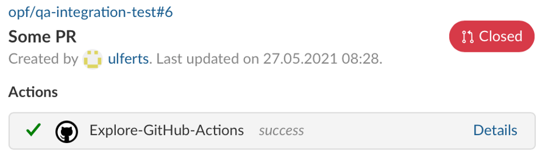

---
sidebar_navigation:
  title: Github integration
  priority: 600
description: Integrate the Github pull request workflow into OpenProject.
robots: index, follow
keywords: github integration
---
# GitHub integration

OpenProject offers an integration for GitHub pull requests.
You create a pull request in GitHub and link it to an OpenProject work package.


Rather than inserting a link to the work package you can also reference it just by adding "OP#87" to the pull request's description where 87 is the ID of the work package.

OpenProject will add comments to work packages about the pull request when the pull request is

* first referenced (usually when opened)
* merged
* closed


Given the right permissions on the project, a "GitHub" tab is shown for work packages. All previously linked pull requests can be seen there including the PR's status and checks (e.g. tests and linter runs).

## Configuration

You will have to configure both OpenProject and GitHub for the integration to work.

### OpenProject

In *Project settings* and *Modules* you will need to activate the GitHub module.


Then you will have a GitHub tab appearing in your work package view where you will see all information pulling through from GitHub.


In your OpenProject work package, the GitHub integration supports you to create a branch straight from the work package and consequently the matching pull request.


Copy Branch name

Then open new branch in GitHub desktop

Then go to Typora and make changes

Save

Changes in GitHub desktop

in OP use commit message

Publish branch


create PR

add info in comment

create PR green button

click link to OP WP

comment in activity that PR is created

commit messaage mit OP Verweis auf das AP


see GitHub action in GitHub tab


If PR is merged, it will appear in OP


If you already have an existing pull request in GitHub, you can link it using the code OP#0000 (0000 being the ID of the work package) in the GitHub pull request description.





First you will need to create a user in OpenProject that will make the comments.
The user will have to be added to each project with a role that allows them
to comment on work packages.

The role needs two permissions and should only receive those two: "View work packages" and "Add notes" which you will find in the "Work package tracking" section.


Once the user is created you need to generate an OpenProject API token for it
to use later on the GitHub side of things. For this you have to:

1. Login as the newly created user
2. Go to My Account (click on Avatar in top right corner)
3. Go to Access Token
4. Click on generate in the API row

Copy the generated key. You can now configure the necessary webhook in GitHub.

### GitHub

In GitHub you have to set up a webhook in each repository to be integrated with OpenProject.


You need to configure just two things in the webhook.
The **Content Type** has to be `application/json`.
The **Payload URL** must point to your OpenProject server's GitHub webhook endpoint (`/webhooks/github`).

Now you need the API key you copied earlier. Append it to the *Payload URL* as a simple GET parameter named `key`. In the end the URL should look something like this:

```
https://myopenproject.com/webhooks/github?key=42
```
_Earlier version may have used the `api_key` parameter. In OpenProject 10.4, it is `key`._

Now the integration is set up on both sides and you can use it.
