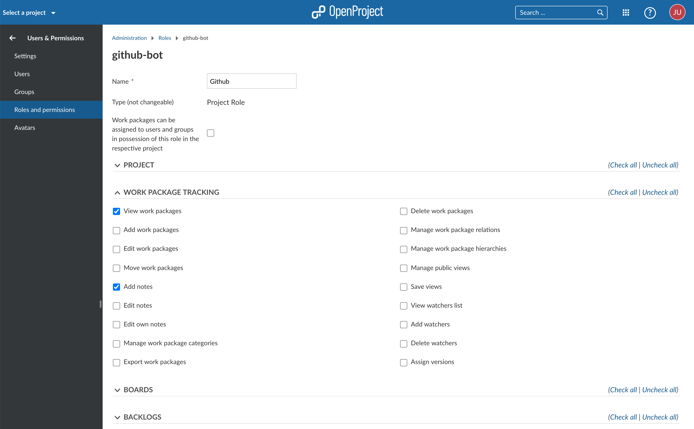
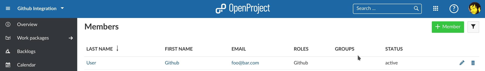
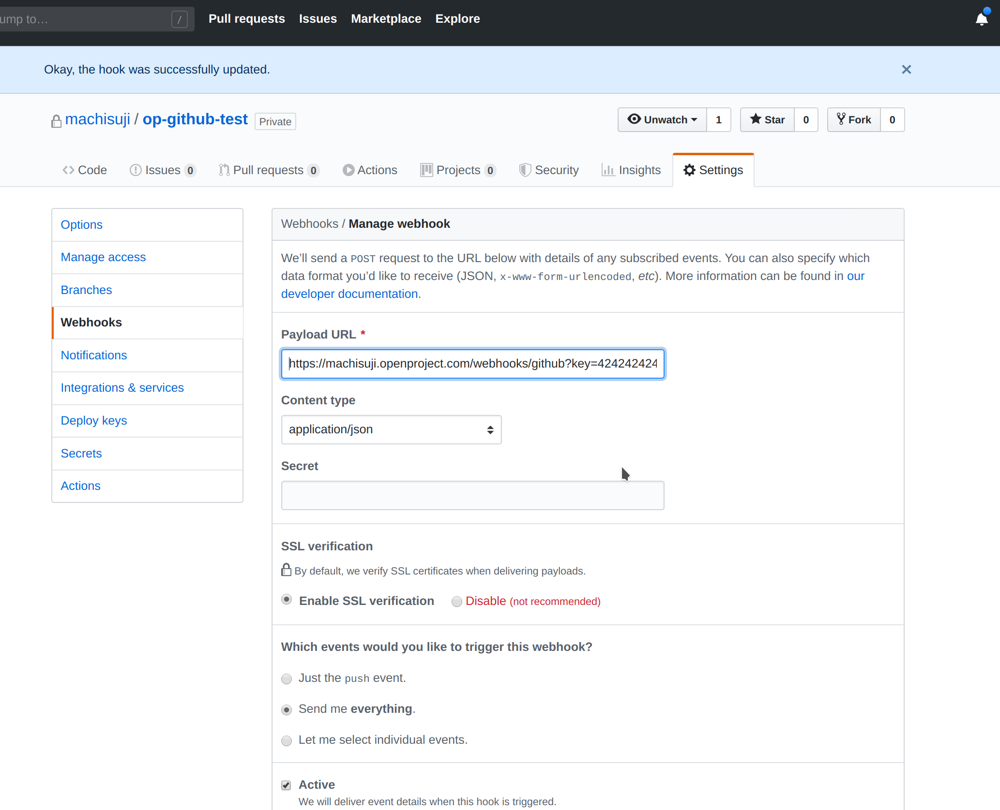

---
sidebar_navigation:
  title: Github Integration
  priority: 600
description: Integrate the Github pull request workflow into OpenProject.
robots: index, follow
keywords: github integration
---
# Github Integration

OpenProject offers are very basic Github integration for pull requests.
You create a pull request in Github and link to an OpenProject work package.


Rather than inserting a link to the work package you can also reference it just by adding "OP#87" to the pull request's description where 87 is the ID of the work package.

OpenProject will add comments to work package about the pull request when
the pull request is

* first referenced (usually when opened)
* merged
* closed


Mind that editing an existing pull request's description to add a work package link will
not add a comment in OpenProject. Github does not send webhook events for that.

If you still want a comment in OpenProject you will have to reference the
work package in a comment on the pull request in Github.

## Configuration

You will have to configure both OpenProject and Github for the integration to work.

### OpenProject

First you will need to create a user in OpenProject that will make the comments.
The user will have to be added to each project with a role that allows them
to comment on work packages.





Once the user is created you need to generate an OpenProject API token for it
to use later on the Github side of things. For this you have to:

1. Login as the newly created user
2. Go to My Account (click on Avatar in top right corner)
3. Go to Access Token
4. Click on generate in the API row

Copy the generated key. You can now configure the necessary webhook in Github.

### Github

In Github you have to set up a webhook in each repository to be integrated with OpenProject.



You need to configure just two things in the webhook.
The **Content Type** has to be `application/json`.
The **Payload URL** must point to your OpenProject server's github webhook endpoint (`/webhooks/github`).

Now you need the API key you copied earlier. Append it to the *Payload URL* as a simple GET parameter named `key`. In the end the URL should look something like this:

```
https://myopenproject.com/webhooks/github?key=42
```
_Earlier version may have used the `api_key` parameter. In OpenProject 10.4, it is `key`._

Now the integration is set up on both sides and you can use it.
