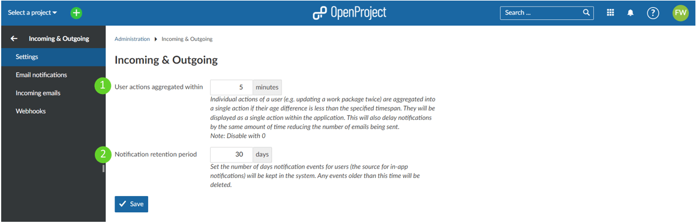
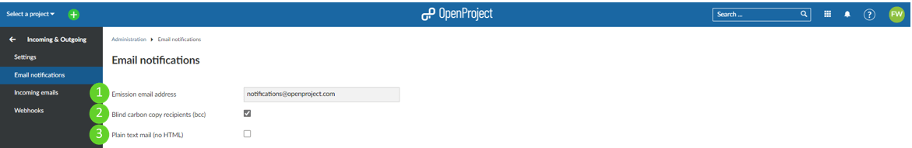
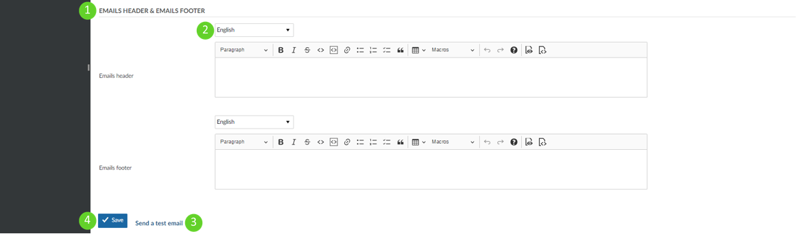
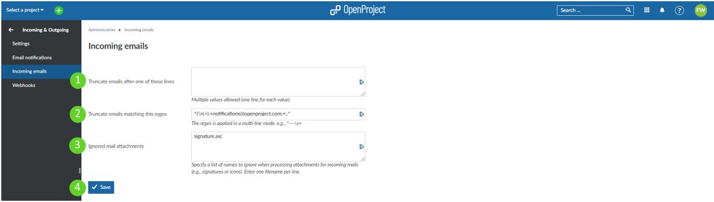

---
sidebar_navigation:
  title: Incoming & Outgoing
  priority: 760
description: incoming and outgoing notification settings in OpenProject.
robots: index, follow
keywords: incoming and outgoing notifications
---
# Incoming & outgoing

Configure **incoming & outgoing settings** in OpenProject, i.e. email notifications and incoming email configuration.

Navigate to *Administration* -> *Incoming & Outgoing*.

| Topic                                                        | Content                                                    |
| ------------------------------------------------------------ | ---------------------------------------------------------- |
| [Incoming & outgoing settings](#incoming--outgoing-settings) | How to configure the global incoming and outgoing settings |
| [Email notifications](#email-notifications-settings) | How to configure outgoing email notifications?             |
| [Incoming emails](#incoming-emails-settings) | How to configure settings for inbound emails?              |

## Incoming & outgoing settings

To change the global settings for incoming and outgoing messages, navigate to *Administration* -> *Incoming & Outgoing*.

1. **User actions aggregated within xx minutes**. This specifies a time interval in which all notifications regarding a specific user's actions are bundled into one single notification. Individual actions of a user (e.g. updating a work package twice) are aggregated into a single action if their age difference is less than the specified timespan. They will be displayed as a single action within the application. This will also delay notifications by the same amount of time reducing the number of emails being sent.
2. **Notification retention period xx days.** This specifies a time interval for which notifications are retained in OpenProject system. Here you can set the number of days notification events for users (the source for in-app notifications) will be kept in the system. Any events older than this time will be deleted.

## Email notifications settings

To adapt email notification settings, go to *Administration* -> *Incoming & Outgoing* -> *Email notifications*.

1. **Emission email address**. This email address will be shown as the sender for the email notifications sent by OpenProject (for example, when a work package is changed).
2. Activate **blind carbon copy recipients** (bcc).
3. Define if the email should be formatted in **plain text** (no HTML).

The frequency of sending e-mails per work package can be set in [this way](../system-settings/display-settings/#time-and-date-formatting-aggregation-of-changes-in-activity).

### Configure email header and email footer

Configure your notification email header and footer which will be sent out for email notifications from the system.

1. **Formulate header and/or footer** for the email notifications. These are used for all the email notifications from OpenProject (e.g. when creating a work package).
2. **Choose a language** for which the email header and footer will apply.
3. **Send a test email**. Please note: This test email does *not* test the notifications for work package changes etc. Find out more in [this FAQ](../../installation-and-operations/installation-faq#i-dont-receive-emails-test-email-works-fine-but-not-the-one-for-work-package-updates).
4. Do not forget to **save** your changes.

## Incoming emails settings

To adapt incoming email settings, go to *Administration* -> *Incoming & Outgoing* -> *Incoming emails*. Here you can configure the following options.

1. **Define after which lines an email should be truncated**. This setting allows shortening email after the entered lines.
2. Specify a **regular expression** to truncate emails.
3. **Ignore mail attachment** of the specified names in this list.
4. Do not forget to **save** the changes.

**To set up incoming email**, please visit our [Operations guide](../../installation-and-operations/configuration/incoming-emails).

**To configure individual email reminders**, please visit our [User guide](../../getting-started/my-account/#email-reminders).