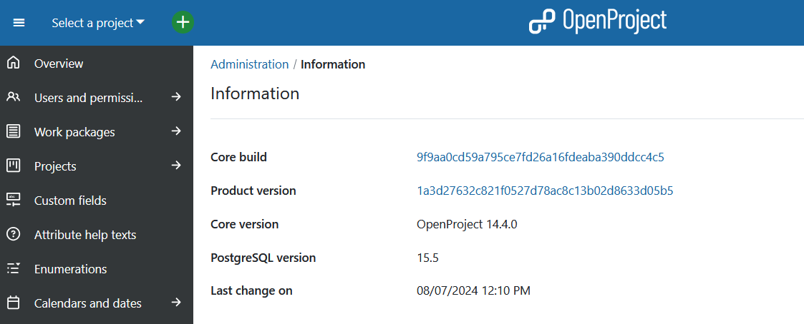
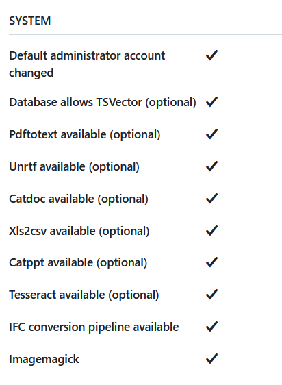
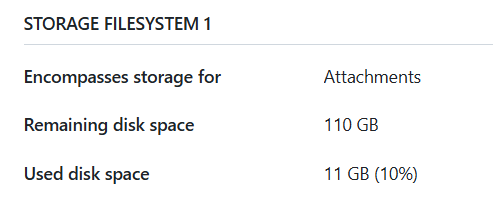

---
sidebar_navigation:
  title: Information
  priority: 100
description: System information in OpenProject.
keywords: system information
---
# System information

System information shows you an overview about current system status and more information on your OpenProject installation configuration, including the core build and version, as well as the product version. Navigate to *Administration* -> *Information*.

## Security badge

The **Security badge** shows the current status of your OpenProject installation. It will inform administrators of an OpenProject installation on whether new releases or security updates are available for your platform.

If enabled, this option will display a badge with your installation status at Administration > Information right next to the release  version, and on the home screen. It is only displayed to administrators.

The badge will match your current OpenProject version against the official OpenProject release database to alert you of any updates or  known vulnerabilities. To ensure the newest available update can be returned, the check will  include your installation type, current version, database type,  enterprise status and an anonymous unique ID of the instance. To localize the badge, the user's locale is sent. No personal  information of your installation or any user within is transmitted,  processed, or stored.

To disable rendering the badge, uncheck the setting at *Administration* > *System settings* > *General* or pass the configuration flag `security_badge_displayed: false` .

## Additional system information

There are a few automatic checks from the system to ensure the safety and correct set up of your configuration if you navigate to *Administration* -> *Information*.

If one point is not fulfilled, e.g. changing the default administrator account, you will get a warning message in the form of a bug icon.

## Storage information

You will get information about the storage filesystem in your OpenProject application if you navigate to *Administration* -> *Information*.

You will see the remaining disk space as well as used disk space in your OpenProject installation.

