---
sidebar_navigation:
  title: GitHub integration
  priority: 900
description: Integrate the GitHub pull request workflow into OpenProject.
keywords: github integration
---
# GitHub integration

OpenProject offers an integration with GitHub pull requests (PRs) to link software development closely to planning and specification.
You create a pull request in GitHub and link it to an OpenProject work package.

## Overview

OpenProject work packages will directly display information from GitHub in a separate tab.

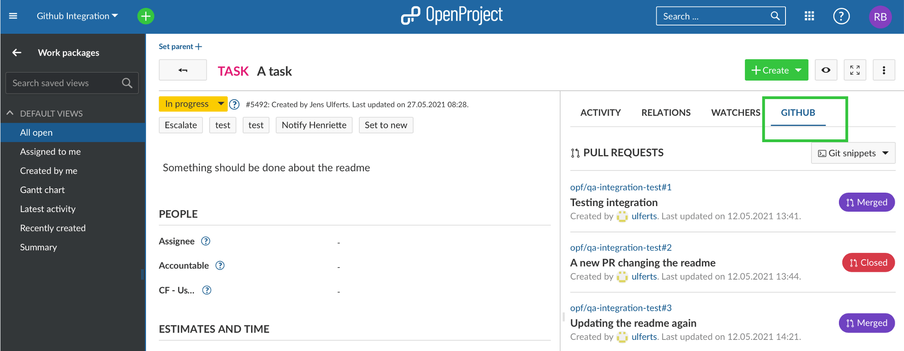

The tab shows all PRs linked to a work package with their corresponding status (e.g. 'Open' or 'Merged') as well as the state (e.g. 'success' or 'queued') of the GitHub actions configured to run for a PR. PRs and work packages are in an n:m relationship, so a work package can be linked to multiple PRs and a PR can be linked to multiple work packages.

Additionally, in your OpenProject work package, the GitHub integration supports you to create a branch straight from the work package and consequently the matching pull request.

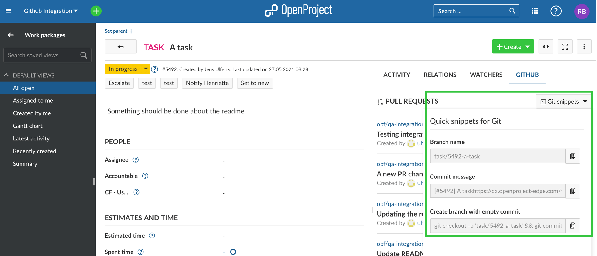

Pull request activities will also show up in the Activity tab when the pull request is

* first referenced (usually when opened)
* merged
* closed

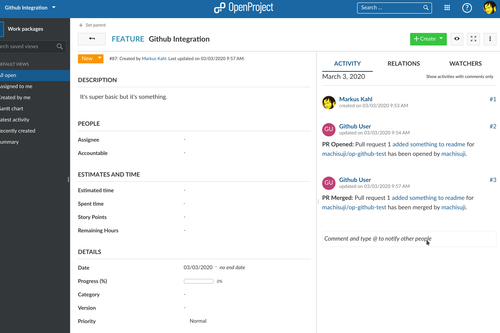

## Create a pull request

As pull requests are based on branches, a new branch needs to be created first. For that, open the GitHub tab in your OpenProject work package detail view. Click on 'Git snippets' to extend the menu. First, copy the branch name by clicking the corresponding button.

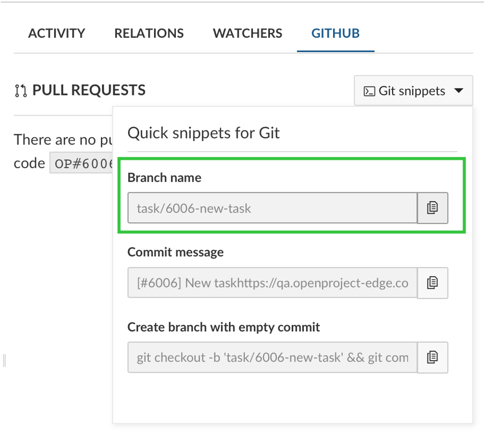

Then, open your git client, e.g. GitHub desktop or a console. There, you create your branch with the name you copied from your OpenProject work package. That way, all the branches will follow a common pattern and as the OpenProject ID is included in the branch name, it will be easy to see the connection between a PR and a work package when taking a look at a list of PRs on GitHub.

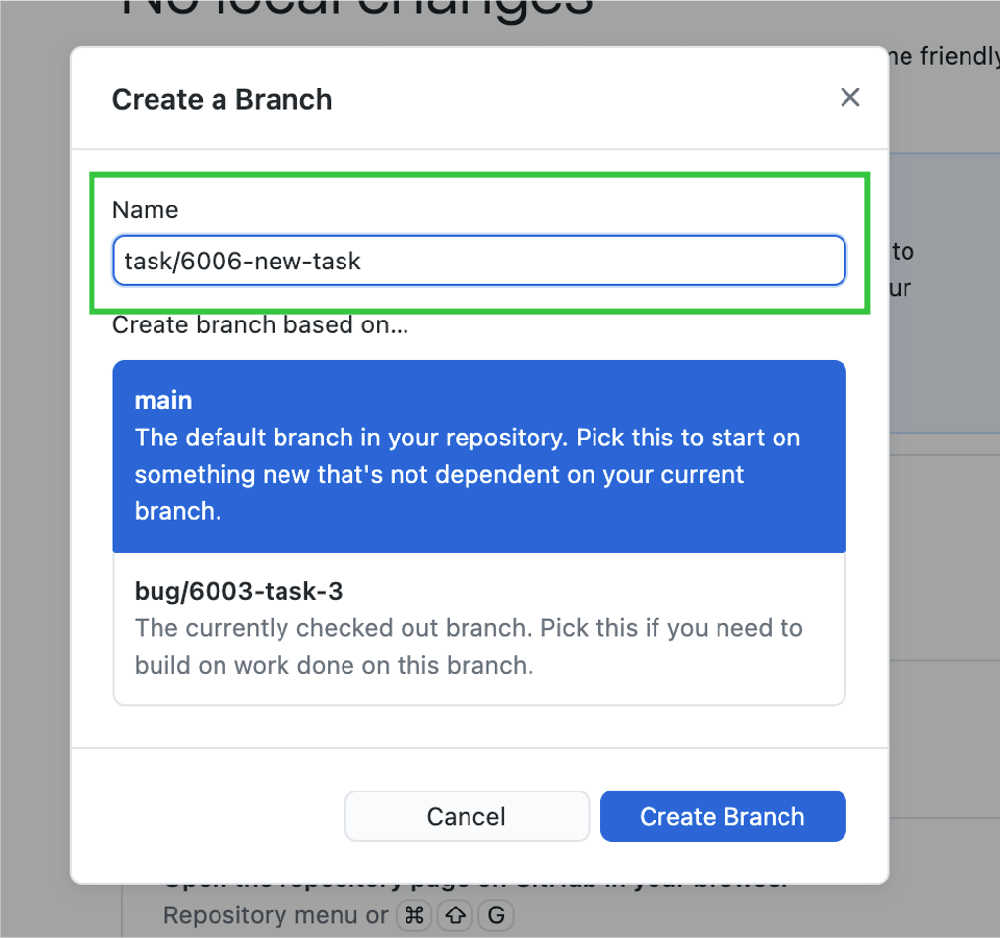

With the branch opened, you can start the actual development work using whatever tool you deem to be the best (it is VIM BTW), to alter your codebase.

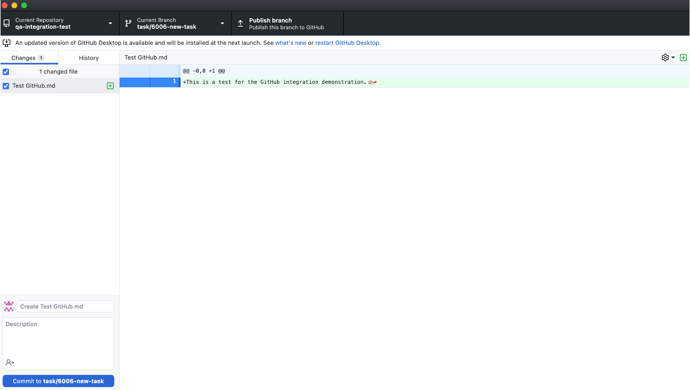

Once you are satisfied with the changes you create a commit. Within the 'Git snippets' menu, OpenProject suggests a commit message for you based on the title and the URL of the work package.

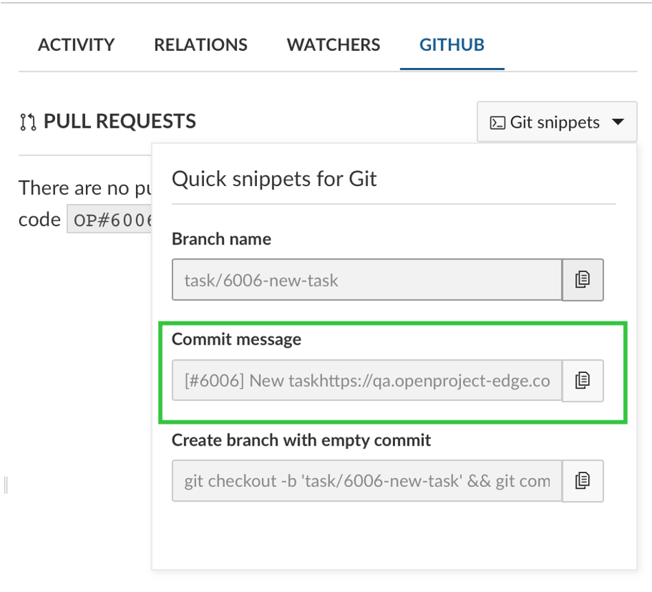

A URL pointing to a work package within a pull request description or a comment will lead to the two entities becoming linked. Using the value in the 'Commit message' input thus helps you to establish that link. The link needs to be in the PR and not in a commit but GitHub will use the first commit message as the proposed branch description (as long as there is only one commit).

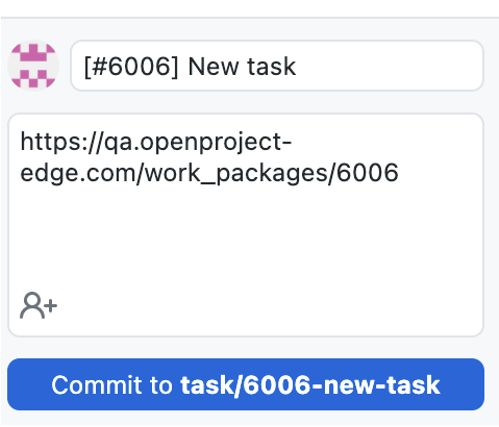

Once the branch is published,

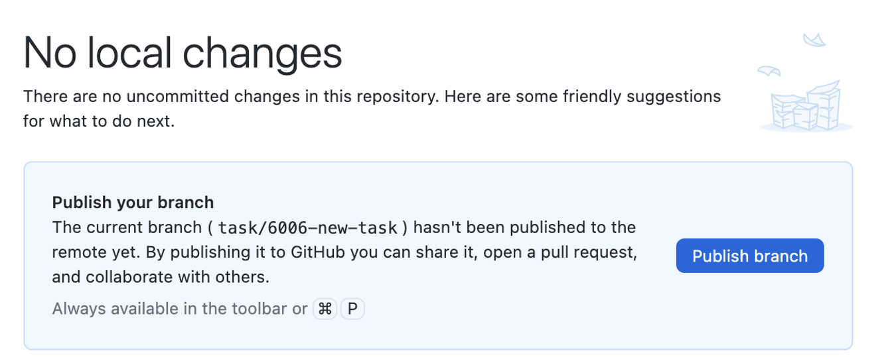

you create your pull request. Title and comment with the link to the respective OpenProject work package will be prefilled, at least if there is only one commit to the branch. Because of this one commit limitation and if the policy is to create a branch as early as possible, there is a third option in the 'Git snippets' menu ('Create branch with empty commit') that will open a branch and add an empty commit to it in one command. Using this option, one can first create the branch quickly and have it linked to the work package right from the beginning. Commits can of course be added to the branch (and PR) after that.

The branch description can be amended before a PR is created giving the opportunity to further describe the changes. To help with that, it is also possible to copy parts of the work package description since the description can be displayed in the markdown format. Links to additional work packages can also be included in the PR description.

Rather than inserting a link to the work package you can also reference it just by adding "OP#87" to the pull request's description where 87 is the ID of the work package.

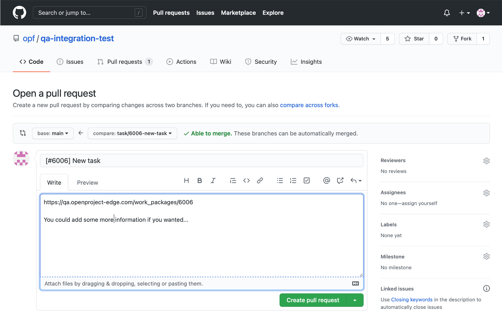

Click on **Create pull request** and your pull request will be opened.

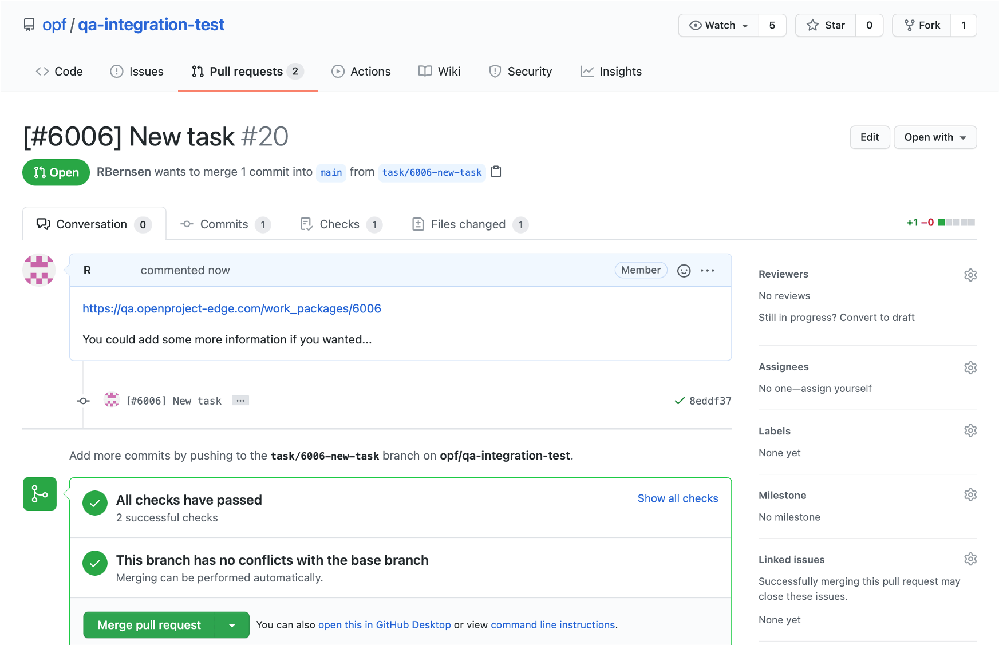

When you click on the link in the comment, it will take you to the OpenProject work package, where you will see in the Activity tab of the work package that the pull request was created.

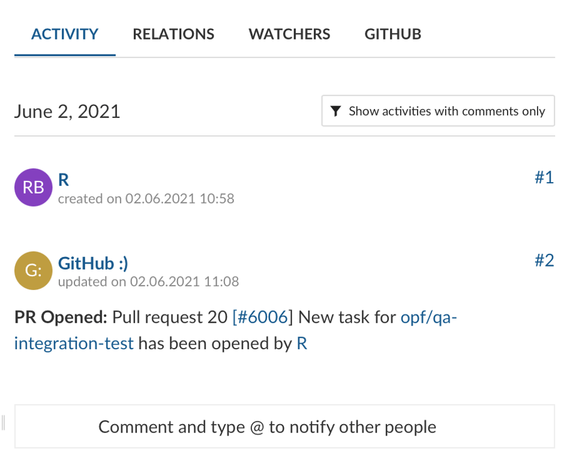

In the GitHub tab of that work package, the status of the pull request as well as status of all the configured GitHub Actions will also be displayed.

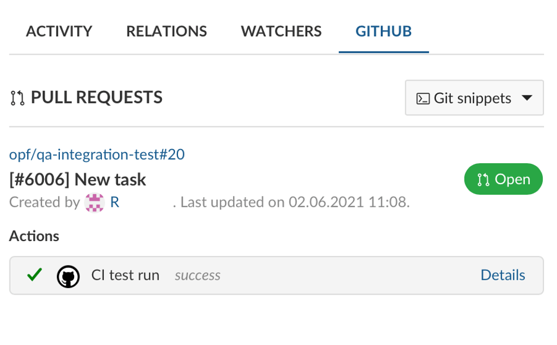

If the status of a pull request changes, it will accordingly appear in its OpenProject work package. Please see the example below.

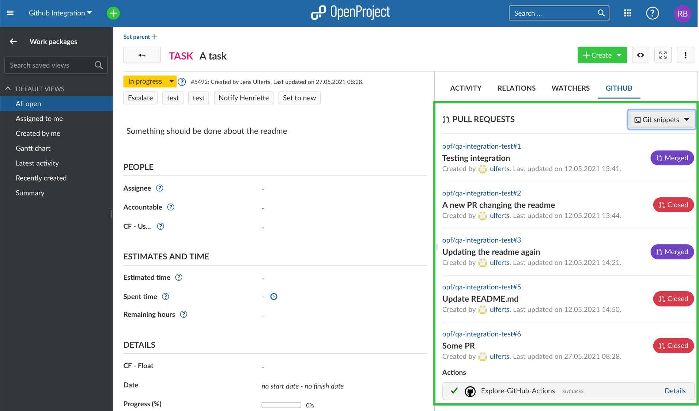

## Configuration

You will have to configure both OpenProject and GitHub for the integration to work.

### OpenProject

First you will need to create a user in OpenProject that will make the comments.
The user will have to be added to each project with a role that allows them
to see work packages and comment on them.

The role needs two permissions and should only receive those two: "View work packages" and "Add notes" which you will find in the "Work package tracking" section.

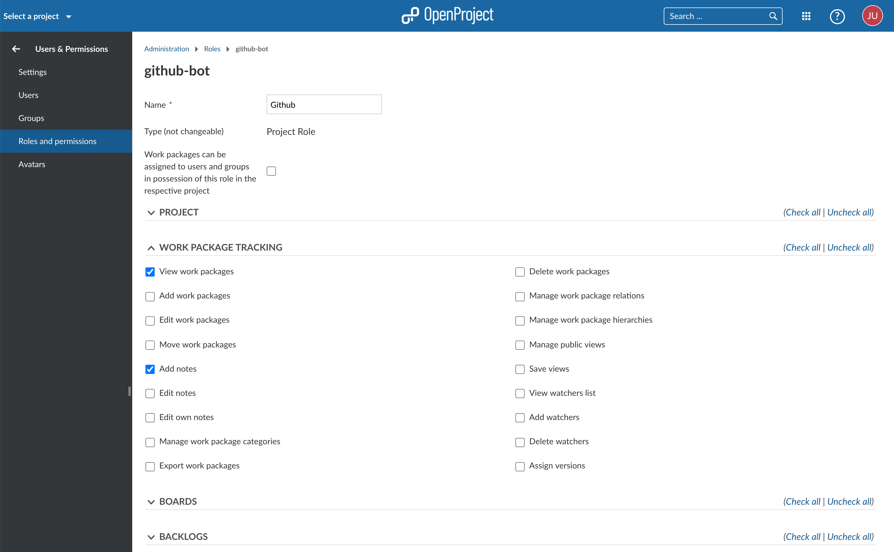

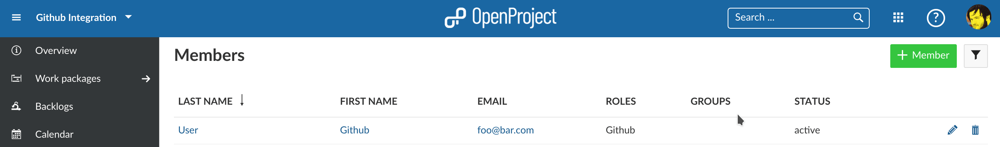

Once the user is created you need to generate an OpenProject API token for it
to use later on the GitHub side of things. For this you have to:

1. Login as the newly created user
2. Go to My Account (click on Avatar in top right corner)
3. Go to Access Token
4. Click on generate in the API row

Copy the generated key. You can then configure the necessary webhook in GitHub.

In addition, in *Project settings* and *Modules* you will need to activate the GitHub module so that all information pulling through from GitHub will be shown in the work packages.

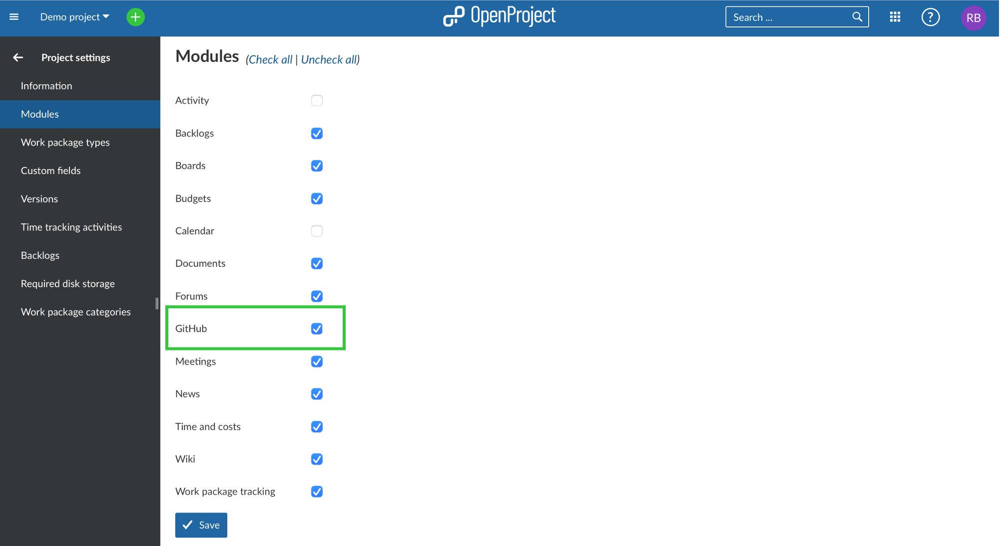

Seeing the 'GitHub' tab requires **Show GitHub content** permission, so this permission needs to be granted to all roles in a project allowed to see the tab.

### GitHub

In GitHub you have to set up a webhook in each repository to be integrated with OpenProject.

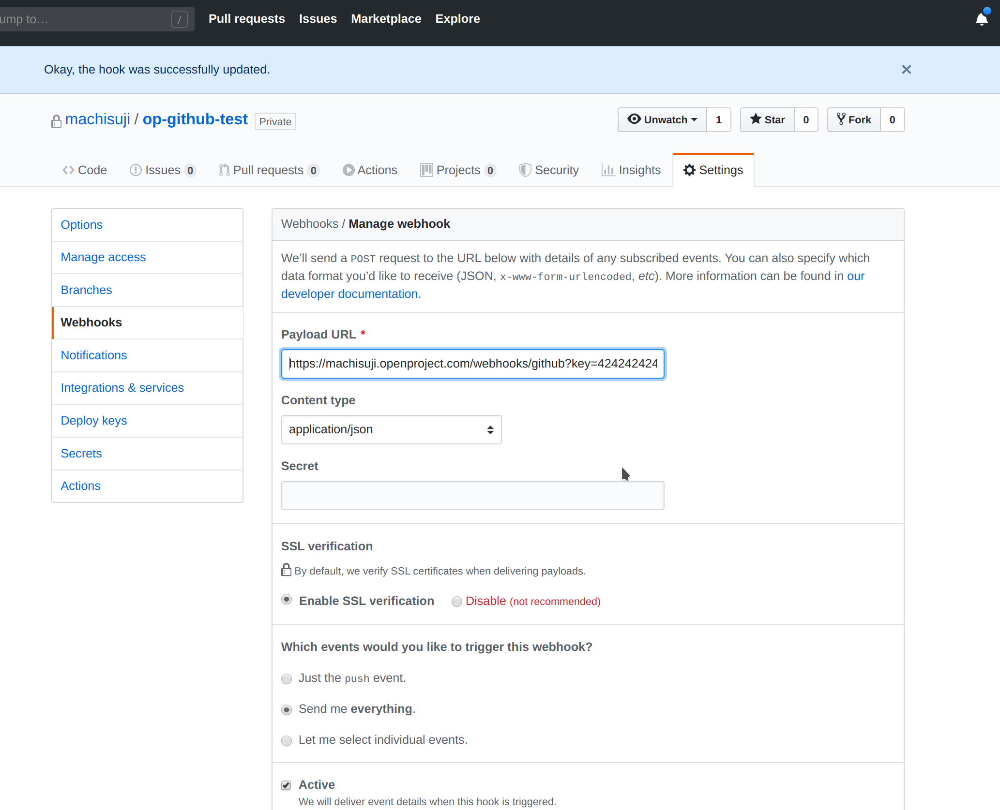

You need to configure just two things in the webhook.
The **Content Type** has to be `application/json`.
The **Payload URL** must point to your OpenProject server's GitHub webhook endpoint (`/webhooks/github`).

> **Note**: For the events that should be triggered by the webhook, please select "Send me everything".

Now you need the API key you copied earlier. Append it to the *Payload URL* as a simple GET parameter named `key`. In the end the URL should look something like this:

`https://myopenproject.com/webhooks/github?key=42`

_Earlier version may have used the `api_key` parameter. In OpenProject 10.4, it is `key`._

Now the integration is set up on both sides and you can use it.
