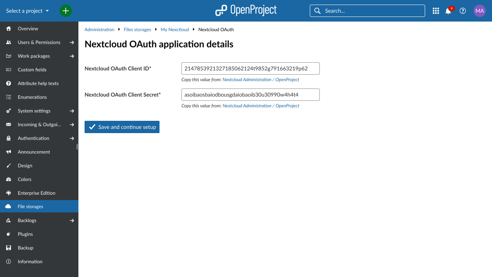
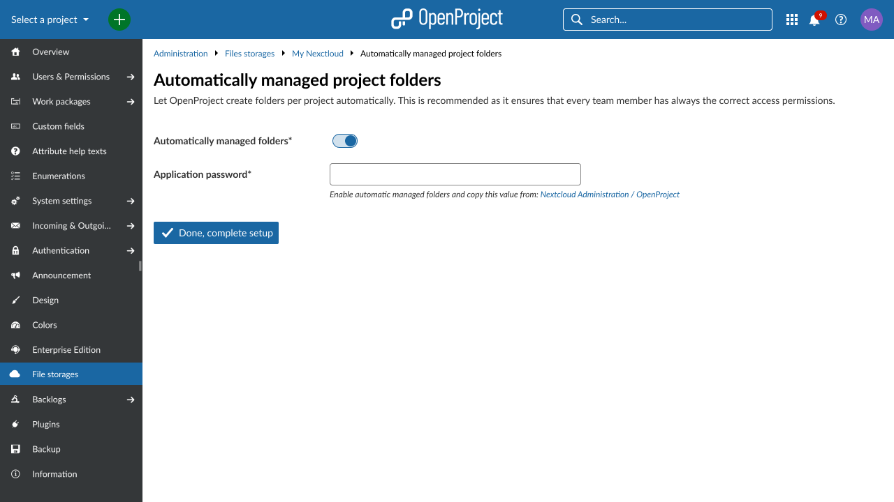
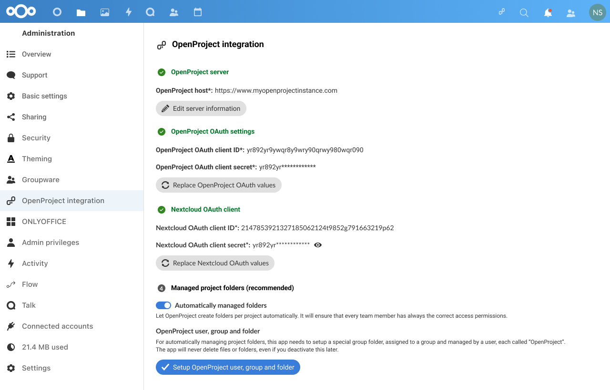
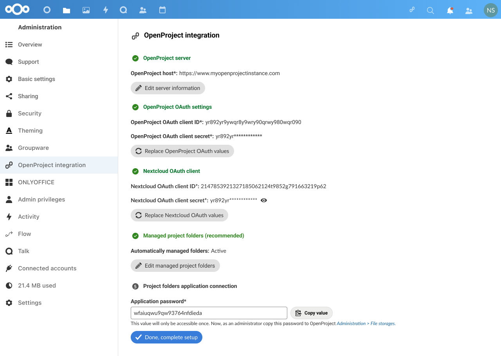
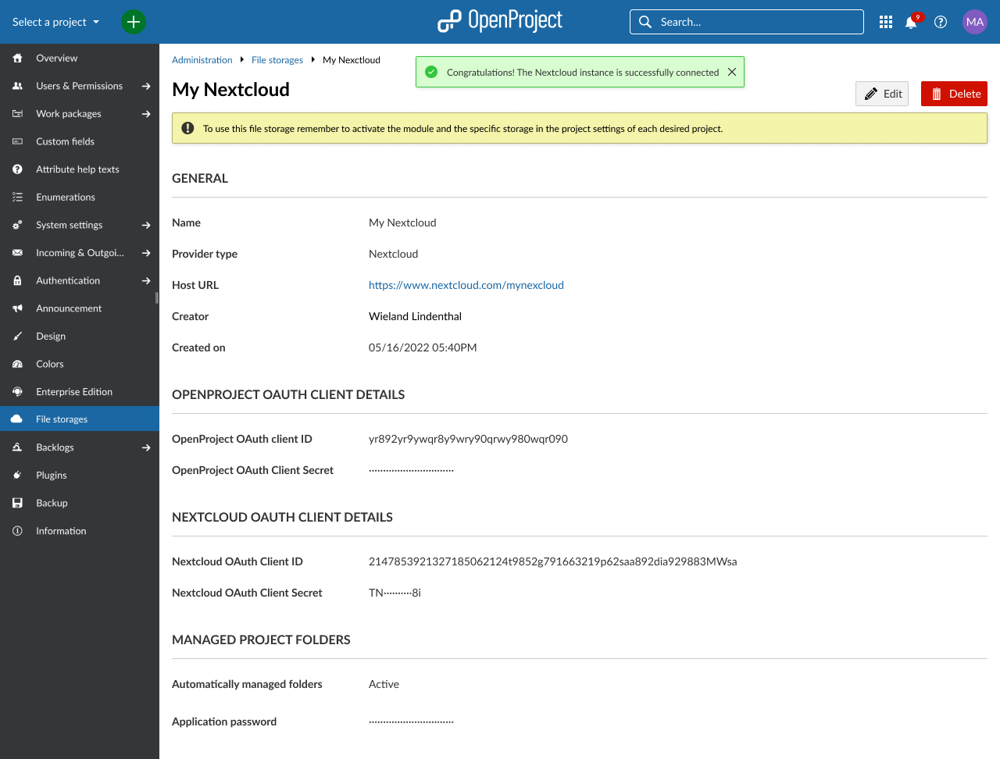
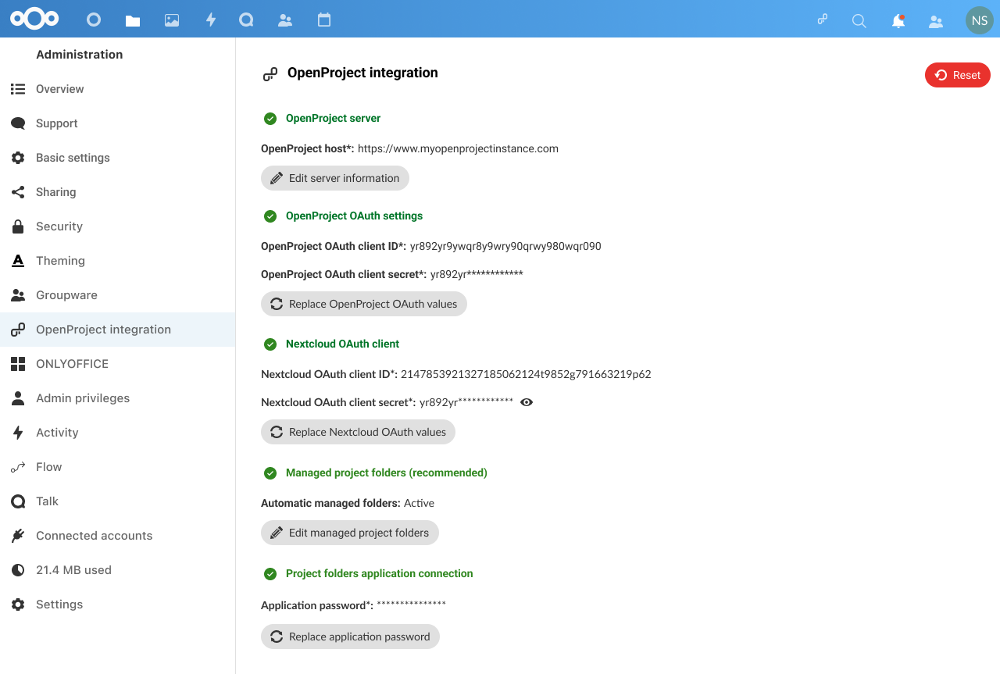

---
sidebar_navigation:
  title: Nextcloud integration setup
  priority: 600
description: Set up Nextcloud as a file storage in your OpenProject instance
keywords: Nextcloud file storage integration
---


# Nextcloud integration setup

| Topic                      | Description                                                  |
| ----------------------------------- | :----------------------------------------------------------- |
| [Minimum requirements](#minimum-requirements)            | Minimum version requirements to enable the integration       |
| [Set up the integration](#set-up-the-integration)      | Connect your Nextcloud and OpenProject instances as an administrator |
| [Reset OAuth values](#reset-oauth-values)             | Create and manage work package types.                        |
| [Delete a Nextcloud file storage](#delete-a-nextcloud-file-storage) | Create and manage work package status.                       |
| [Using the integration](#using-the-integration) | Create and manage workflows for work packages in OpenProject. |

OpenProject offers close integration with Nextcloud to allow users to:

- Link files and folders stored in Nextcloud with OpenProject work packages
- View, open and download files and folder linked to a work package via the Files tab
- View all work packages linked to a file
- View OpenProject notifications via the Nextcloud dashboard

> Note: This guide only covers the integration setup. Please go to our [Nextcloud integration user guide](../../../user-guide/nextcloud-integration/) to learn more about how to work with the Nextcloud integration.

## Minimum requirements

Please note these minimum version requirements for the integration to work with a minimal feature set:

- OpenProject version 12.2 (or above)
- Nextcloud version 22 (or above)
- The [OpenProject Integration](https://apps.nextcloud.com/apps/integration_openproject) app, version 2.0.0 (or above)

We recommend using the latest versions of both Nextcloud and OpenProject to be able to use the latest features. 

## Set up the integration

> **Important**: You need to have administrator privileges in both your Nextcloud and OpenProject instances to set up this integration.

Watch this video to find out how to set up the Nextcloud integration as an Administrator and as a user.
<video src="https://openproject-docs.s3.eu-central-1.amazonaws.com/videos/OpenProject-Nextcloud-Integration-Setup.mp4" type="video/mp4" controls="" style="width:100%"></video>


#### 1. Add the "OpenProject Integration" app in Nextcloud and point it to your OpenProject instance

Start by opening your Nextcloud instance as an administrator.

Navigate to the Nextcloud app store by clicking on *your avatar in the top right corner → Apps*. 


On the left menu, click on **Integration** and look for the "[OpenProject Integration](https://apps.nextcloud.com/apps/integration_openproject)" app. 

You can also use the search field in the top right corner and type "OpenProject" to find it. Once you have found the app, click the **Download and enable** button.


Once the OpenProject Integration app is downloaded and enabled, navigate to the settings page by clicking on *your avatar in the top right corner → Settings*. On the left-side menu, click on **OpenProject Integration**

In the configuration page that appears, you'll see a blank text field titled **OpenProject host**. Enter the address of the OpenProject instance you would like to connect with Nextcloud (including "https://").


Click on the **Save** button. 

> **Note:** If the OpenProject host cannot be added, you may check the [Troubleshooting](#troubleshooting) section at the bottom of this page

The next part of the setup will require you to enter OpenProject OAuth values here, but before we do that, you will need to generate them in OpenProject. To do so, navigate to your OpenProject instance in a new browser tab. 

#### 2. Create a Nextcloud file storage in your OpenProject instance

Navigate to your administration settings page by clicking on *your avatar in the top right corner → Administration*. From the side menu on the left, click on **File storages**.

Click on **+ Storage** to add a new file storage.


A new page titled **New storage** will appear, where you will be able to configure your new Nextcloud storage.

By default, **Provider type** is set to Nextcloud. This does not need to be modified. 

Give a **name** to this new storage. This will be visible to all users in all projects using this file storage. We highly recommended choosing a distinct name that allows users to differentiate it from any other file storages you may add in the future. 

Next, enter the **Host URL** of your Nextcloud instance. This is simply the address of your Nextcloud instance, including the "https://".


Click on **Save and continue setup**. Your new storage is now created, but before you can use it, you will need to exchange OAUth IDs and secrets between your Nextcloud and OpenProject instances. You will do this in the next step.

#### 3. Enter OpenProject OAuth values in Nextcloud settings

At this point, you will see a page titled **OpenProject OAuth application details**.

Note that OpenProject has automatically generated an OAuth **client ID** and a **client secret**. These values are needed to permit Nextcloud to connect to OpenProject.

> **Important**: These generated values are not accessible again after you close the window. Please do not navigate away from this page before copying them over to Nextcloud, as instructed below. Treat these values with care, as you would an important password. Please do not reveal them to anyone else.


Go back to the browser tab where you were configuring the **OpenProject Integration** app. (We recommend you have two browser tabs open: the current one with OpenProject and the former one with Nextcloud).

Copy the two generated values (client ID and secret) from the OpenProject tab to the respective fields in Nextcloud, namely **OpenProject OAuth client ID** and **OpenProject OAuth client secret**. 


Once you have copied the values, click on **Save** to proceed to the next step.

#### 4. Enter Nextcloud OAuth values in OpenProject

In the page that appears, you will see new OAuth values that are once again generated automatically, but this time by Nextcloud.

OpenProject will need these values to be able to connect to your Nextcloud instance.

Much like in the previous step, you will need to copy these two generated values (**Nextcloud OAuth client ID** and **Nextcloud OAtuh client secret**) and paste them into OpenProject.


Navigate back to your OpenProject tab and click on the **Done. Continue setup** button on the screen you previously left it at. You will now see a screen where you will be able to enter the Nextcloud values. 



Once you have entered the client ID and client secrets on this page, click on **Save and continue setup**.

#### 5. Automatically managed folders

As a last step, you will be asked if you want to use automatically managed folders. If you choose this option, OpenProject will automatically create project folders in Nextcloud and manage permissions such that all project members always have the necessary access privileges. Unless you already have a particular folder structure in place, we recommend choosing this option.



In case you want to use this functionality you will be requested to enter a password. Switch back to Nextcloud and click on **Yes, I have copied these values**. This will open the last step of the process in Nextcloud, where you can also select if you want to use automatically managed folders. Click on **Setup OpenProject user, group and folder** to configure the folders and see the password. Once configured, you can copy the password back to OpenProject.





> **Important**: You will need to install the [Group folder](https://apps.nextcloud.com/apps/groupfolders) app in Nextcloudin order to have OpenProject automatically managed your Nextcloud folders. Each storage can only have one group folder with the same name.

At this point, you can click on **Done, complete setup** in both applications and your instance configuration will be completed.



The **OpenProject Integration** page on your Nextcloud tab should also indicate that the integration is complete with three green check marks.



The integration is now complete, and your OpenProject and Nextcloud instances are ready to share information. 

Additional settings on this page also allow you, as an administrator, to define default settings for options that are available to each user. These can of course be overriden by a user to their liking:


- **Enable navigation link** displays a link to the OpenProject instance in the Nextcloud header 
- **Enable unified search for tickets** allows users to search for OpenProject work packages via the universal search bar in Nextcloud 


#### 6. Add your new Nextcloud file storage to a project

Now that the integration is set up, the next step is to make the Nextcloud file storage you just created available to individual projects.

To do so, navigate to any existing project in your OpenProject instance and click on **Project settings** **→ Modules** and follow the instructions in the [Project settings user guide](../../../user-guide/projects/project-settings/file-storages).

> **Note:** For information on how to use the file storage (link Nextcloud user accounts at a user level, link files to a work package, view and download linked files, unlink files), please read our [Nextcloud integration user guide](../../../user-guide/nextcloud-integration/).

## Reset OAuth values

If you wish to reset OAuth values for any reason, you can do so on either side by clicking on the **Reset OAuth values** button (in Nextcloud settings) or the **Replace OAuth values** button (in OpenProject admin settings).

> **Important**: When you reset/replace these values, you will need to update the configuration with the new OAuth credentials from the side you are resetting. This will also require all users to re-authorize OpenProject to access their Nextcloud account by logging in again.


## Delete a Nextcloud file storage

You can delete a Nextcloud file storage either at a project level or at an instance-level. 

Deleting a file storage at a project level simply makes it unavailable to that particular project, without affecting the integration for other projects. Project admins can do so by navigating to *Project settings → File storages* and clicking the **delete** icon next to the file storage you would like to remove.


Deleting a file storage at an instance level deletes the Nextcloud integration completely and make it unaccessible to all projects in that instance. Should an instance administrator nevertheless want to do so, they navigate to *Administration → File storages* and clicking the **delete** icon next to the file storage they would like to remove.


> **Important:** Deleting a file storage as an instance administrator will also delete all settings and links between work packages and Nextcloud files/folders. This means that should you want to reconnect your Nextcloud instance with OpenProject, will need complete the entire setup process once again.


## Using the integration

Once the file storage is added and enabled for projects, your users are able to take full advantage of the integration between Nextcloud and OpenProject. For more information on how to link Nextcloud files to work packages in OpenProject and access linked work packages in Nextcloud, please refer to the [Nextcloud integration guide](../../../user-guide/nextcloud-integration/).


## Troubleshooting

### Setting up OpenProject in Nextcloud

#### Error message "Please enter a valid OpenProject hostname"

On Nextcloud inside the _OpenProject Integration_ App, when adding the OpenProject host, it shows the error **"Please enter a valid OpenProject hostname"**. There are multiple reasons that can cause the error;

- The host address could be wrong. Please check in a separate browser tab that the URL that you have provided is correct. OpenProject should load. 
- If your Nextcloud and OpenProject servers are both in a local network, it might be necessary to explicitly [allow local remote servers in Nextcloud](https://docs.nextcloud.com/server/latest/admin_manual/configuration_server/config_sample_php_parameters.html) by setting a system configuration via your Nextcloud command line. This allows Nextcloud to connect to other local servers. Use the command `sudo -u www-data php occ config:system:set allow_local_remote_servers --value 1` in order to enable the setting for Nextcloud.
- Your Nextcloud server does not have access to the OpenProject server. To test the connection between Nextcloud and OpenProject, you can use the following command on your Nextcloud server's command line:

  ```bash
  curl https://openproject.example.com
  ```
  In case the `curl` command above results in an error pay attention what it is telling you. Typical reasons for connection issues are misconfigured firewalls, proxies, or a bad TLS/SSL setup.

##### While using a self signed TLS/SSL certificate you receive "certificate verify failed"

Some administrators setup OpenProject using a self signed TLS/SSL certificate with their own CA (certificate authority). That CA needs to be known on the Nextcloud server. On a Debian/Ubuntu based server, make sure you add the CA certificate for your OpenProject certificate to `/usr/local/share/ca-certificates` and run `sudo update-ca-certificates` afterwards. Then Nextcloud's PHP code should be able to verify your OpenProject TLS/SSL certificate when emitting HTTPS requests to your Nextcloud server.

Attention: Please do not confuse the CA for the Nextcloud server's certificate with the CA of the OpenProject server's certificate which you might have provided in the OpenProject installation wizard. They do not necessarily need to be the same.

#### While setting up Project folders

While setting up the project folders we create a new user, group and group folder named `OpenProject`. At the time of set up the system expects either all of these entities to have been set up with proper permissions or none of them to be present. If one or more of these entities are present without required permissions, an error message will be displayed.

##### Error message "The user "OpenProject" already exists"

On Nextcloud inside the _OpenProject Integration_ App, when setting up an OpenProject user, group and folder, it shows the error **"The user "OpenProject" already exists"**. This error occurs if user `OpenProject` exists but group `OpenProject` and/or group folder `OpenProject` doesn't exist, or they exist with broken permissions. To solve this problem refer to possible solutions in section [Possible solutions to Project folders setup error](#possible-solutions-to-project-folders-setup-error)

##### Error message "The group "OpenProject" already exists"

On Nextcloud inside the _OpenProject Integration_ App, when setting up an OpenProject user, group and folder, it shows the error **"The group "OpenProject" already exists"**. This can occur if group or group folder `OpenProject` exists but the user `OpenProject` doesn't exist. To solve this problem refer to possible solutions in section [Possible solutions to Project folders setup error](#possible-solutions-to-project-folders-setup-error)

##### Error message "The group folder name "OpenProject" already exists"

On Nextcloud inside the _OpenProject Integration_ App, when setting up an OpenProject user, group and folder, it shows the error **"The group folder name "OpenProject" already exists"**. This can occur if both group and user `OpenProject` doesn't exist but the group folder `OpenProject` exists. To solve this problem refer to possible solutions in section [Possible solutions to Project folders setup error](#possible-solutions-to-project-folders-setup-error)

##### Possible solutions to Project folders setup error

If you are facing any of the aforementioned errors while trying to set up the `Project folders` feature for the first time, or you don't care about the `OpenProject` user/group/folder data then the easiest solution is to remove any of the created `OpenProject` user/group/folder entities. Please follow the following steps:

- Disable the _OpenProject Integration_ App
- Remove user `OpenProject`
- Remove group `OpenProject`
- Inside the _Group folders_ App (*Administration settings → Administration → Group folders*), remove group folder `OpenProject`
- Enable the _OpenProject Integration_ App
- Set up the project folders again

> Note: You need to disable the _OpenProject Integration_ App because user/group `OpenProject` is protected by the app, and it won't allow you to delete the user/group named `OpenProject`. Disabling and enabling the app is safe. No app data will be deleted.

If you do care about the `OpenProject` user/group/folder data then the conditions that bring the project folder setup to error state, and its possible solutions are as listed below: 

- User `OpenProject` doesn't exist. Please check if the user exists, if not create a user named `OpenProject` with username and display name `OpenProject`, some secure random password, email is not necessary.
- Group `OpenProject` doesn't exist. Please check if the group exists, if not create a group named `OpenProject`.
- User `OpenProject` is not a member of group `OpenProject`. Please check the user is a member of the group, if not add the user `OpenProject` to the group `OpenProject`.
- User `OpenProject` is not group admin of group `OpenProject`. Please check the user is admin of the group, if not make user `OpenProject` the group admin of group `OpenProject`
- Group folder `OpenProject` doesn't exist. If you don't have the _Group folders_ App installed, please install and enable it. Inside the _Group folders_ App (*Administration settings → Administration → Group folders*) make a group folder named `OpenProject`. Add the group `OpenProject` to the group folder with all the permissions i.e. Write, Share, Delete. Add user `OpenProject` to advance permissions list.
- Group folder `OpenProject` is not assigned to group `OpenProject`. Inside the _Group folders_ App (*Administration settings → Administration → Group folders*) check if the `OpenProject` group folder has group `OpenProject` assigned to it, if not add the group `OpenProject` with all the permissions i.e. Write, Share, Delete.
- Group `OpenProject` doesn't have all the permissions for group folder `OpenProject`. Inside the _Group folders_ App (*Administration settings → Administration → Group folders*) check if the group `OpenProject` has all the permissions for group folder `OpenProject`, if not give group `OpenProject` all the permissions i.e. Write, Share, Delete.
- User `OpenProject` doesn't have advanced permissions for group folder `OpenProject`.  Inside the _Group folders_ App (*Administration settings → Administration → Group folders*) check if the user `OpenProject` has advanced permissions for group folder `OpenProject`, if not add user `OpenProject` to advanced permissions list.

> Note: The name `OpenProject` is case-sensitive, so should be in exactly that format.

#### While trying to delete or disable user/group "OpenProject"

If you face an error while trying to delete or disable user/group "OpenProject" then that's because user/group is protected by the _OpenProject Integration_ App. If you really need to delete the user or group follow these steps:

1. Disable the _OpenProject Integration_ App
2. Remove user `OpenProject`
3. Remove group `OpenProject`
4. Inside the _Group folders_ App (*Administration settings → Administration → Group folders*), remove group folder `OpenProject`
5. Enable the _OpenProject Integration_ App

> Note: Disabling and enabling the app is safe. No app data will be deleted.

### Setting up Nextcloud in OpenProject

#### Error message "Host can not be connected to"

On OpenProject inside the storage administration (*Administration → File storages → + Storage*), when adding the Nextcloud host, it shows the error "Host can not be connected to". There are multiple potential reasons that can cause this error message.

- The host address could be simply wrong. Please check in a separate browser tab that the URL that you have provided is correct. Nextcloud should load.
- Your OpenProject server does not have access to the Nextcloud server. To test the connection between OpenProject and Nextcloud, you can use the following command on your OpenProject server's command line:

  ```bash
  curl -H 'OCS-APIRequest:true' -H 'Accept:application/json' https://nextcloud.example.com/nextcloud/ocs/v2.php/cloud/capabilities
  ```
  
  If Nextcloud is setup correctly the response should look similar to the following. Pay special attention to current Nextcloud version, which in this example here is "24.0.6". At the time of writing this documentation the minimum version of Nextcloud is 22.
  
  ```
  {"ocs":{"meta":{"status":"ok","statuscode":200,"message":"OK"},"data":{"version":{"major":24,"minor":0,"micro":6,"string":"24.0.6","edition":"","extendedSupport":false},"capabilities":{"bruteforce":{"delay":0},"metadataAvailable":{"size":["\/image\\\/.*\/"]},"theming":{"name":"Nextcloud","url":"https:\/\/nextcloud.com","slogan":"a safe home for all your data","color":"#0082c9","color-text":"#ffffff","color-element":"#0082c9","color-element-bright":"#0082c9","color-element-dark":"#0082c9","logo":"https:\/\/nextcloud.example.com\/nextcloud\/core\/img\/logo\/logo.svg?v=0","background":"https:\/\/nextcloud.example.com\/nextcloud\/core\/img\/background.png?v=0","background-plain":false,"background-default":true,"logoheader":"https:\/\/nextcloud.example.com\/nextcloud\/core\/img\/logo\/logo.svg?v=0","favicon":"https:\/\/nextcloud.example.com\/nextcloud\/core\/img\/logo\/logo.svg?v=0"}}}}}
  ```
  If you do not get such a response check out what the `curl` command above is telling you. Typical reasons for connection issues are misconfigured firewalls, proxies, or a bad TLS/SSL setup.

##### While using a self signed TLS/SSL certificate you receive "certificate verify failed"

Some administrators setup Nextcloud using a self signed TLS/SSL certificate with their own CA (certificate authority). The CA needs to be known on the OpenProject server. On a Debian/Ubuntu based server, make sure you add the CA certificate for your Nextcloud certificate to `/usr/local/share/ca-certificates` and run `sudo update-ca-certificates` afterwards. Then OpenProject's Ruby code should be able to verify your Nextcloud TLS/SSL certificate when emitting HTTPS requests to your Nextcloud server.

Attention: Please do not confuse the CA for the Nextcloud server's certificate with the CA of the OpenProject server's certificate which you might have provided in the OpenProject installation wizard. They do not necessarily need to be the same.


#### Error message "Host is not fully set up"

The integration OpenProject with Nextcloud makes use of authorized HTTP requests between the two servers. The HTTP requests contain a `Authorization` header, containing a `Bearer` access token. Sometimes Nextcloud installations are not fully setup and the HTTP server strips the `Authorization` header, with the consequence that Nextcloud does not know which Nextcloud user is requesting. Run the following command on the command line of your OpenProject server to check that your installation is complete

  ```bash
  curl --location --request GET 'https://nextcloud.example.com/index.php/apps/integration_openproject/check-config' --header 'Authorization: foo'
  ```

  If Nextcloud setup correctly the response should look like the following

  ```
  {"user_id":"","authorization_header":foo}
  ```

  If not, first verify that the app **OpenProject Integration** is installed. If that is the case please check the [instructions for setting up pretty URLs in Nextcloud](https://docs.nextcloud.com/server/22/admin_manual/installation/source_installation.html#pretty-urls). This usually also resolves the issue of stripped `Authorization` headers.

## Getting support

If you run into any new issues or you cannot solve your integration please use our [Support Installation & Updates forum](https://community.openproject.org/projects/openproject/forums/9) or if you have an Enterprise subscription, please contact us at Enterprise Support.
