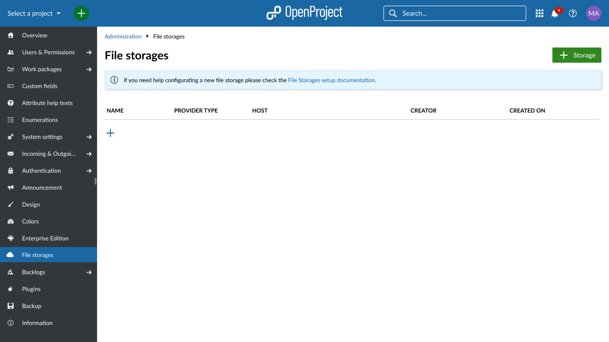
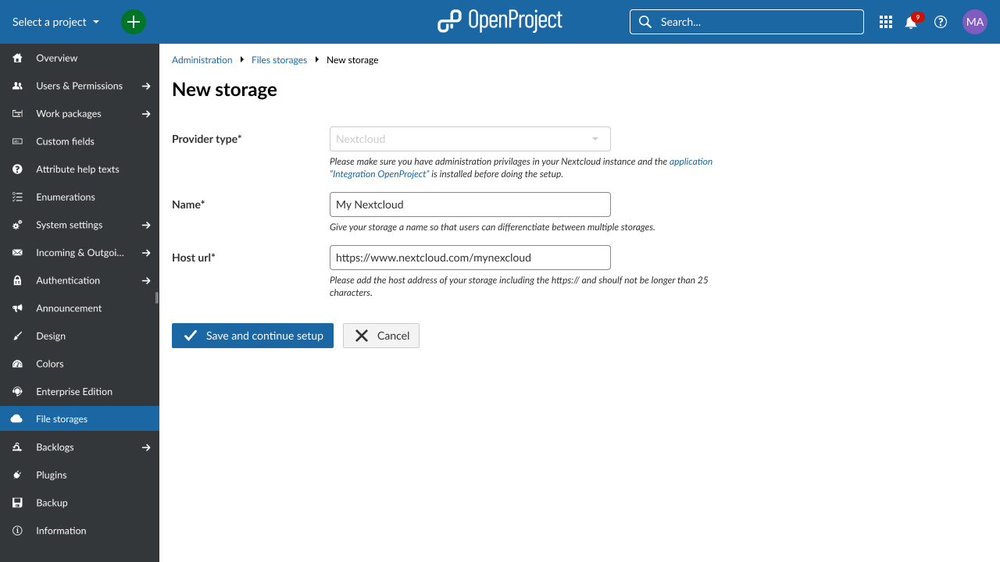
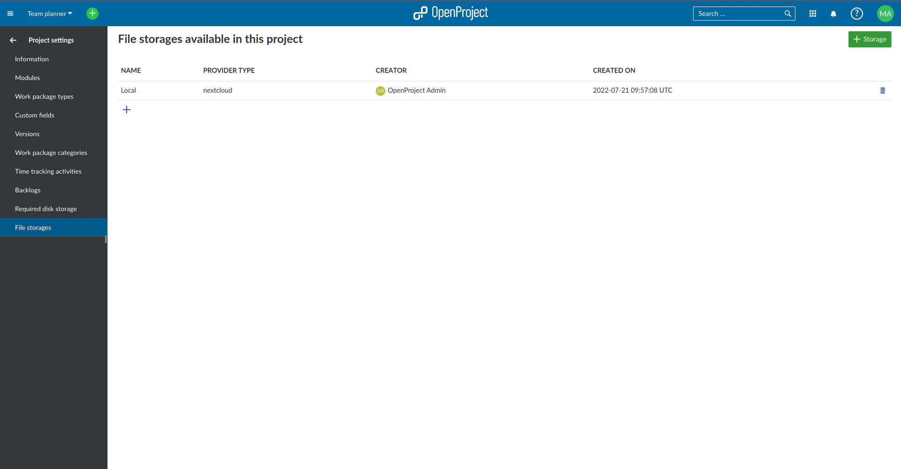
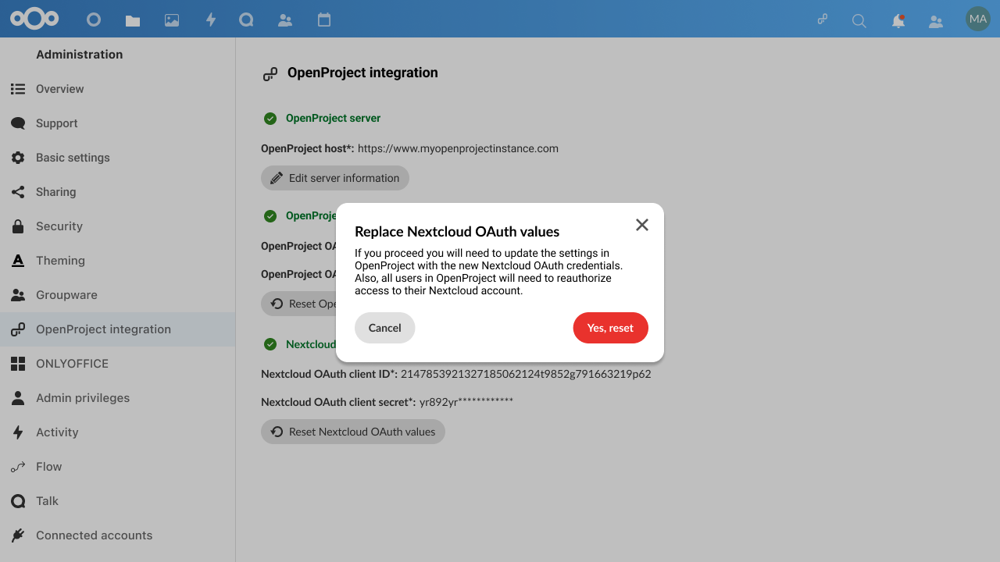

---
sidebar_navigation:
  title: Nextcloud integration setup
  priority: 600
description: Nextcloud integration setup
keywords: integrations, apps, Nextcloud
---

# OpenProject and Nextcloud integration setup 

The integration between OpenProject and Nextcloud has the potential to improve the productivity of all users. It combines the strengths of Nextcloud, the world's most deployed on-premises collaborative file storage platform and OpenProject, the leading free and open source project management and collaboration software

This integration allows you to link files and folders in Nextcloud with work packages in OpenProject, allowing you to see all files related to a work package (in Open Project) and all work packages related to a file (in Nextcloud). As a project member, you no longer need to lose time trying to find the right files to be able to complete your tasks, and the integration of OpenProject-specific notifications on Nextcloud dashboard ensures that no change goes unnoticed. 

## Step-by-step setup instructions

For integrating with OpenProject 12.2, the minimum required version of Nextcloud is 22. For the Nextcloud app  "OpenProject integration" that extends your Nextcloud installation, the minimum required version is 2.0.0. To be able to configure this integration, you need to have administrator privileges in both your Nextcloud and OpenProject instances.

**1. Add the "OpenProject integration" app and connect the instance** - in Nextcloud

To activate your integration to OpenProject in Nextcloud, navigate to the built-in app store. You find the app store in the menu that opens when you click your round user avatar in the top right corner. In the app store click on _Integrations_. There you will find the "OpenProject integration" app. You can also use the search field in the top right corner to look for the OpenProject integration app. Once you have found the app, click the button **Download and enable**.

Once the OpenProject integration app is downloaded and enabled, you can access it from within the _Settings_ page, via the side menu. Start by entering the _Host URL_ of your desired OpenProject instance.

Click on the **Save** button and open your OpenProject instance in a new browser tab.

**2. Introduce the basic information of your integration** - in OpenProject

Make sure you are logged in as an administrator in your OpenProject instance. Navigate to *File storages* from the Administration page. To start configuring your new Nextcloud integration, click on the **Add (+)** button to add a new file storage.

By default, the storage *Provider type* is set to _Nextcloud_; this does not need to be modified. To proceed, enter a *Name* to your Nextcloud storage. This name will be visible to all the users using it. We highly recommended choosing a clear and distinct name that allows users to differentiate it from other potential file storages integrations in the future. You will also need to set the *Host URL* of your Nextcloud instance. The *Host URL* is the web address of your Nextcloud instance. Make sure you include the _https://_ bit of the address.

Once you filled in all mandatory fields, click on the **Save and continue setup** button.

**3. Generate and copy the OpenProject OAuth values** - in OpenProject and Nextcloud

In this step, the *OpenProject OAuth values* are generated automatically. These values are needed to permit OpenProject to connect to Nextcloud. If you have not done so yet, we recommend you to best have two browser tabs open, the current one with OpenProject and the former one with Nextcloud. Now copy the two *OpenProject OAuth values* from the OpenProject tab to the respective fields in the Nextcloud tab. Simply paste them into the respective _OpenProject OAuth settings_ fields.

> **Important**: The *OpenProjects OAuth values (client ID and client secret)* are not accessible again after you close the window. Please make sure you copy the generated values you see in the _Nextcloud OpenProject Integration settings_. Treat these values with care. Do not save them in any public place. Simply treat them as carefully as you would treat an important password.

Once you have copied the values, click on the **Save** button to proceed to the next step in Nextcloud.

**4. Generate and copy the Nextcloud OAuth values** - in Nextcloud and OpenProject

As in the previous step, the *OAuth values* are generated automatically, but this time on the Nextcloud end. These values are needed to allow the connection from Nextcloud to OpenProject, so you will need to once again copy them here and paste them in OpenProject (without closing the Nextcloud tab). If you had not clicked the **Done. Continue setup** button in the OpenProject tab in the previous step, you can do so now to proceed to the screen where you will be able to paste the Nextcloud OAuth values in OpenProject.

Once these values are entered, you can click the button **Save and complete setup** in your OpenProject tab and the **Yes, I have copied these values** in Nextcloud. Once this is done, your instance configuration is complete.

**5. Enable the file storages module and activate it in the desired project** - in OpenProject

Now that the integration setup is complete and ready to use, there is just one more step for you as administrator: in every project in which you want to use the integration you need to activate the *File storages* module and add your recently configured file storage to the project.

To activate the module, go to the **Project settings** in the desired project and access the **Modules** entry in the side menu. There, activate the *File storages* module. Once this is done, a new menu entry called **File storages** appears at the bottom of the side menu, where you can select your new Nextcloud integration.

## How to reset your OAuth values

If you need to reset the values of the Nextcloud integration (as an administrator), you can always reset the OAuth values from both sides of the integration by clicking on the **Reset OAuth values** (in Nextcloud) or **Replace OAuth values** (in OpenProject) buttons.

> **Important**: When you reset/replace these values, you will need to update the configuration with the new OAuth credentials from the side you are reseting. This will also require all users to re-authorize OpenProject to access their Nextcloud account by logging in again.

## How to delete a file storage integration

As an administrator, you can always delete the integration to Nextcloud using the **Delete** button in OpenProject settings or the **Reset** button in Nextcloud settings.

> **Important:** If you perform this action, the integration will be reset and deleted and all settings and user connections that were created will be deleted. This means that should you want to reconfigure the integration, you will need complete the entire setup process once again.
