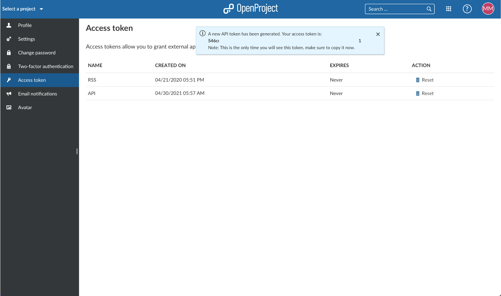
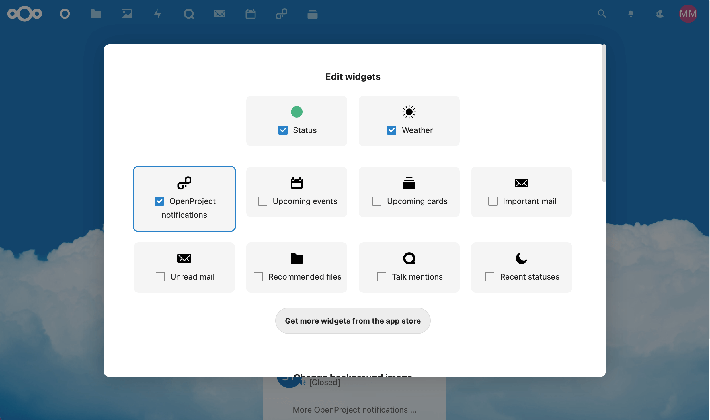
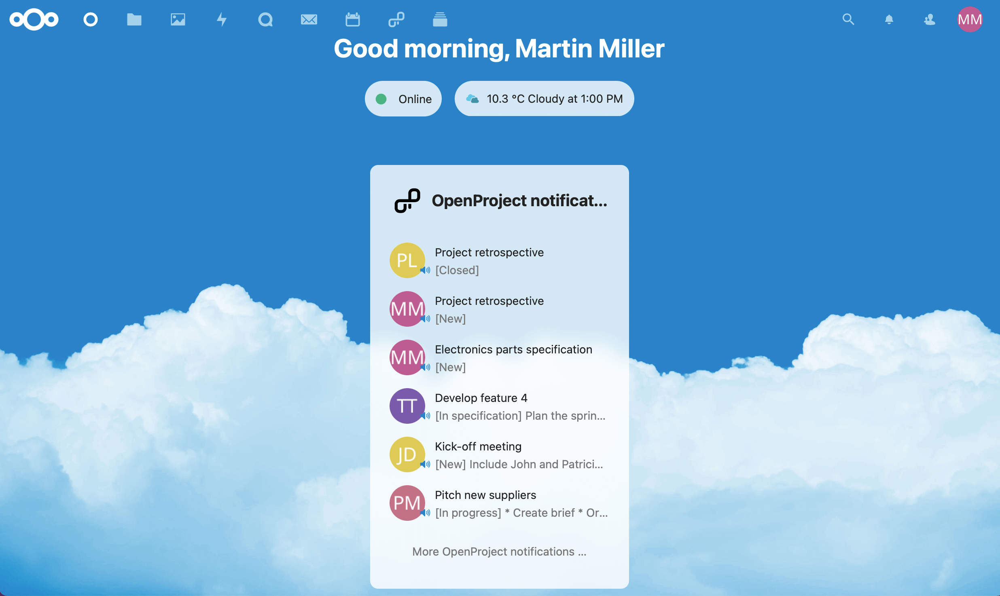
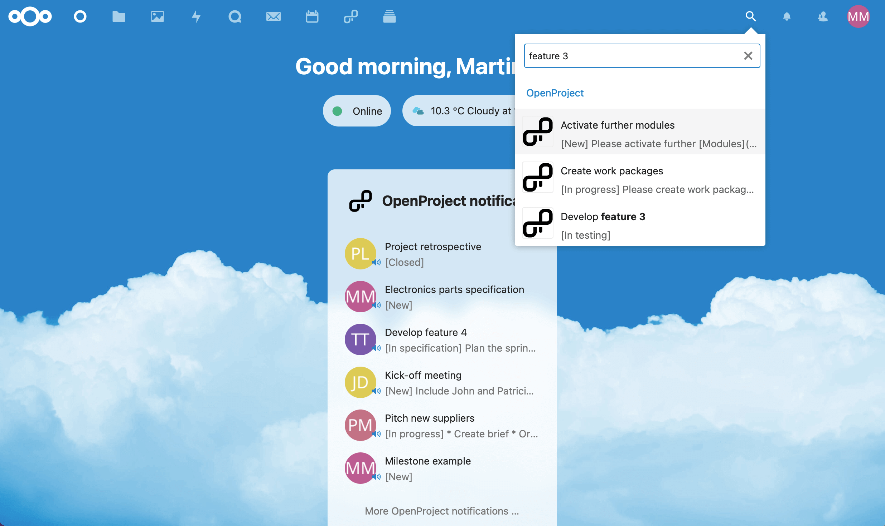
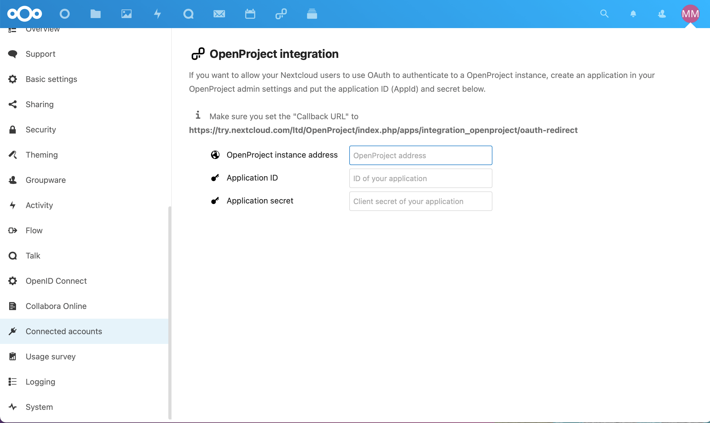
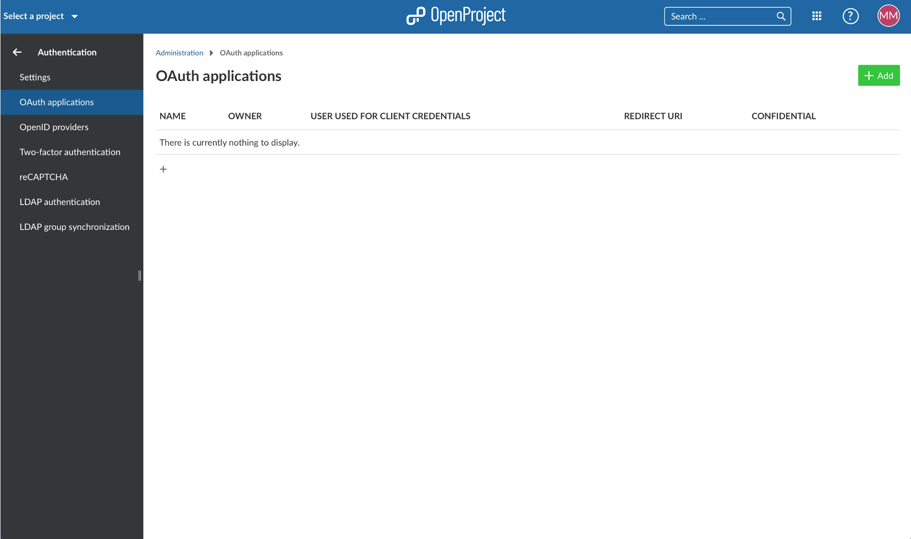
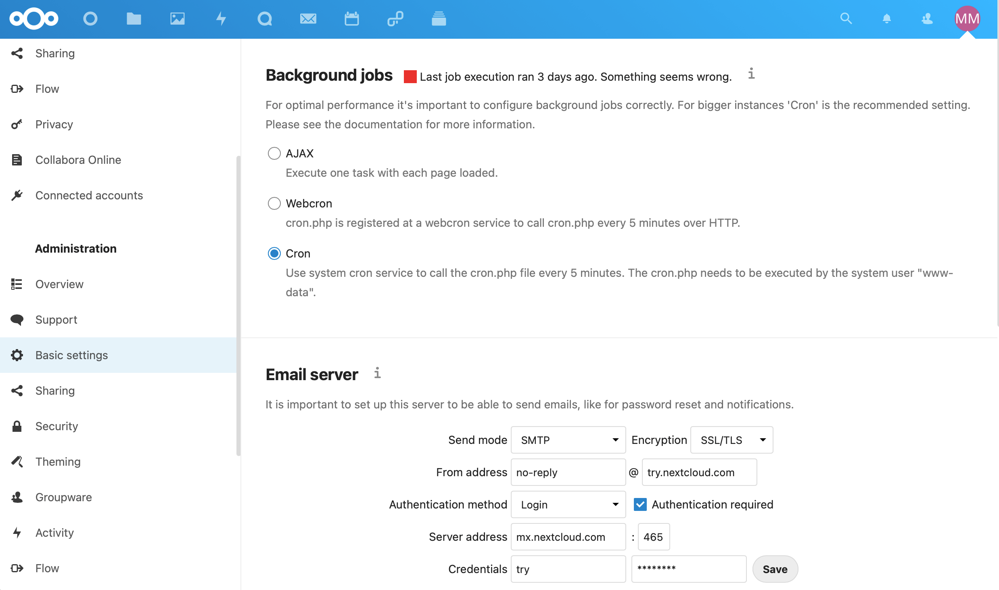

---
sidebar_navigation:
  title: Nextcloud integration
  priority: 600
description: Nextcloud and OpenProject integration
robots: index, follow
keywords: integrations, apps, Nextcloud
---

# OpenProject and Nextcloud integration 

The OpenProject and Nextcloud integration will improve the productivity of their enterprise users. It combines the strengths of the market leading content collaboration platform Nextcloud and the leading open source project management software OpenProject.

The integration is available starting with Nextcloud 20. It enables users to keep an eye on ongoing project activities directly in their Nextcloud instance.

## Benefits of the integration

The first step of the combined effort is the integration of OpenProject in the Nextcloud dashboard. Users can add an OpenProject widget to display latest changes to project's work packages. With this, it offers users a view of ongoing projects and activities.

## Step by step instructions

The integration is available starting with Nextcloud 20. It enables users to keep an eye on ongoing project activities directly out of their Nextcloud instance.

**Add OpenProject integration app**

To activate your integration to OpenProject in Nextcloud, navigate to the built in app store under your user name in Your apps. You can use the search field in the top right corner to look for the OpenProject integration. Click the button Download and enable.

**Activate the OpenProject integration app**

To activate your integration, navigate to your personal settings and choose Connected accounts in the menu on the left.

Enter the URL of your OpenProject instance and your access token which you can find in OpenProject under My Account and then Access token. Reset the API token and copy/paste it.

**Display of OpenProject in the Nextcloud dashboard**

On the Nextcloud dashboard you can add an OpenProject widget. Display the latest changes to your project's work packages to keep an eye on your ongoing project activities directly from your Nextcloud instance.

In your personal settings in Connected accounts, please remember to also activate the Enable navigation link to display a link to your OpenProject instance in the header navigation.

The link will show here:

By activating "enable unified search for tickets" in your personal settings, the Nextcloud dashboard will include OpenProject information in the the built-in universal search:

**Set up of OAuth to OpenProject**

Within your Settings under Administration and then Connected Accounts you can set-up the OAuth authentication to your OpenProject instance.

In OpenProject, add Nextcloud as application under Administration then Authentication and OAuth and enter the information in your Nextcloud instance.

## Where do I find the Nextcloud integration in OpenProject?

Further integration efforts are under way, which will deliver a Nextcloud integration also on the OpenProject side.

## What if project notifications are not displayed?

If the notifications are not displayed in your Nextcloud dashboard, please check the following in your Nextcloud basic settings: in the background jobs, Cron must be activated.

