---
sidebar_navigation:
  title: Nextcloud integration setup
  priority: 600
description: Set up Nextcloud as a file storage in your OpenProject instance
keywords: Nextcloud file storage integration
---


# Nextcloud integration setup

| Topic                      | Description                                                  |
| ----------------------------------- | :----------------------------------------------------------- |
| [Minimum requirements](#minimum-requirements)            | Minimum version requirements to enable the integration       |
| [Setting up the integration](#setting-up-the-integration)      | Connect your Nextcloud and OpenProject instances as an administrator |
| [Resetting OAuth values](#resetting-oauth-values)             | Create and manage work package types.                        |
| [Deleting a Nextcloud file storage](#deleting-a-nextcloud-file-storage) | Create and manage work package status.                       |
| [Using the integration](#using-the-integration) | Create and manage workflows for work packages in OpenProject. |

OpenProject offers close integration with Nextcloud to allow users to:

- Link files and folders stored in Nextcloud with OpenProject work packages
- View, open and download files and folder linked to a work package via the Files tab
- View all work packages linked to a file
- View OpenProject notifications via the Nextcloud dashboard

## Minimum requirements

Please note these minimum version requirements for the integration to work:

- OpenProject version 12.2 (or above)
- Nextcloud version 22 (or above)
- The [OpenProject Integration](https://apps.nextcloud.com/apps/integration_openproject) app, version 2.0.0 (or above)

## Setting up the integration

> **Important**: You need to have administrator privileges in both your Nextcloud and OpenProject instances to set up this integration.

Watch this video to find out how to set up the Nextcloud integration as an Administrator and as a user.
<video src="https://openproject-docs.s3.eu-central-1.amazonaws.com/videos/OpenProject-Nextcloud-Integration-Setup.mp4" type="video/mp4" controls="" style="width:100%"></video>


#### 1. Add the "OpenProject Integration" app in Nextcloud and point it to your OpenProject instance

Start by opening your Nextcloud instance as an administrator.

Navigate to the Nextcloud app store by clicking on *your avatar in the top right corner → Apps*. 

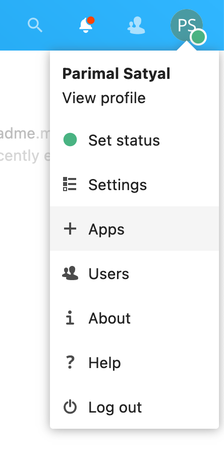

On the left menu, click on **Integration** and look for the "[OpenProject Integration](https://apps.nextcloud.com/apps/integration_openproject)" app. 

You can also use the search field in the top right corner and type "OpenProject" to find it. Once you have found the app, click the **Download and enable** button.

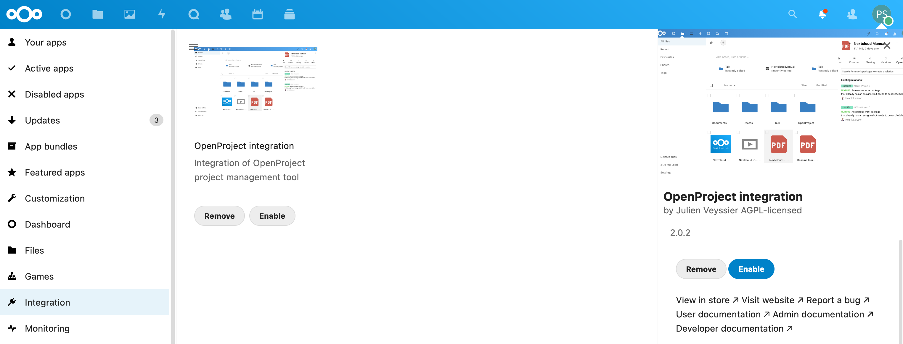

Once the OpenProject Integration app is downloaded and enabled, navigate to the settings page by clicking on *your avatar in the top right corner → Settings*. On the left-side menu, click on **OpenProject Integration**

In the configuration page that appears, you'll see a blank text field titled **OpenProject host**. Enter the address of the OpenProject instance you would like to connect with Nextcloud (including "https://").


Click on the **Save** button. 

> **Note:** If the OpenProject host cannot be added, you may check the [Troubleshooting](#troubleshooting) section at the bottom of this page

The next part of the setup will require you to enter OpenProject OAuth values here, but before we do that, you will need to generate them in OpenProject. To do so, navigate to your OpenProject instance in a new browser tab. 

#### 2. Create a Nextcloud file storage in your OpenProject instance

Navigate to your administration settings page by clicking on *your avatar in the top right corner → Administration*. From the side menu on the left, click on **File storages**.

Click on **+ Storage** to add a new file storage.


A new page titled **New storage** will appear, where you will be able to configure your new Nextcloud storage.

By default, **Provider type** is set to Nextcloud. This does not need to be modified. 

Give a **name** to this new storage. This will be visible to all users in all projects using this file storage. We highly recommended choosing a distinct name that allows users to differentiate it from any other file storages you may add in the future. 

Next, enter the **Host URL** of your Nextcloud instance. This is simply the address of your Nextcloud instance, including the "https://".

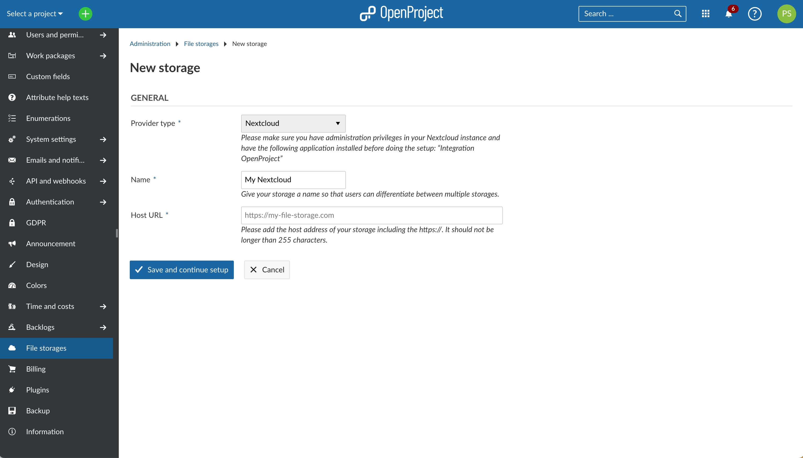

Click on **Save and continue setup**. Your new storage is now created, but before you can use it, you will need to exchange OAUth IDs and secrets between your Nextcloud and OpenProject instances. You will do this in the next step.

#### 3. Enter OpenProject OAuth values in Nextcloud settings

At this point, you will see a page titled **OpenProject OAuth application details**.

Note that OpenProject has automatically generated an OAuth **client ID** and a **client secret**. These values are needed to permit Nextcloud to connect to OpenProject.

> **Important**: These generated values are not accessible again after you close the window. Please do not navigate away from this page before copying them over to Nextcloud, as instructed below. Treat these values with care, as you would an important password. Please do not reveal them to anyone else.


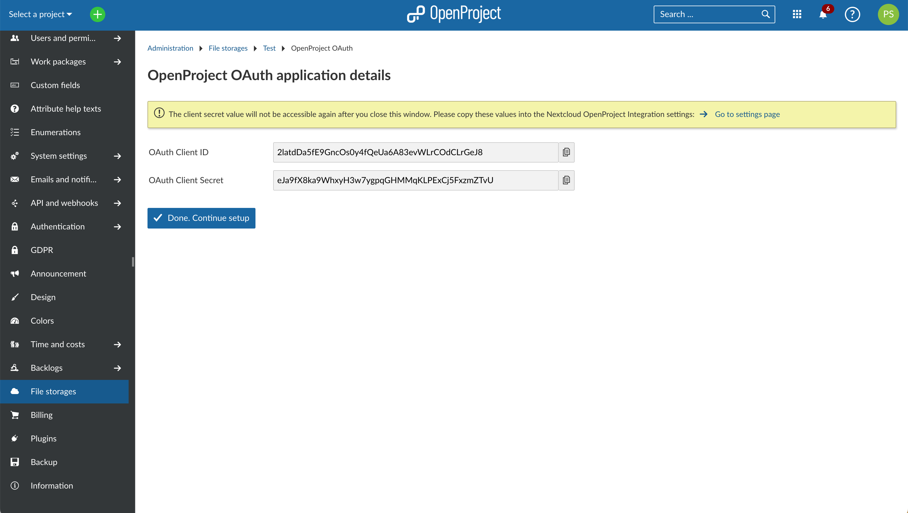

Go back to the browser tab where you were configuring the **OpenProject Integration** app. (We recommend you have two browser tabs open: the current one with OpenProject and the former one with Nextcloud).

Copy the two generated values (client ID and secret) from the OpenProject tab to the respective fields in Nextcloud, namely **OpenProject OAuth client ID** and **OpenProject OAuth client secret**. 

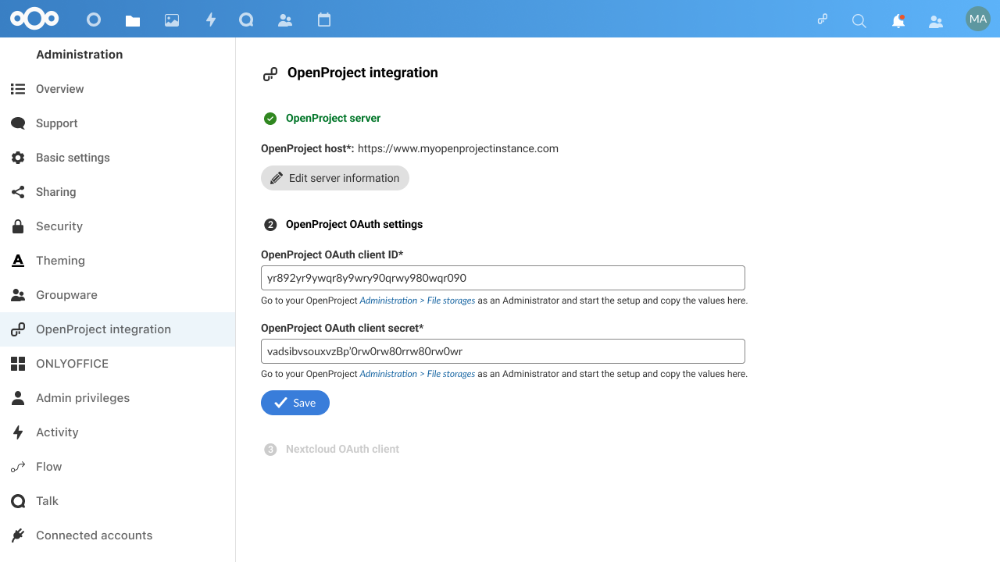

Once you have copied the values, click on **Save** to proceed to the next step.

#### 4. Enter Nextcloud OAuth values in OpenProject

In the page that appears, you will see new OAuth values that are once again generated automatically, but this time by Nextcloud.

OpenProject will need these values to be able to connect to your Nextcloud instance.

Much like in the previous step, you will need to copy these two generated values (**Nextcloud OAuth client ID** and **Nextcloud OAtuh client secret**) and paste them into OpenProject.

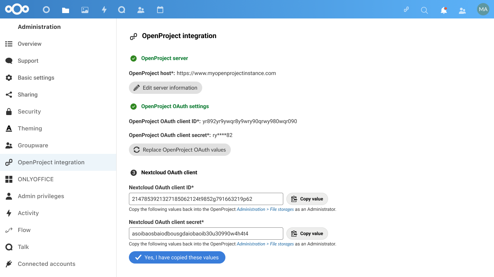

Navigate back to your OpenProject tab and click on the **Done. Continue setup** button on the screen you previously left it at. You will now see a screen where you will be able to enter the Nextcloud values. 

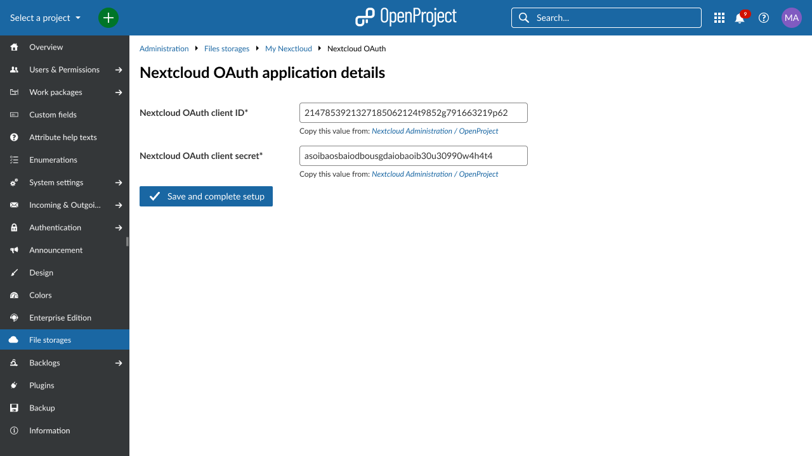

Once you have entered the client ID and client secrets on this page, click on **Save and complete setup**. In the next screen, click on **Yes, I have copied these values**. At this point, your instance configuration is complete and you should see a green banner confirming this.

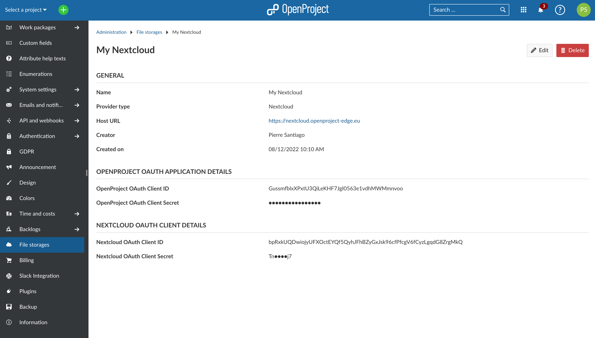

The **OpenProject Integration** page on your Nextcloud tab should also indicate that the integration is complete with three green check marks.

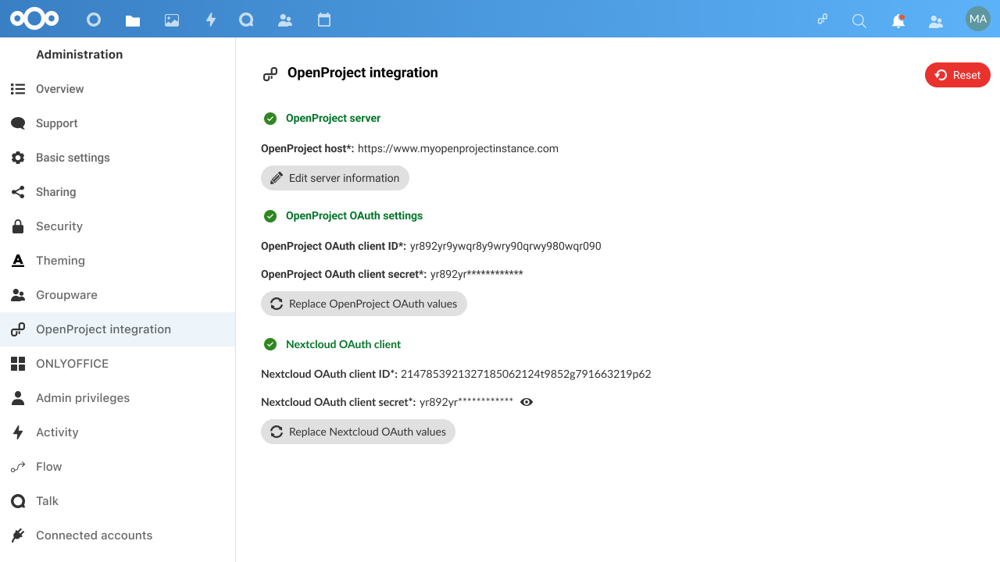

The integration is now complete, and your OpenProject and Nextcloud instances are ready to share information. 

Additional settings on this page also allow you, as an administrator, to define default settings for options that are available to each user. These can of course be overriden by a user to their liking:


- **Enable navigation link** displays a link to the OpenProject instance in the Nextcloud header 
- **Enable unified search for tickets** allows users to search for OpenProject work packages via the universal search bar in Nextcloud
- **Enable notifications for activity in my work packages** sends users Nextcloud notifications when there are updates to linked OpenProject work packages


#### 5. Add your new Nextcloud file storage to a project

Now that the integration is set up, the next step is to make the Nextcloud file storage you just created available to individual projects.

To do so, navigate to any existing project in your OpenProject instance and click on  **Project settings** **→ Modules**. There, active the **File Storages** module by clicking on the checkbox next to it and then clicking on **Save**.

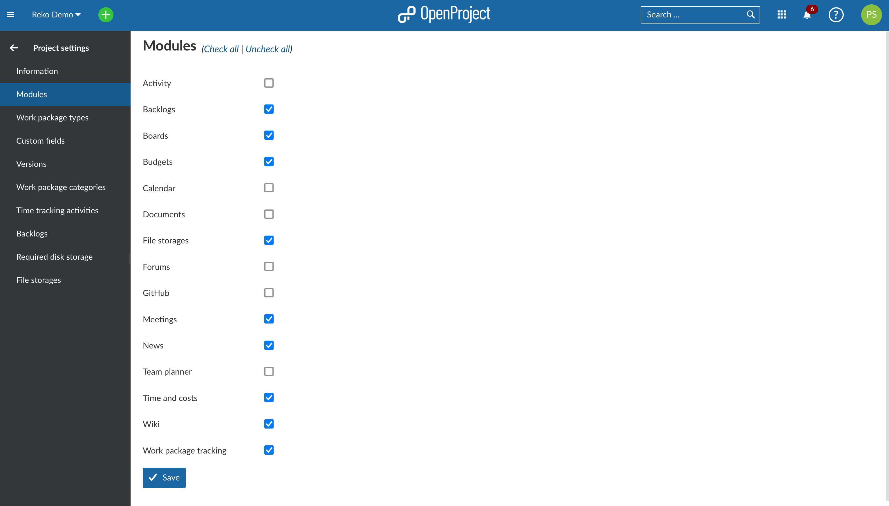

Click on this new **Files storages** menu entry. It will take you to a page titled **File storages available in this project**, which is normally empty.

Click on **+ Storage**.


In the page that follows, make sure your newly-created Nextcloud file storage is selected under **Storage**. If you only have one Nextcloud file storage set up (which is the most likely scenario), it should already be selected by default.

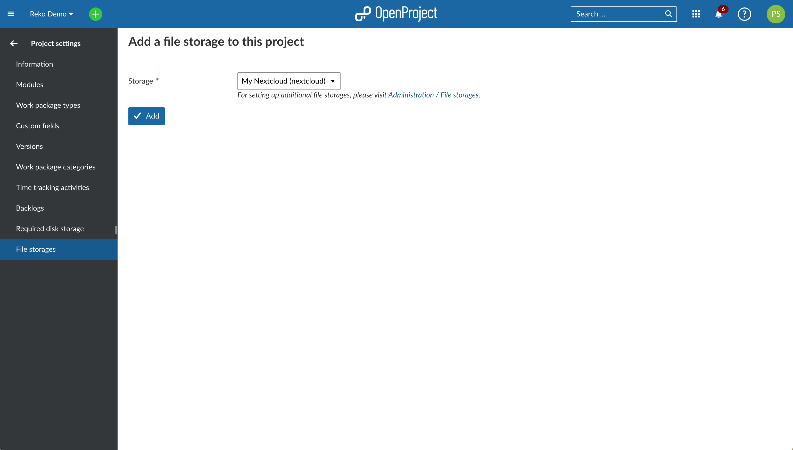

Click on **Add** to add your new Nextcloud file storage to this project.

The Nextcloud file storage is now available to all work packages in this project. 

> **Note:** For information on how to use the file storage (link Nextcloud user accounts at a user level, link files to a work package, view and download linked files, unlink files), please read our [Nextcloud integration user guide](../../../user-guide/nextcloud-integration/).

## Resetting OAuth values

If you wish to reset OAuth values for any reason, you can do so on either side by clicking on the **Reset OAuth values** button (in Nextcloud settings) or the **Replace OAuth values** button (in OpenProject admin settings).

> **Important**: When you reset/replace these values, you will need to update the configuration with the new OAuth credentials from the side you are resetting. This will also require all users to re-authorize OpenProject to access their Nextcloud account by logging in again.

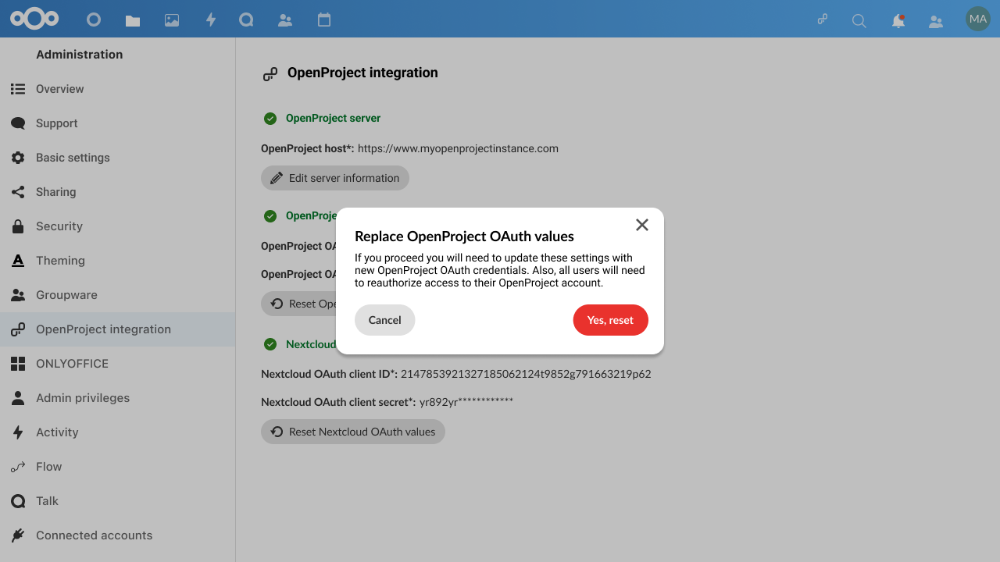

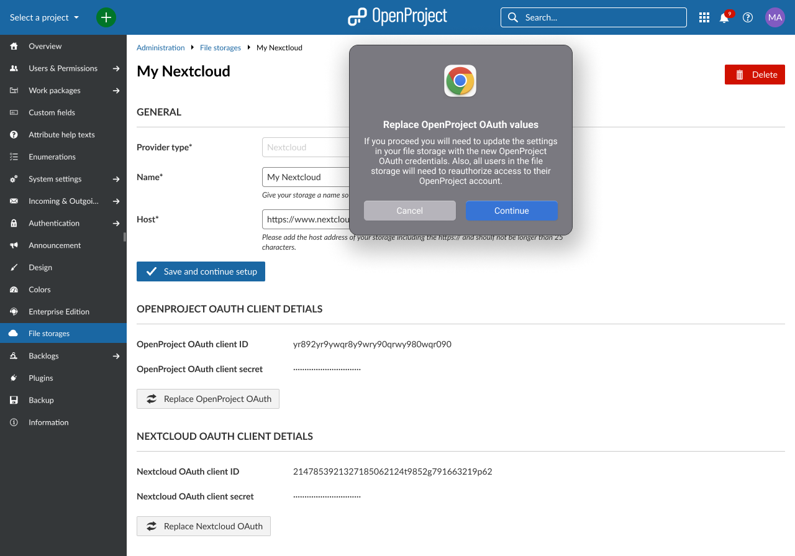


## Deleting a Nextcloud file storage

You can delete a Nextcloud file storage either at a project level or at an instance-level. 

Deleting a file storage at a project level simply makes it unavailable to that particular project, without affecting the integration for other projects. Project admins can do so by navigating to *Project settings → File storages* and clicking the **delete** icon next to the file storage you would like to remove.

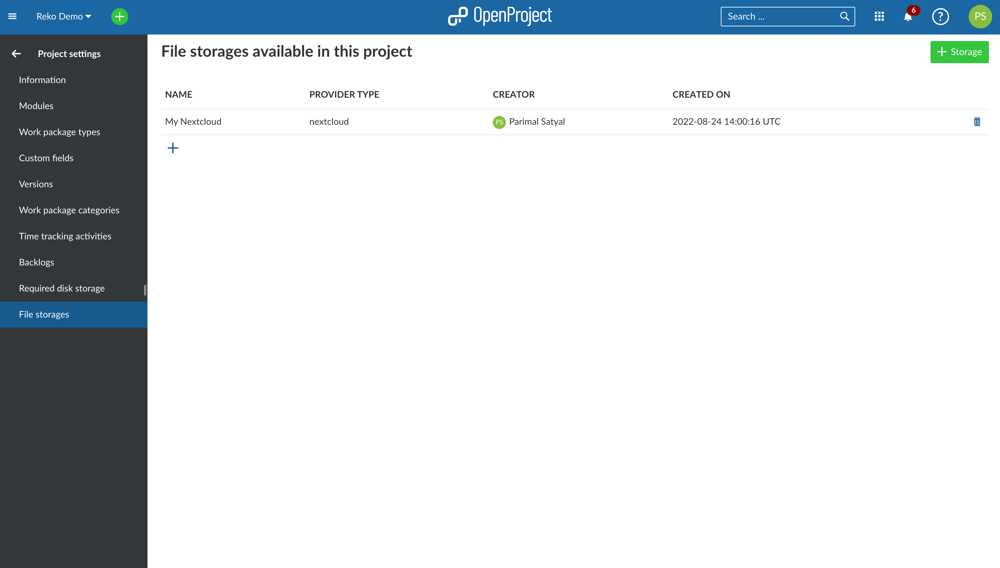

Deleting a file storage at an instance level deletes the Nextcloud integration completely and make it unaccessible to all projects in that instance. Should an instance administrator nevertheless want to do so, they navigate to *Administration → File storages* and clicking the **delete** icon next to the file storage they would like to remove.

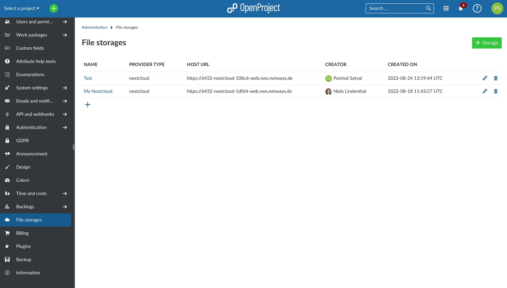

> **Important:** Deleting a file storage as an instance administrator will also delete all settings and links between work packages and Nextcloud files/folders. This means that should you want to reconnect your Nextcloud instance with OpenProject, will need complete the entire setup process once again.


## Using the integration

Once the file storage is added and enabled for projects, your users are able to take full advantage of the integration between Nextcloud and OpenProject. For more information on how to link Nextcloud files to work packages in OpenProject and access linked work packages in Nextcloud, please refer to [Using the Nextcloud integration](../../../user-guide/nextcloud-integration/).


## Troubleshooting

On Nextcloud inside the OpenProject Integration App when adding the OpenProject host it shows the error **"Please enter a valid OpenProject hostname"**.

- If you are on a local network with your Nextcloud and OpenProject hosts, it might be necessary to explicitly allow local remote servers by setting a system configuration flag on your Nextcloud host's command line. Use the command `sudo -u www-data php occ config:system:set allow_local_remote_servers --value 1` in order to change the setting for Nextcloud.

- To test the connection between OpenProject and Nextcloud, you can use the following methods from your OpenProject host's command line:

  ```bash
  curl --location --request GET 'https://nextcloud.example.com/index.php/apps/integration_openproject/check-config' --header 'Authorization: foo'
  
  # If Nextcloud OpenProject Integration is integrated correctly the response should look like the following
  
  {"user_id":"","authorization_header":foo}
  ```
  
  ```bash
  curl -H 'OCS-APIRequest:true' -H 'Accept:application/json' https://nextcloud.example.com/nextcloud/ocs/v2.php/cloud/capabilities
  
  # If Nextcloud is setup correctly the response should look like the following. Pay special attention to current Nextcloud version, which in this example here is "24.0.6". At the time of writing this documentation the minimum version of Nextcloud is 22.
  
  {"ocs":{"meta":{"status":"ok","statuscode":200,"message":"OK"},"data":{"version":{"major":24,"minor":0,"micro":6,"string":"24.0.6","edition":"","extendedSupport":false},"capabilities":{"bruteforce":{"delay":0},"metadataAvailable":{"size":["\/image\\\/.*\/"]},"theming":{"name":"Nextcloud","url":"https:\/\/nextcloud.com","slogan":"a safe home for all your data","color":"#0082c9","color-text":"#ffffff","color-element":"#0082c9","color-element-bright":"#0082c9","color-element-dark":"#0082c9","logo":"https:\/\/nextcloud.example.com\/nextcloud\/core\/img\/logo\/logo.svg?v=0","background":"https:\/\/nextcloud.example.com\/nextcloud\/core\/img\/background.png?v=0","background-plain":false,"background-default":true,"logoheader":"https:\/\/nextcloud.example.com\/nextcloud\/core\/img\/logo\/logo.svg?v=0","favicon":"https:\/\/nextcloud.example.com\/nextcloud\/core\/img\/logo\/logo.svg?v=0"}}}}}
  ```
  


If you run into any new issues or you cannot solve your integration please use our [Support Installation & Updates forum](https://community.openproject.org/projects/openproject/forums/9) or if you have an Enterprise subscription, please contact us at Enterprise Support.
