---
sidebar_navigation:
  title: OneDrive integration setup
  priority: 601
description: Set up One Drive as a file storage in your OpenProject instance
keywords: OneDrive, file storage, integration
---

# OneDrive (Enterprise add-on) integration setup

| Topic                                                              | Description                                                           |
|--------------------------------------------------------------------|:----------------------------------------------------------------------|
| [Minimum requirements](#minimum-requirements)                      | Minimum version requirements to enable the integration                |
| [Set up the integration](#set-up-the-integration)                  | Connect OpenProject and OneDrive instances as an administrator        |
| [Drive guide](./drive-guide)                                       | How to configure a drive and obtain the drive id                      |
| [Using the integration](#using-the-integration)                    | How to use the OneDrive integration                                   |
| [Edit a OneDrive file storage](#edit-a-onedrive-file-storage)      | Edit a OneDrive file storage                                          |
| [Delete an OneDrive file storage](#delete-a-onedrive-file-storage) | Delete a OneDrive file storage                                        |

[feature: one_drive_sharepoint_file_storage]

> [!NOTE]
> This feature includes using both OneDrive and SharePoint integrations.

OpenProject offers an integration with OneDrive to allow users to:

- Link files and folders stored in OneDrive with OpenProject work packages
- View, open and download files and folder linked to a work package via the Files tab

The goal here is to provide a _Document Library_, embedded in a SharePoint site, as a file storage system for
OpenProject.

The standard integration is supposed to work with a SharePoint subscription. The integration though can work with a
OneDrive for Business plan as well. There might be some differences in the setup, which are not covered by this
documentation.

> [!NOTE]
> This guide only covers the integration setup. Please go to our [OneDrive integration user guide](../../../user-guide/file-management/nextcloud-integration/) to learn
> more about how to work with the OneDrive integration.

## Minimum requirements

Please note these minimum version requirements for the integration to work with a minimal feature set:

- OpenProject version 13.1 (or above)
- Access to OneDrive or SharePoint

We recommend using the latest versions of both OneDrive and OpenProject to be able to use the latest
features.

## Set up the integration

> [!IMPORTANT]
> You need administrator privileges in the Azure portal for your Microsoft Entra ID and in your
> OpenProject instance to set up this integration.
>
> Please make sure that you configure your Azure application to have the following **API permissions**:
>
> - Files.ReadWrite.All - Type: Delegated
> - Files.ReadWrite.All - Type: Application
> - offline_access - Type: Delegated
> - User.Read - Type: Delegated

Navigate to **System administration -> File storages**. You will see the list of all storages that have already been set
up. If no files storages have been set up yet, a banner will tell you that there are no storages yet set up.

Click the green **+Storage** button and select the OneDrive option.

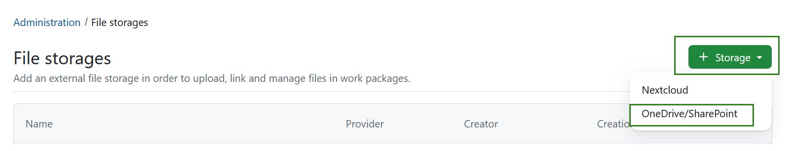

A screen will open, in which you will first need to add the **Name**, **Drive ID** and the **Directory (tenant) ID**
details for your new OneDrive storage. Please consult your Azure administrator and
the [Drive guide](./drive-guide) to obtain respective information. Be aware, that the last step includes copying
generated information to the Azure portal. Enter your data and click the green _Save and continue_ button.

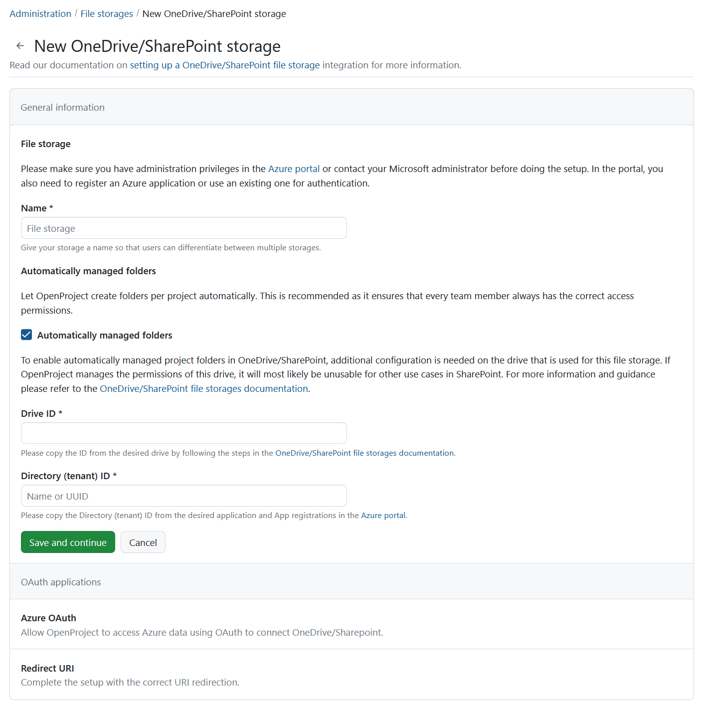

The _Access and project folders_ section of the setup will open next, where you can choose between automatically- or manually-managed access and folders. Choose your preferred option and click the green _Save and continue_ button to proceed.

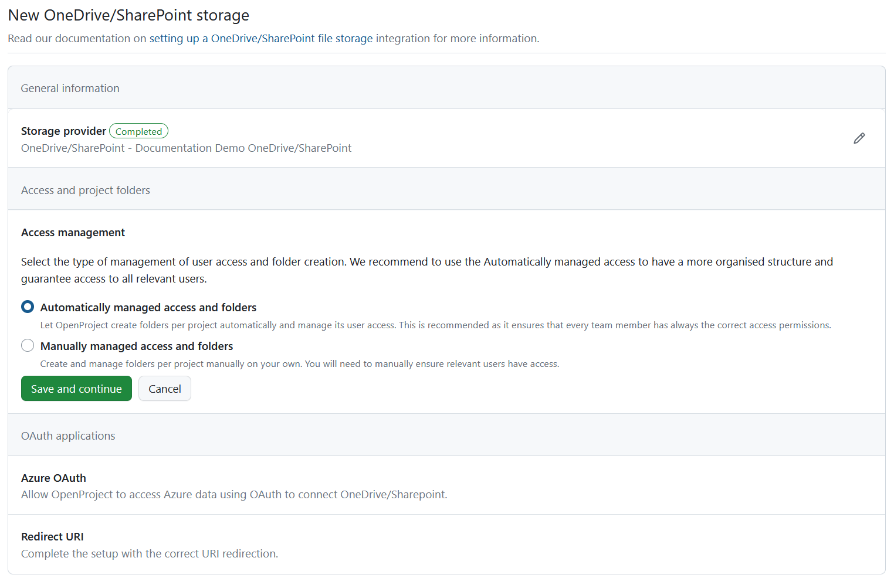

Continue by filling out the information for the _Azure OAuth_ and once again click the green _Save and continue_ button.

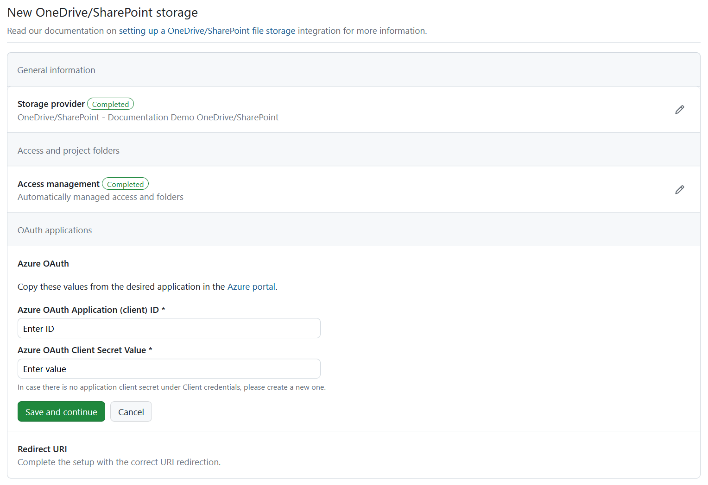

Finally, copy the _Redirect URl_ and click the green _Finish setup_ button.

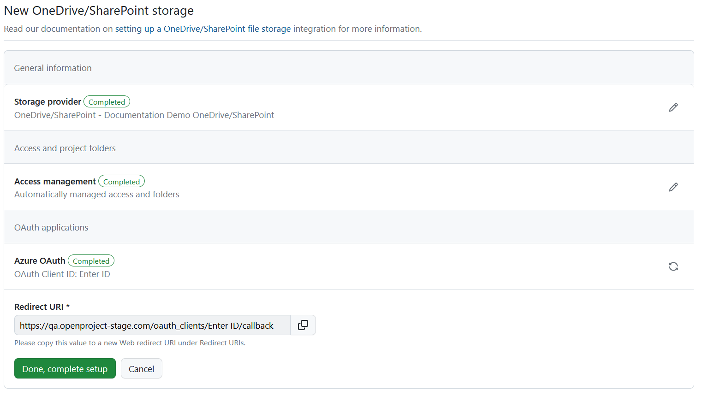

You will see the following message confirming the successful setup on top of the page.

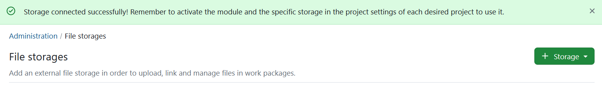

> [!IMPORTANT]
> In Sharepoint you can add (custom) columns in addition to the ones shown by default (_Modified_ and _Modified by_).
> Please keep in mind if these custom columns are added, OpenProject integration can no longer copy the automatically-managed project folders. The columns will have to be de-activated, or ideally not be created in the first place.

## Enable OneDrive file storage in projects

Now that the integration is set up, the next step is to make the OneDrive file storage you just created available to
individual projects. This can be either done by you directly in the system administration under **Enabled in projects**
tab of a specific file storage, or on a project level under **Project settings**.

To add a OneDrive to a specific project on a project level, navigate to any existing project in your OpenProject
instance and click on **Project settings** -> **Files** and follow the instructions in
the [Project settings user guide](../../../user-guide/projects/project-settings/files/).

To add a OneDrive storage to one or multiple projects on an instance level, click on a file storage under
_Administration -> Files -> External file storages_ and select **Enabled in projects** tab. You will see the list of all
projects, for which the file storage was already activated. Click the **+Add projects** button.

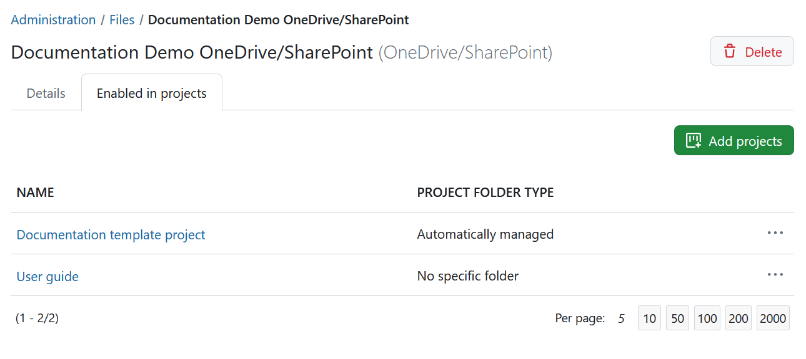

You can you use the search bar to select either one or multiple projects and have an option of including subprojects.
Select the type of project folders for file uploads and click **Add**.

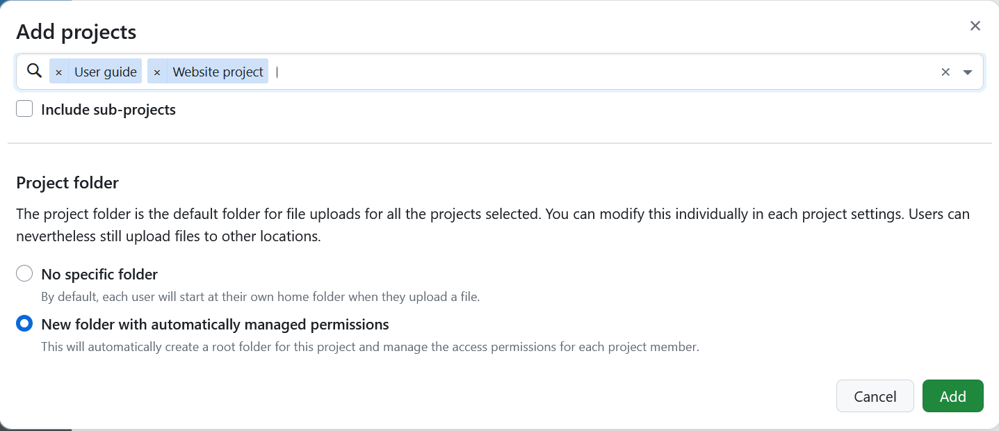

You can always remove file storages from projects by selecting the respective option. 

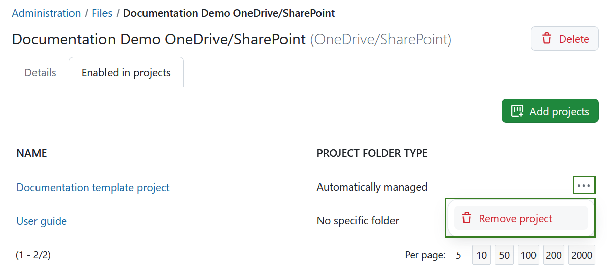

## Using the integration

Once the [file storage is added and enabled for projects](../../../user-guide/projects/project-settings/files/), your
users are able to take full advantage of the integration between OneDrive and OpenProject. For more information on how
to link OneDrive files to work packages in OpenProject, please refer to
the [OneDrive integration user guide](../../../user-guide/file-management/one-drive-integration).

## Edit a OneDrive file storage

To edit an existing OneDrive file storage hover over the name of the storage you want to edit and click it.

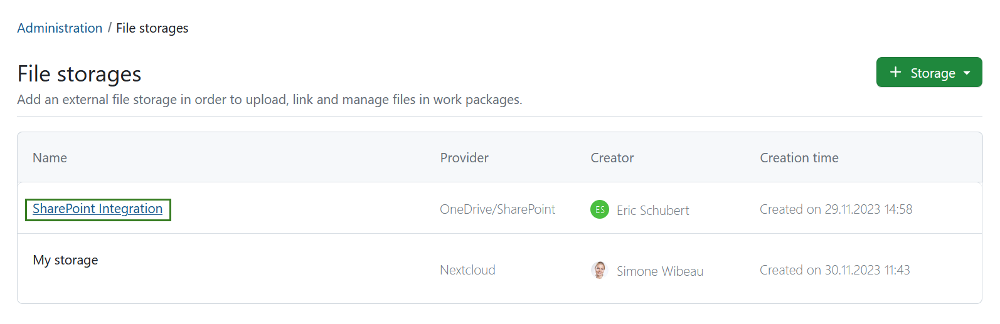

To update the general storage information, select the **Details** tab, click the **Edit** icon next to the storage provider. To replace the Azure authentication information, click on the **Sync** icon next to the OAuth application. With changing the authentication information the redirect URI will get generated again and thus needs to be copied again. The redirect URI can be copied by clicking on the **Copy-to-Clipboard** element next to the information text, or by entering the form by clicking the **View** icon.

> [!TIP]
> If you have selected automatically-managed access and folders you will also see the _Health status_ message on the right side. If the file storage set-up is incomplete or faulty, an error message will be displayed in that section. Read more about errors and troubleshooting [here](../../files/external-file-storages/health-status/).

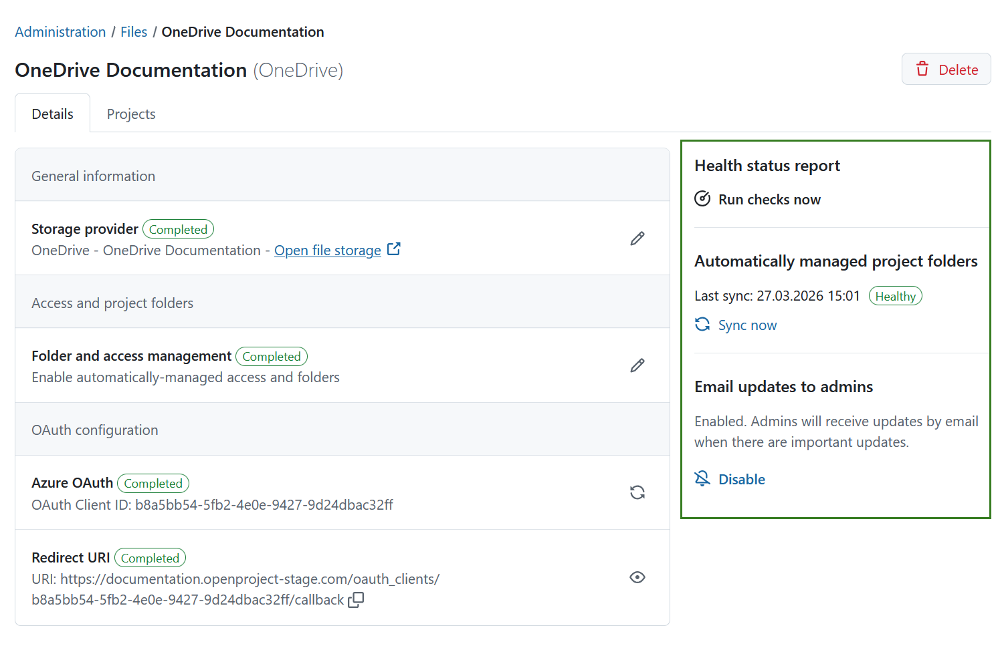

Here you will be able to edit all the information you have specified when creating the OneDrive connection  initially.

## Delete a OneDrive file storage

You can delete a OneDrive file storage either at a project level or at an instance-level.

Deleting a file storage at a project level simply makes it unavailable to that particular project, without affecting the
integration for other projects. Project admins can do so by navigating to **Project settings -> Files** and
clicking the **Delete** icon next to the file storage you would like to remove.

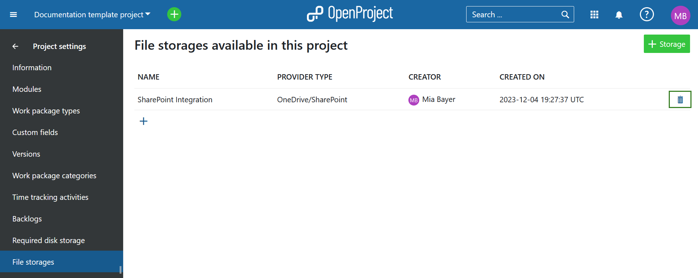

Deleting a file storage at an instance level deletes the OneDrive integration completely, making it
inaccessible to all projects in that instance. Should an instance administrator nevertheless want to do so, they can
navigate to **Administration -> File storages**, hover over the name of the file storage they want to remove and click
it to enter the next page. Then they need to click the **Delete** button in the top right corner.

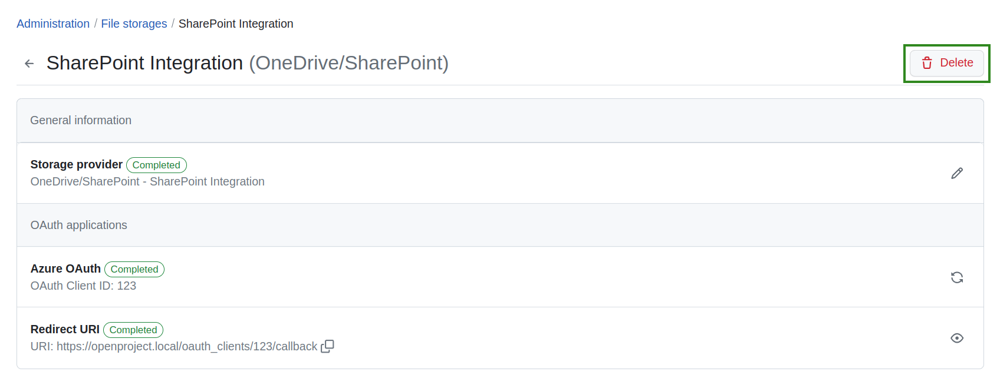

You will be asked to confirm you understand the consequences of the deletion.

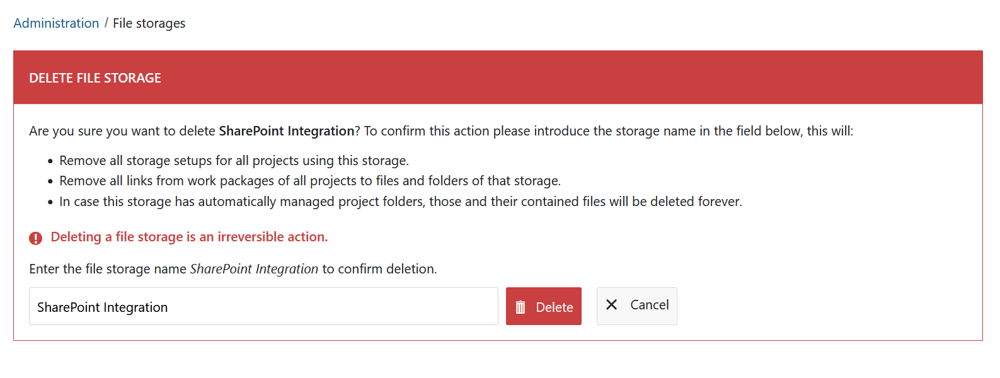

> [!IMPORTANT]
> Deleting a file storage as an instance administrator will also delete all settings and links between
> work packages and OneDrive files/folders. This means that should you want to reconnect your
> OneDrive instance with OpenProject, you will need complete the entire setup process once again.

## Getting support

If you run into any issues, or you cannot set up your integration yourself, please use
our [Support Installation & Updates forum](https://community.openproject.org/projects/openproject/forums/9) or if you
have an Enterprise subscription, please contact us at Enterprise Support.
