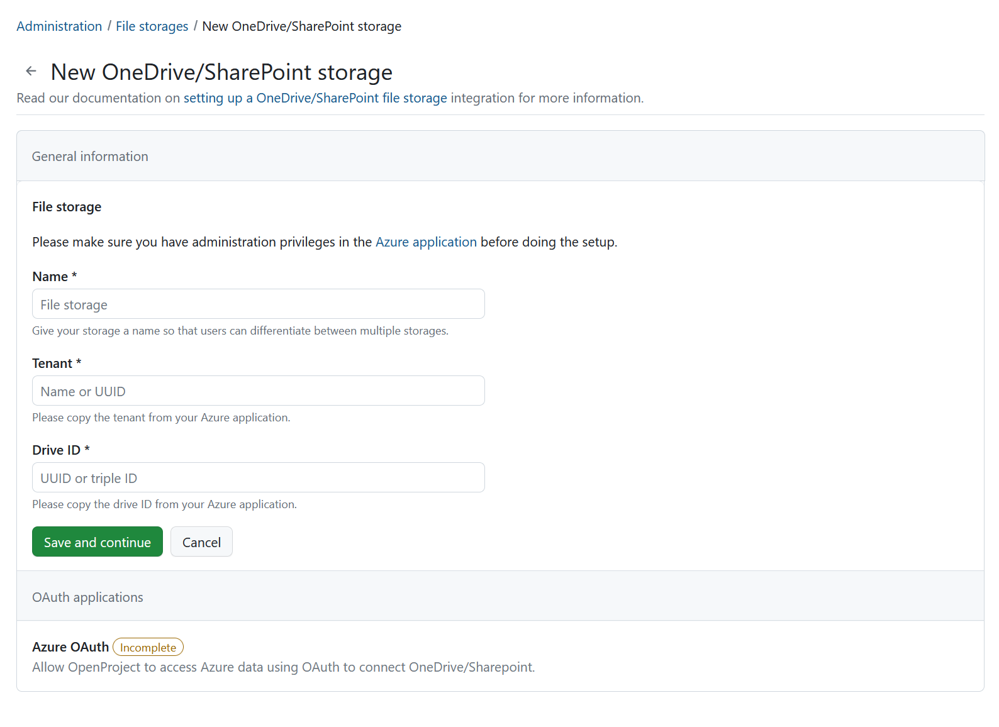
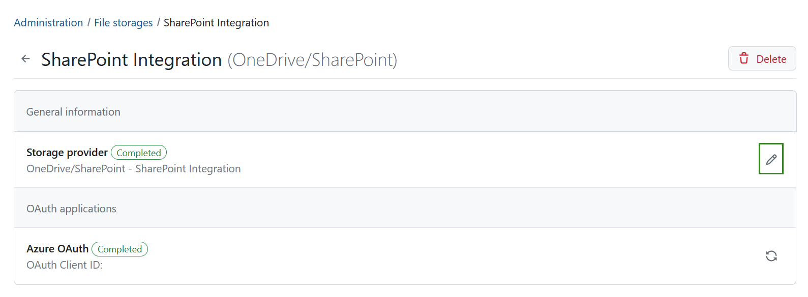

---
sidebar_navigation:
  title: OneDrive/Sharepoint integration setup
  priority: 601
description: Set up One Drive as a file storage in your OpenProject instance
keywords: One Drive, Sharepoint, file storage, integration
---

# OneDrive/Sharepoint (Enterprise add-on) integration setup

| Topic                      | Description                                                  |
| ----------------------------------- | :----------------------------------------------------------- |
| [Minimum requirements](#minimum-requirements)            | Minimum version requirements to enable the integration       |
| [Set up the integration](#set-up-the-integration)      | Connect OpenPRoject and OneDrive/Sharepoint instances as an administrator |
| [Drive ID guide](/drive-id-guide) | How to obtain a drive ID |
| [Using the integration](#using-the-integration) | How to use the OneDrive/SharePoint integration |
|  | Edit a OneDrive/SharePoint file storage |
| [Delete an OneDrive/SharePoint file storage](#delete-a-onedrivesharepoint-file-storage) | Delete a OneDrive/SharePoint file storage |

> **Note**: OneDrive/SharePoint integration is an Enterprise add-on and can only be used with [Enterprise cloud](../../../enterprise-guide/enterprise-cloud-guide/) or [Enterprise on-premises](../../../enterprise-guide/enterprise-on-premises-guide/). An upgrade from the free Community edition is easy and helps support OpenProject.

OpenProject offers an integration with OneDrive/Sharepoint to allow users to:

- Link files and folders stored in OneDrive/Sharepoint with OpenProject work packages
- View, open and download files and folder linked to a work package via the Files tab
- View all work packages linked to a file (IS THIS TRUE ?)

> Note: This guide only covers the integration setup. Please go to our [OneDrive/Sharepoint integration user guide](../../../user-guide/nextcloud-integration/) to learn more about how to work with the OneDrive/Sharepoint integration.

## Minimum requirements

Please note these minimum version requirements for the integration to work with a minimal feature set:

- OpenProject version 13.1 (or above)
- Access to OneDrive/SharePoint

We recommend using the latest versions of both OneDrive/Sharepoint and OpenProject to be able to use the latest features. 

## Set up the integration

> **Important**: You need to have administrator privileges in both your OneDrive/SharePoint and OpenProject instances to set up this integration.

Navigate to **System administration -> File storages**. You will the list of all storages that have already been set up. If no files storages have been set up yet, this list will be empty. 

Click the green **+Storage** button and select the OneDrive/SharePoint option. 

A screen will open, in which you will need to add the following details for your new OneDrive storage. Please consult your Azure administrator and the [Drive ID guide](/drive-id-guide) to obtain respective information. 

PLEASE ADD THE PART AFTER "SAVE AND CONTINUE " BUTTON HAS BEEN CLICKED HERE

## Using the integration

Once the [file storage is added and enabled for projects](../../../user-guide/projects/project-settings/file-storages), your users are able to take full advantage of the integration between OneDrive/SharePoint and OpenProject. For more information on how to link SharePoint files to work packages in OpenProject and access linked work packages in OneDrive/SharePoint, please refer to the [OneDrive/SharePoint integration user guide](../../../user-guide/file-management/onedrive-integration).

## Edit a OneDrive/SharePoint file storage

To edit an existing OneDrive/SharePoint file storage hover over the name of the storage you want to edit and click it. 

Click the **Edit** icon next to the storage provider.

Here you will be able to edit all of the information you have specified when creating the OneDrive/SharePoint connection initially.

## Delete a OneDrive/SharePoint file storage

You can delete a OneDrive/SharePoint file storage either at a project level or at an instance-level.

Deleting a file storage at a project level simply makes it unavailable to that  particular project, without affecting the integration for other  projects. Project admins can do so by navigating to *Project settings → File storages* and clicking the **delete** icon next to the file storage you would like to remove.

Deleting a file storage at an instance level deletes the SharePoint integration completely and make it unaccessible to all projects in that  instance. Should an instance administrator nevertheless want to do so,  they can navigate to *Administration → File storages*, hover over the name of the file storage they want to remove, then click the **delete** icon in the detailed view which will be opened.

You will be asked to confirm the exact file storage name. 

> **Important:** Deleting a file storage as an instance  administrator will also delete all settings and links between work  packages and OneDrive/SharePoint files/folders. This means that should you want to reconnect your OneDrive/SharePoint instance with OpenProject, will need complete  the entire setup process once again.

## Getting support

If you run into any new issues or you cannot solve your integration please use our [Support Installation & Updates forum](https://community.openproject.org/projects/openproject/forums/9) or if you have an Enterprise subscription, please contact us at Enterprise Support.