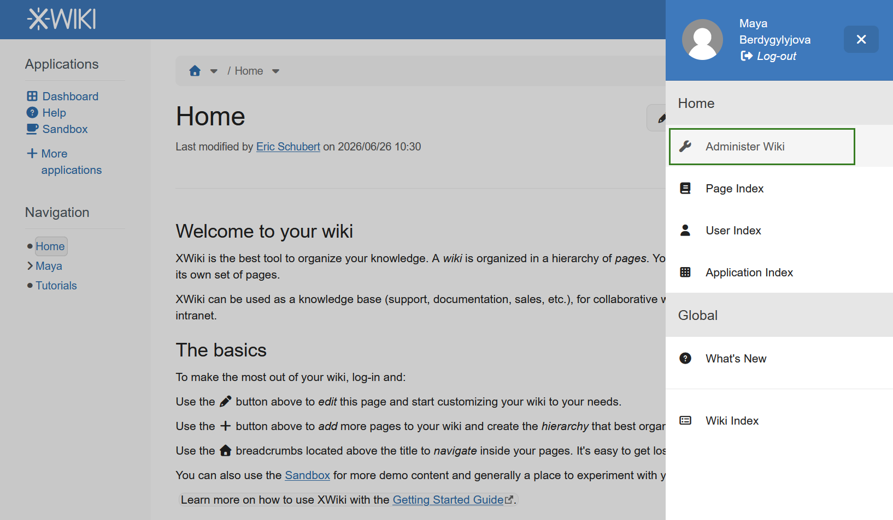
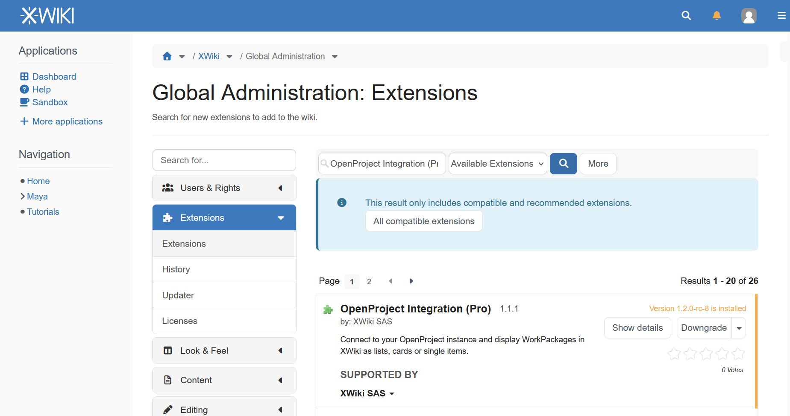
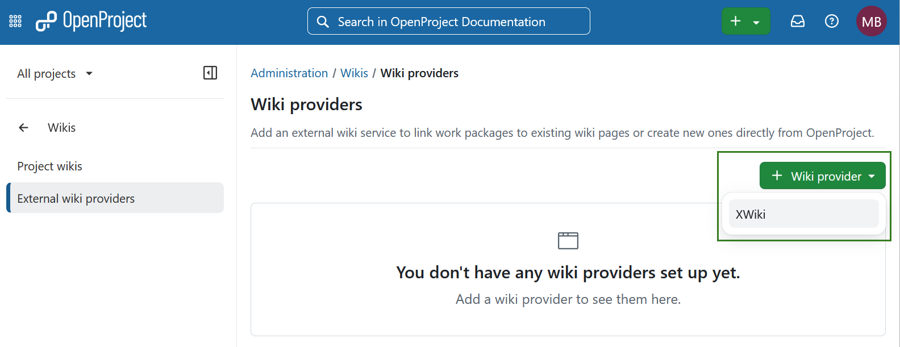
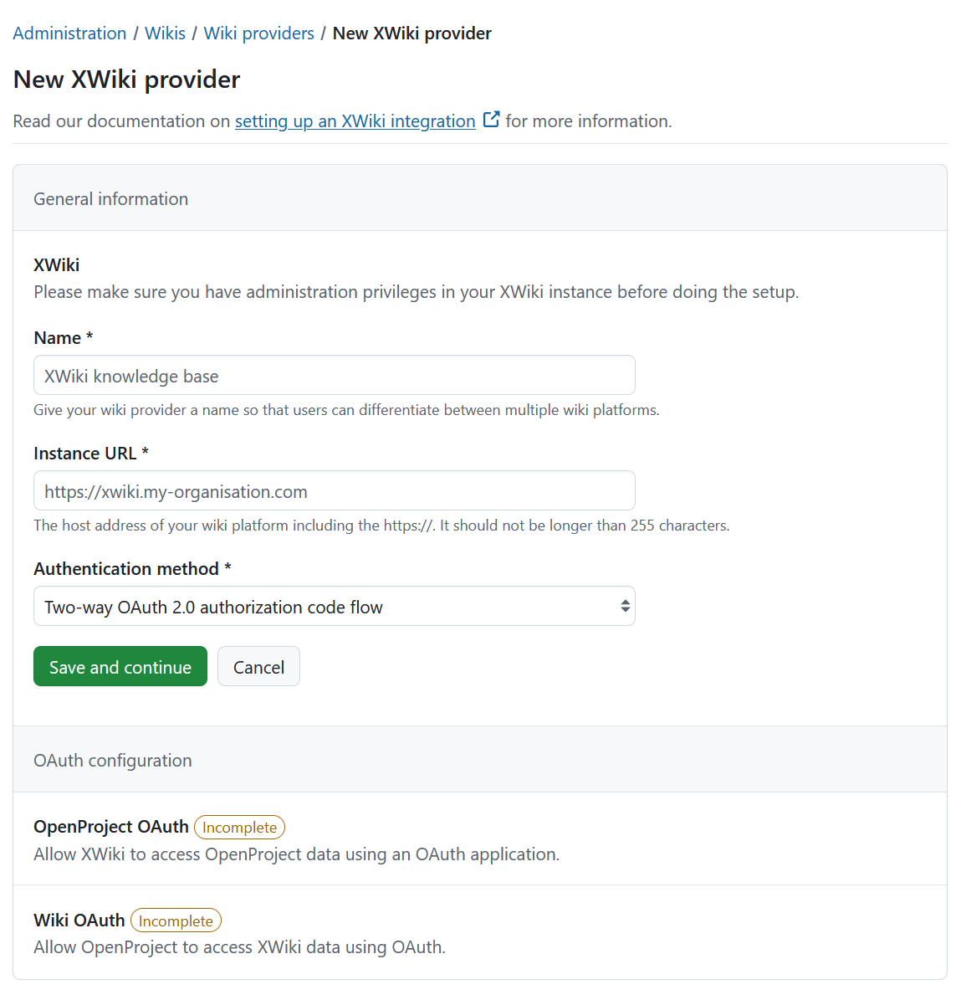
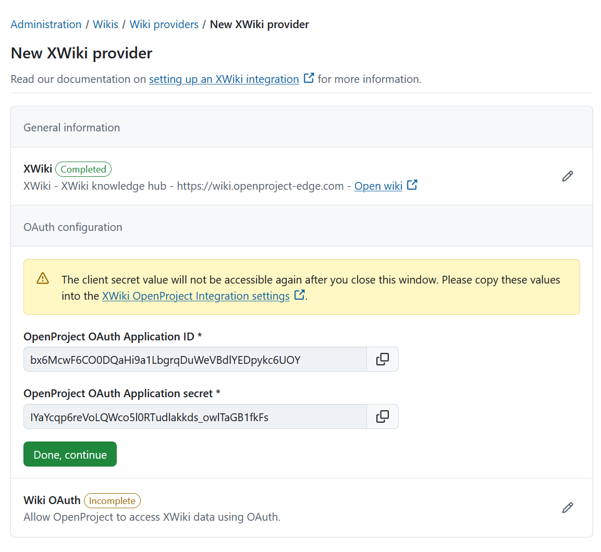
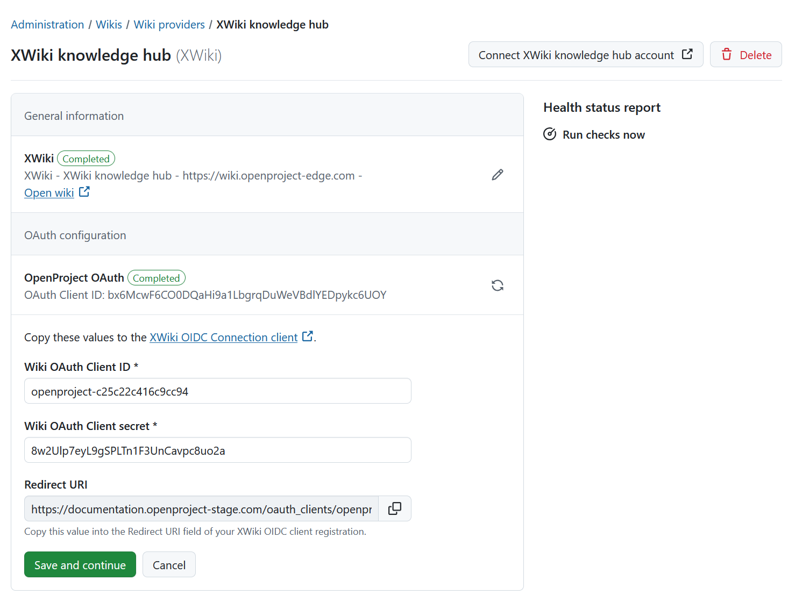
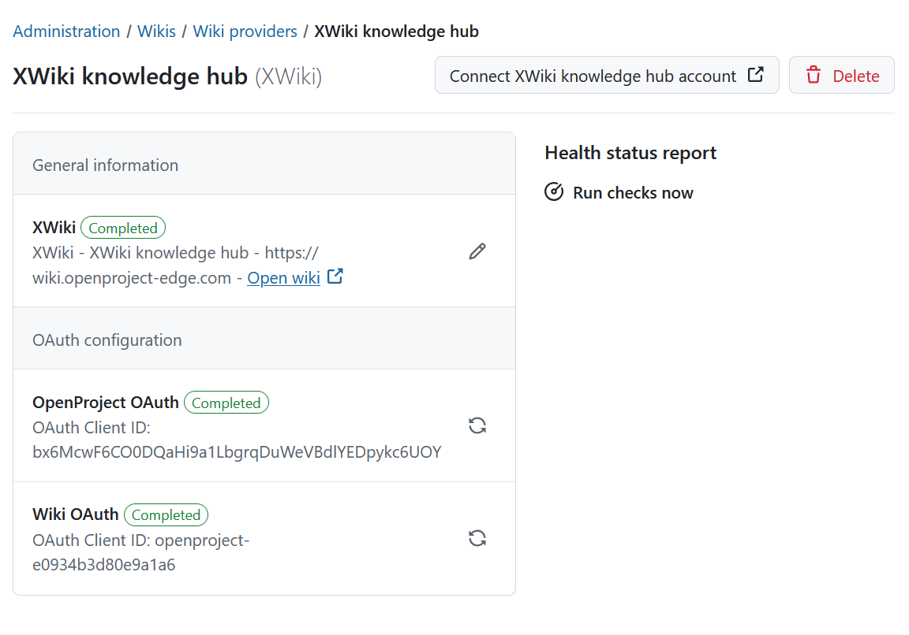

---
sidebar_navigation:
  title: XWiki integration setup
  priority: 550
description: Set up One Drive as a file storage in your OpenProject instance
keywords: XWiki, file storage, integration
---

# XWiki (Enterprise add-on) integration setup

[feature: xwiki_integration ]

| Topic                                                                       | Description                                                  |
|-----------------------------------------------------------------------------|:-------------------------------------------------------------|
| [Wikis](../../wikis)                                                        | Section about configuration of Wiki providers in OpenProject |
| [XWiki: Set up](#set-up-the-xwiki-provider)                                 | How to set up an XWiki provider                              |
| [XWiki: Replacing authentication](#replace-authentication-details)          | Replacing authentication details and its effects             |

## Set up the XWiki provider

> [!IMPORTANT]
> You need to have administrator privileges both in your XWiki and OpenProject instances to set this integration up.

### 1. Install the OpenProject plugin in XWiki

Start by opening the XWiki instance as an administrator. Click on the _Drawer_ icon in the top right corner and select
_Administer Wiki_.



Click on _Extensions_, search for **OpenProject Integration (Pro)**, and install the plugin.



### 2. Create the XWiki provider in OpenProject

Navigate to the OpenProject administration settings page. In the left hand menu select _Wikis → Wiki providers_.
Click the **+ Wiki provider** button and select **XWiki**.



A new page titled **New XWiki provider** will appear, where you will be able to configure your XWiki instance.

First, choose a **Name** for the XWiki provider. This name will be shown when linking pages from this XWiki instance in
OpenProject.

Then, enter the **Instance URL** of your XWiki instance. This URL will be checked on submitting this form.

Lastly, choose the **Authentication method**. This determines how OpenProject users will connect their user accounts to
their XWiki accounts. Additional information is provided in the next step.



### 3. Configure authentication credentials in OpenProject

Depending on which authentication method you chose in the previous step, this configuration step differs. Currently,
OpenProject supports only a single authentication method:

- **Two-way OAuth 2.0 authorization code flow**

#### Two-way OAuth 2.0 authorization code flow

This method requires the user to go through an OAuth 2.0 authorization code flow to connect their OpenProject user
account to their XWiki account, and vice versa.

First, you will see the client credentials generated by OpenProject. Copy the **Application ID** and **Application
secret** to your clipboard and insert them in the corresponding form at the XWiki instance. A link to the correct
configuration page (leads to XWIKI side) is displayed in a banner above.



Click on **Done, continue**. This will show the next step, where a **Client ID** and **Client secret** are generated on
the OpenProject side to be used for the XWiki OAuth client configuration. These values are just examples – if needed,
you can change them. The generated secret fulfills all requirements to be considered secure. Copy all the values,
including the **Redirect URI**, to your clipboard and insert them in the corresponding form at the XWiki instance. A
link to the correct XWiki form will be displayed again above the form.



Once this is done, click on **Save and continue**. This will conclude the configuration of the XWiki provider and the
details page will be shown.



## Replace authentication details

If authentication credentials are lost, leaked, or need to be rerolled, you can replace them by clicking on the name of
an XWiki provider. This will open the details page of the provider. Click **Replace** next to the configuration entry.

The replacement action is available separately for each pair of credentials and will generate new credentials after
confirming the destructive action. As described in the
section [Two-way OAuth 2.0 authorization code flow](#two-way-oauth-20-authorization-code-flow) you will have to copy the
new values over to the corresponding XWiki forms.

> [!IMPORTANT]
> Every user will have to reconnect from the affected side after resetting the credentials. For example, if replacing
> the Wiki OAuth credentials, the connection from the OpenProject account to the XWiki account is lost and has to be
> reconnected.

To learn how to link a wiki to a work package or create a new one, refer to [this user guide](../../../user-guide/work-packages/edit-work-package/#link-to-or-create-a-wiki-page).

## Configuration using environment variables

For some deployment scenarios, it might be desirable to configure a provider through environment variables. These variables follow the rules defined in the [documentation about using environment variables](../../../installation-and-operations/configuration/environment/).

The configuration `OPENPROJECT_WIKI__PROVIDERS` accepts an array of JSON objects to configure external wiki providers, such as XWiki.
For each XWiki provider you can define the following attributes:

- `type`: Must be set to `xwiki`
- `name`: Defines the user-visible name of the wiki provider.
- `url`: The wiki provider's base URL.
- `uid` (optional): The XWiki installation id of the related XWiki instance. If not provided, this will be asynchronously fetched later.
- `openproject_oauth`
    - `client_id`: The client ID that XWiki will be able to use to authenticate towards OpenProject via OAuth.
    - `client_secret`: The client secret that XWiki will be able to use to authenticate towards OpenProject via OAuth. Make sure to pick a strong password.
- `xwiki_oauth`
    - `client_id`: The client ID that OpenProject shall use to authenticate towards XWiki via OAuth.
   - `client_secret`: The client secret that OpenProject shall use to authenticate towards XWiki via OAuth.

The following is a configuration example for a single XWiki provider:

```
[{ "type": "xwiki", "name": "XWiki knowledge base", "url": "https://xwiki.example.com", "openproject_oauth": { "client_id": "xwiki", "client_secret": "secret" }, "xwiki_oauth": { "client_id": "openproject", "client_secret": "secret" } }]
```

### Applying the configuration

To apply the configuration after changes, you need to run the `db:seed` rake task. In all installations, this command is run automatically when you upgrade or install your application. Use the following commands based on your installation method:

- **Packaged installation**: `sudo openproject run bundle exec rake db:seed`
- **Docker**: `docker exec -it <container of all-in-one or web> bundle exec rake db:seed`.

Changes will also be applied to existing wiki providers this way. Existing wiki providers will be matched to the ones defined in environment variables preferably
by their `uid` (if one was defined) and otherwise by their human-readable name.
