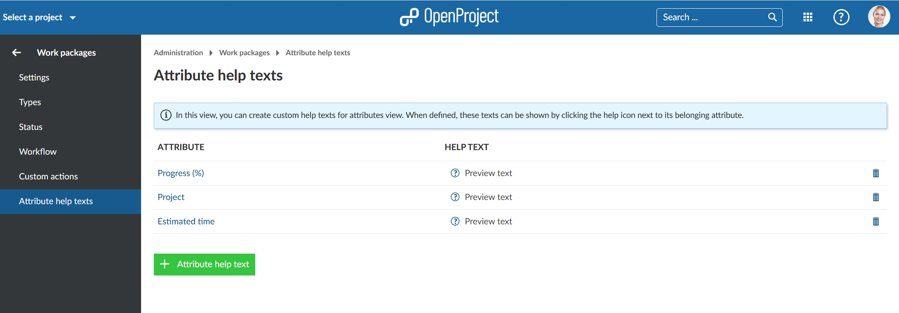
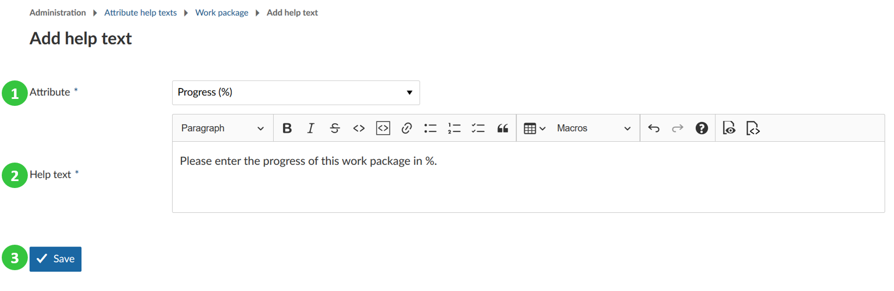
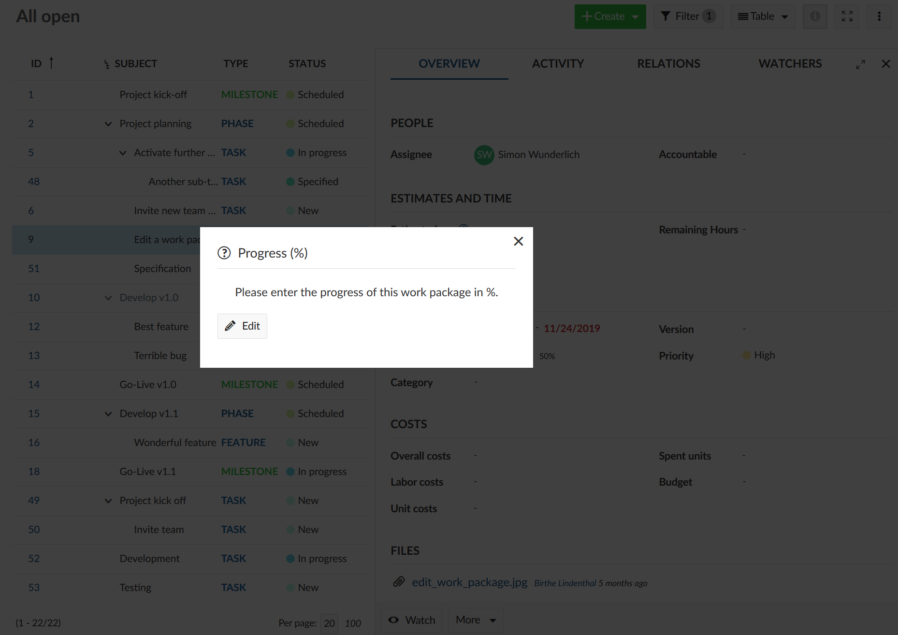
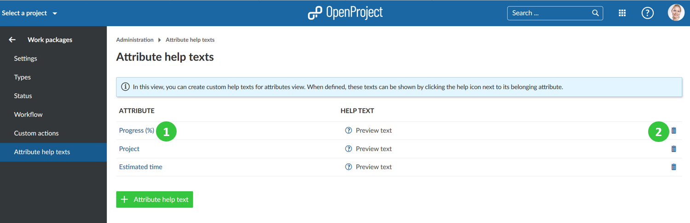

---

sidebar_navigation:
  title: Attribute help texts
  priority: 950
description: Additional help texts for work package attributes in OpenProject.
robots: index, follow
keywords: attribute help texts
---

# Manage attribute help texts (Premium feature)

Users of the [Enterprise Edition](https://www.openproject.org/enterprise-edition/) and [Cloud Edition](https://www.openproject.org/hosting/) can configure attribute help texts which show hints for work package attributes.

With attribute help texts you can easily add explanations to work package attributes to explain it for users. This way you will reduce wrong entries for attributes. This is especially relevant for company specific custom fields.

Navigate to -> *Administration* -> *Work packages* -> *Attribute help texts*.

In order to create new attribute help texts, press the green **+ Attribute help text** button.

1. **Choose an attribute** from the list for which you want to add a description from the drop-down list. Also custom fields will be shown here which might need further specific explanation.
2. Enter the **detailed help text description** which will be shown in the work package forms for the users.
3. Do not forget to **Save** your changes.

Once you configure the help text for an attribute, project members can see the explanation.

Be aware that the help text will be visible in all projects.

Once you saved the help text, users see a question mark item next to the attribute.

When the users click on it, they see the description for this attribute.

 ## Edit or delete attribute help texts

Navigate to -> *Administration* -> *Work packages* -> *Attribute help texts* in order to edit or remove an attribute help text.

1. Click on the **name** of the attribute to edit an existing attribute help text.
2. Click on the **delete icon** to delete an attribute help text.

