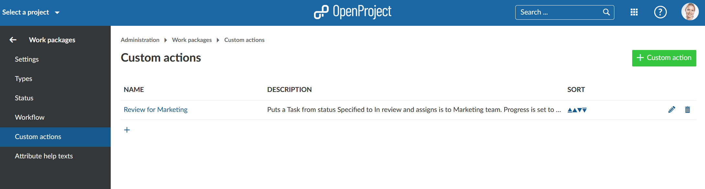
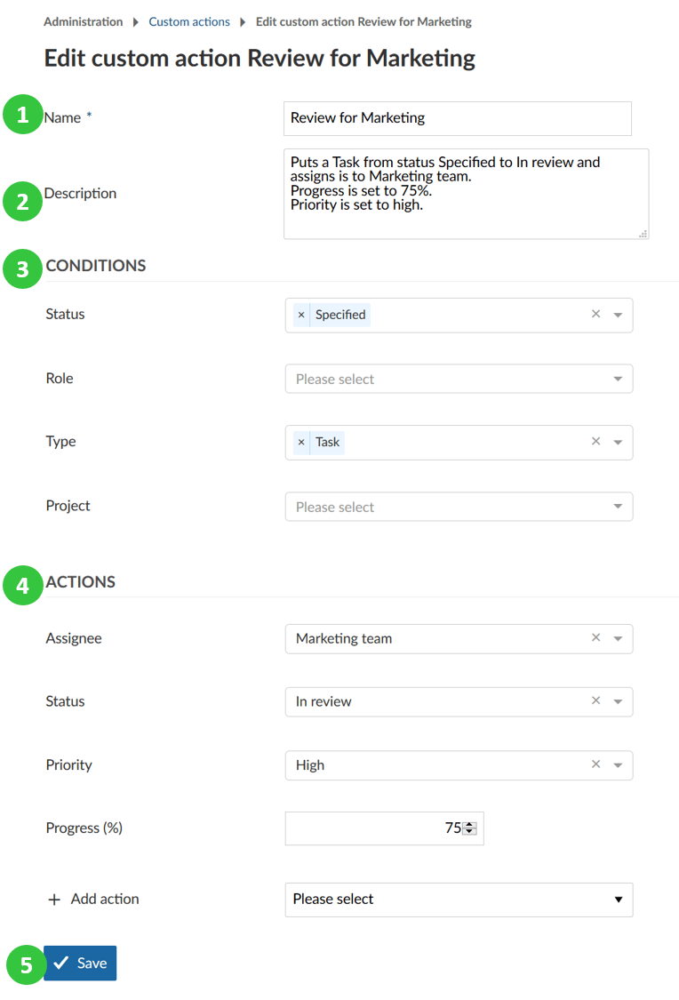
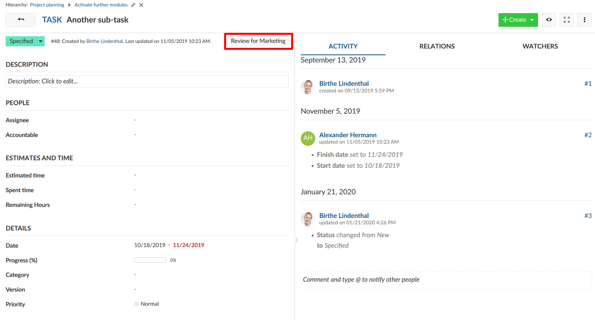
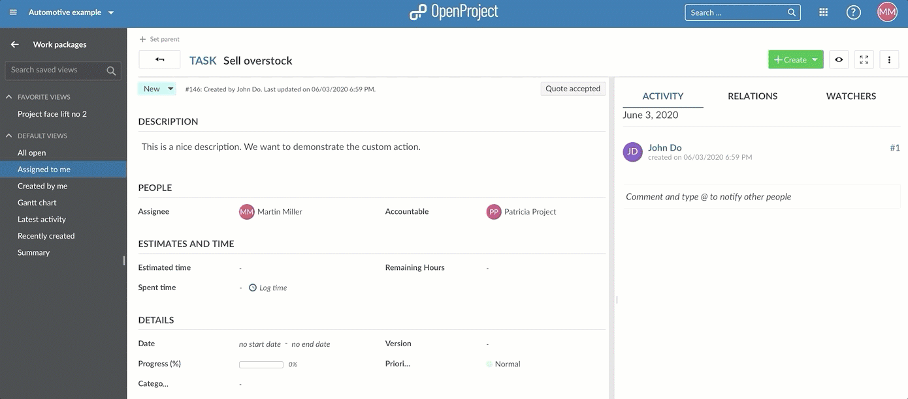
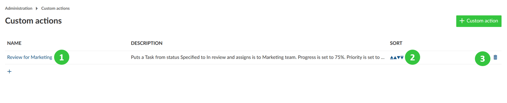

---

sidebar_navigation:
  title: Custom actions
  priority: 960
description: Intelligent workflows with custom actions.
robots: index, follow
keywords: custom actions
---

# Intelligent workflows with custom actions (Premium feature)

Intelligent workflows with custom actions support you to easily update several work package attributes at once with a single click on one button.

You can use custom actions to standardize your workflows, avoid errors and reduce manual work for updates.

The intelligent workflows with custom actions are a premium feature and only available for [Enterprise Edition](https://www.openproject.org/enterprise-edition/) and [Cloud Edition](https://www.openproject.org/hosting/) customers.

## Create custom actions

Navigate to the -> *Administration* -> *Work packages* -> *Custom actions*.

To create a new custom action button press the green **+ Custom action button**.

You can now configure the **Conditions** and **Actions** for the custom action button.

1. Enter a **name** for the custom action button. This name will then appear on the button on the work package.
2. Set a **description** (i.e. what are the conditions and actions).
3. Set the **conditions** for which the custom action button should apply, e.g. in which status, for which role, what type or in which project should the custom action button appear.
4. Set the **actions** what should happen after pressing the custom action button, e.g. status transitions, and changes to any other attribute.
5. **Save** your changes.

If a work package is then in the defined condition, the button will appear on top of a work package and will apply the actions and changing the attributes of a work package as defined in the configuration when clicking on the button.

## Update, sort or delete custom actions

1. Click on the name of a custom action in order to update the attributes.
2. Click the up or down arrow in order to sort the order of the custom action button on the work packages.
3. Delete a custom action.

