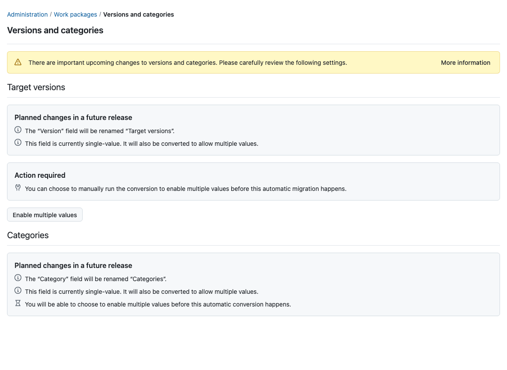
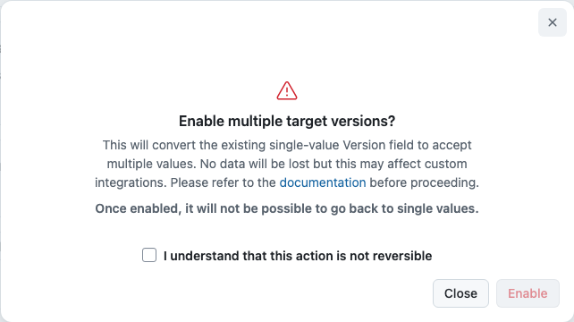

---
sidebar_navigation:
  title: Multiple target versions
  priority: 650
description: Enable multiple target versions on work packages and prepare API clients for the change.
keywords: target versions, multiple versions, version field, versions and categories, migration
---

# Versions and categories
## Multiple target versions

Starting with OpenProject 17.8, the **Version** field for work packages is renamed **Target versions** and changes from a single-value to a multi-value field. A work package can be assigned to more than one version at a time, for example, when a fix ships in several release lines or a feature spans two milestones.

For existing instances, this conversion is not applied automatically yet. Administrators can enable it manually at a time of their choosing before it becomes automatic in a future release. This page explains the change, how it affects users and API clients, and how to enable multiple target versions.

> [!IMPORTANT]
> Enabling multiple target versions is **not reversible**. Once work packages can hold several target versions, there is no unambiguous way to reduce them back to a single value.

## What is changing

| Before 17.8                            | From 17.8                                            |
| -------------------------------------- | ----------------------------------------------------- |
| Field is named **Version**             | Field is named **Target versions**                    |
| A work package can have one version | A work package can have multiple target versions |

The **Category** field will undergo a similar change in a later release: it will be renamed **Categories** and support multiple values. The settings page already announces this upcoming change. No action is possible or required for categories yet.

## How this affects users

- The field appears as **Target versions** everywhere it was previously labeled **Version**: work package forms, tables, filters, exports and notifications.
- The field accepts multiple values. Users who only ever assign one version can continue using the field in the same way as before.
- Existing assignments are untouched: a work package assigned to the version "Sprint 3" before the conversion remains assigned to "Sprint 3" as a target version afterward.

## Migration guide

The conversion happens in one of three ways:

1. **Manually from the administration UI.** Navigate to _Administration → Work packages → Versions and categories_. 

While the conversion is still pending, the **Target versions** section provides an **Enable multiple values** button. Selecting it opens a confirmation dialog explaining that the change cannot be reversed. The conversion runs as a background job, and the page automatically shows its progress and completion. On most instances, the conversion finishes within seconds.

   

   

2. **Through the configuration.** The 'work_package_multiple_versions' setting can also be configured through the configuration file or an environment variable, like any other setting (see [advanced configuration](../../../installation-and-operations/configuration/)). When overridden this way, the settings page indicates that the setting is controlled through the configuration, and the **Enable multiple values** button is not available.

   ```shell
   OPENPROJECT_WORK__PACKAGE__MULTIPLE__VERSIONS=true
   ```

3. **Automatically.** A future OpenProject release will apply the conversion during the upgrade on instances that have not enabled it yet. The release notes will announce which version this is. Enabling multiple target versions beforehand lets you choose when the conversion takes place and gives you time to validate your integrations.

During the conversion, work packages whose version assignments require an update receive a system-generated journal entry to keep their change history consistent. No notifications are sent for these entries.

## Updating API clients

Work packages in API v3 carry versions in two link properties during the transition:

- **`targetVersions`** is the new authoritative property: an array of version links.
- **`version`** is deprecated. While multiple target versions are not yet enabled, it continues to hold a single version link derived from the target versions. Once multiple target versions are enabled, it disappears from work package responses, forms and schemas.

Before the conversion, a work package response contains both:

```json
{
  "_links": {
    "version": {
      "href": "/api/v3/versions/10",
      "title": "Sprint 3"
    },
    "targetVersions": [
      {
        "href": "/api/v3/versions/10",
        "title": "Sprint 3"
      }
    ]
  }
}
```

To write target versions, send the array in a form or PATCH request:

```json
{
  "lockVersion": 2,
  "_links": {
    "targetVersions": [
      { "href": "/api/v3/versions/10" },
      { "href": "/api/v3/versions/479" }
    ]
  }
}
```

Before the conversion, clients that read or write only the single `version` link keep working unchanged. After the conversion, the `version` property is removed from work package responses, forms and schemas; clients must read and write `targetVersions` instead. The work package schema marks `version` as deprecated while it is still present and announces via `options.multiple` whether the field accepts several values, so schema-driven clients adapt automatically.

### Filters

- The existing `version` filter matches work packages that have the given version among their target versions.
- Once multiple target versions are enabled, an additional `targetVersion` filter is available with the same semantics.
- Both filters support the usual list operators as well as the open, closed, and locked version status operators.

